# <center> 视觉slam学习笔记 </center>  
- [ 视觉slam学习笔记 ](#-视觉slam学习笔记-)
- [视觉里程计](#视觉里程计)
- [RTABMAP](#rtabmap)
  - [内存更新](#内存更新)
    - [定位创建](#定位创建)
      - [词典更新](#词典更新)
      - [角点检测](#角点检测)
      - [计算描述子](#计算描述子)
      - [描述子转词典](#描述子转词典)
      - [创建签名](#创建签名)
    - [添加签名到STM](#添加签名到stm)
    - [更新权重](#更新权重)
      - [计算相似度](#计算相似度)
      - [更新权重](#更新权重-1)
    - [签名转移 (STM-\>WM)](#签名转移-stm-wm)
  - [贝叶斯滤波更新](#贝叶斯滤波更新)
    - [计算似然](#计算似然)
    - [调整似然](#调整似然)
    - [计算后验](#计算后验)
  - [回环假设选择](#回环假设选择)
  - [取回 Retrieval (LTM-\>WM)](#取回-retrieval-ltm-wm)
  - [转移 Transfer (STM-\>LTM)](#转移-transfer-stm-ltm)
- [安装与运行](#安装与运行)
  - [安装](#安装)
  - [运行](#运行)
    - [ubuntu22.04运行ros2的rtabmap](#ubuntu2204运行ros2的rtabmap)
    - [解决容器无法显示问题](#解决容器无法显示问题)
    - [gpu运行superpoint(ros1)](#gpu运行superpointros1)

# 视觉里程计
里程计节点可以实现任何类型的里程计方法，与所使用的传感器无关，它应该向 RTAB-Map 提供目前估计的机器人姿态，带有相应tf变换（例如，/ odom -> /base_link）的 Odometry 消息。对于视觉里程计，RTAB-Map 实现了两种标准里程计方法称为帧到图 (F2M) 和帧到帧 (F2F)。这些方法之间的主要区别在于，F2F 将新帧注册到最后一个关键帧，而 F2M 将新帧注册到从过去关键帧创建的本地特征图。
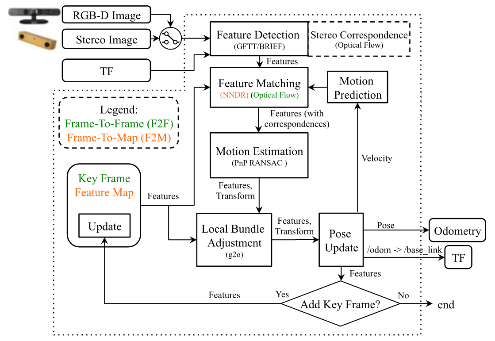
特征检测：获取到新的一帧后，检测GFTT特征，也支持OpenCV中其他的特征点，但选择 GFTT 是为了简化参数调整并在不同的图像尺寸和光强度下获得统一检测的特征。对于立体图像，深度信息是通过光流使用迭代 LucasKanade 方法计算的，以得出左右图像之间每个特征的视差。对于 RGB-D 图像，深度图像用作 GFTT 的掩码，以避免提取无效深度的特征。
特征匹配：对于 F2M，匹配是通过最近邻搜索和最近邻距离比 (NNDR) 计算的，使用 BRIEF 描述子将提取的特征与特征图中的特征进行对比。Feature Map 包含 3D 特征和最后一个关键帧的描述子。对于 F2F，光流直接在 GFTT 特征点上完成，无需提取描述子，提供与关键帧的更快特征对应。
运动预测：运动模型用于根据先前的运动变换预测关键帧（F2F）或特征图（F2M）的特征在当前帧中的位置。这限制了特征匹配的搜索窗口以提供更好的匹配，特别是在具有动态对象和重复纹理的环境中。
运动估计：计算特征对应关系时，OpenCV 的 PnP RANSAC 实现用于计算当前帧对应于关键帧 (F2F) 或特征图 (F2M) 中的特征的变换。
局部 BA：对特征图中所有关键帧的特征 (F2M) 或仅对最后一个关键帧 (F2F) 的特征进行优化得到运动变换结果。
姿态更新：使用运动估计的变换，然后更新输出里程计以及 tf 变换。使用3D 特征对应之间的中值绝对偏差 (MAD) 方法计算协方差。
关键帧和特征图更新：如果在运动估计期间计算的内点数低于固定阈值“Odom/KeyFrameThr”，则更新关键帧或特征图。对于 F2F，关键帧简单地被当前帧替换。对于 F2M，通过添加新帧中的不匹配特征并更新由局部 BA 模块优化的匹配特征的位置来更新特征图。特征图有一个固定的最大特征临时保存（因此最大的关键帧）。当特征图的大小超过固定阈值“OdomF2M/MaxSize”时，与当前帧不匹配的最旧特征被删除。如果关键帧在特征图中不再具有特征，则将其丢弃。
默认使用F2M模式，代码定义在[OdometryF2M.cpp](./rtabmap/corelib/src/odometry/OdometryF2M.cpp)文件中
```C++ 
Transform OdometryF2M::computeTransform(
		SensorData & data,
		const Transform & guessIn,
		OdometryInfo * info)
{
//.....
    transform = regPipeline_->computeTransformationMod(
            tmpMap,   //地图3D点
            *lastFrame_, //当前帧2D点
            // special case for ICP-only odom, set guess to identity if we just started or reset
            //估计初始pose
            guessIteration==0 && !guess.isNull()?this->getPose()*guess:!regPipeline_->isImageRequired()&&this->framesProcessed()<2?this->getPose():Transform(),
            &regInfo);
//.....
}
```
# RTABMAP    
Real‐Time Appearance‐Based Mapping (RTAB‐Map)是一种**基于外观的闭环检测方法**，具有良好的内存管理，以满足处理大场景和在线长周期管理要求。RTAB‐Map集成了视觉和激光雷达SLAM方案，并支持目前绝大多数的传感器,主要特点：
- 基于外观（Appearance-Based），通过图像相似度查找回环
- 贝叶斯滤波算法，估计回环的概率
- 增量式在线构建视觉词典或词袋，针对一个特定环境不需要预训练过程
- 内存管理模型，保证实时在线运行     
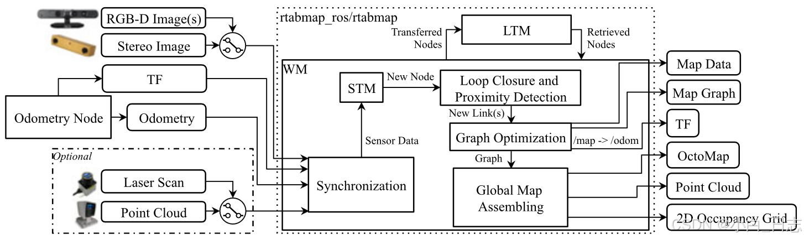  
代码主要过程：
RTABMap（闭环检测）主入口函数 [Rtabmap::process](./rtabmap/corelib/src/Rtabmap.cpp)
输入图像image及其id（header.seq）被封装到SensorData类,还有里程计的信息     

**内存更新(Memory::update)**
  - 创建签名(Memory::createSignature)
  - Add Signature To STM(Memory::addSignatureToStm)
  - Weight Update, Rehearsal(Memory::rehearsal)
  - Transfer the oldest signature from STM to WM(Memory::moveSignatureToWMFromSTM)

**贝叶斯滤波器更新**
  - 计算似然(Memory::computeLikelihood)
  - 调整似然(Rtabmap::adjustLikelihood)
  - 计算后验(BayesFilter::computePosterior)
  - 选择最高的闭环假设     

**RETRIEVAL（取出）**
  - Loop closure neighbors reactivation
  - Load signatures from the database, from LTM to WM(Memory::reactivateSignatures)
Update loop closure links: make neighbors of the loop closure in RAM
TRANSFER: move the oldest signature from STM to LTM   
算法主要流程：  
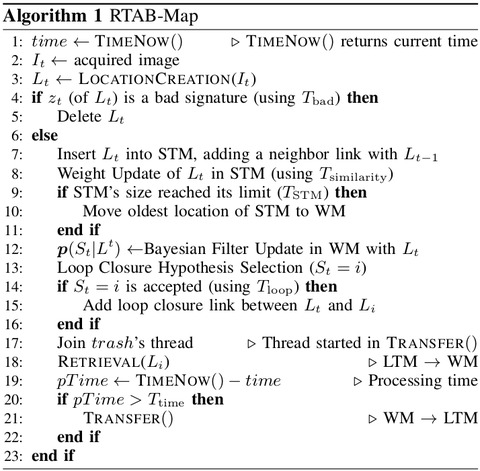    
内存管理模型：   
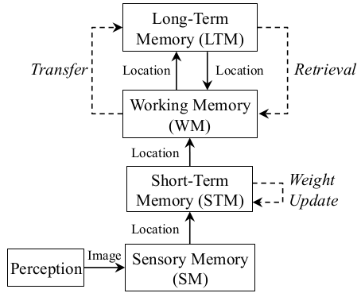    
回环检测（若不考虑内存管理）过程：     
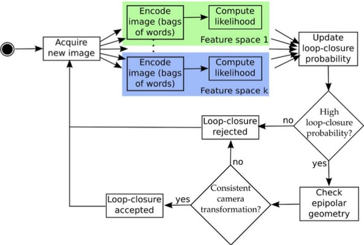      
## 内存更新    
内存更新的过程包括Memory Update : Location creation + Add to STM + Weight Update (Rehearsal排演)，在主函数入口[Rtabmap::process](./rtabmap/corelib/src/Rtabmap.cpp)中的_memory->update()代码段进行调用，定义在[Memory::update()](./rtabmap/corelib/src/Memory.cpp) 函数中。   
### 定位创建     
代码在 [Memory::createSignature](./rtabmap/corelib/src/Memory.cpp) 中，其主要过程为
#### 词典更新
词典更新定义在[VWDictionary::update](./rtabmap/corelib/src/VWDictionary.cpp) ，调用如下线程:
```C++ 
if(_parallelized && !isIntermediateNode)
{
    UDEBUG("Start dictionary update thread");
    preUpdateThread.start();
}
```
- 构建FLANN索引，根据描述子构建KDTree索引词典 (_flannIndex->buildKDTreeIndex(descriptor, KDTREE_SIZE, useDistanceL1_, _rebalancingFactor))，KDTree的创建基于分层k-mean聚类。
- 更新_dataTree，将词典的描述子加入_dataTree.push_back(w->getDescriptor());
#### 角点检测
角点(GFTT)检测调用代码为_feature2D->generateKeypoints，定义在[Feature2D::generateKeypoints](./rtabmap/corelib/src/Features2d.cpp)
均匀分布(gridRows_, gridCols_)，限制点数(maxFeatures_)，亚像素提取(cv::cornerSubPix)
```C++ 
// Get keypoints
int rowSize = globalRoi.height / gridRows_;
int colSize = globalRoi.width / gridCols_;
int maxFeatures =	maxFeatures_ / (gridRows_ * gridCols_);
for (int i = 0; i<gridRows_; ++i)
{
    for (int j = 0; j<gridCols_; ++j)
    {
        cv::Rect roi(globalRoi.x + j*colSize, globalRoi.y + i*rowSize, colSize, rowSize);
        std::vector<cv::KeyPoint> subKeypoints;
        //提取角点由配置文件决定，默认是GFTT，可以SURF ORB SIFT FAST，SUPERPOINT都可以的
        subKeypoints = this->generateKeypointsImpl(image, roi, mask);
        if (this->getType() != Feature2D::Type::kFeaturePyDetector)
        {
            limitKeypoints(subKeypoints, maxFeatures, roi.size(), this->getSSC());
        }
        if(roi.x || roi.y)
        {
            // Adjust keypoint position to raw image
            for(std::vector<cv::KeyPoint>::iterator iter=subKeypoints.begin(); iter!=subKeypoints.end(); ++iter)
            {
                iter->pt.x += roi.x;
                iter->pt.y += roi.y;
            }
        }
        keypoints.insert( keypoints.end(), subKeypoints.begin(), subKeypoints.end() );
    }
}
```
#### 计算描述子
 描述子(BRIEF)计算，调用在_feature2D->generateDescriptors(imageMono, keypoints)，函数定义在[Feature2D::generateDescriptors](./rtabmap/corelib/src/Features2d.cpp)
#### 描述子转词典
量化描述子转化为词典quantize descriptors to vocabulary函数调用在_vwd->addNewWords(descriptorsForQuantization, id)，函数定义在[VWDictionary::addNewWords](./rtabmap/corelib/src/VWDictionary.cpp)
描述子匹配(descriptors – dataTree)，调用函数_flannIndex->knnSearch(descriptors, results, dists, k, KNN_CHECKS);，并计算距离dists    
添加单词 或 参考+1
badDist=true（匹配数量特别少，或 NNDR(neareast neighbor distance ratio) 大于阈值_nndrRatio，然后创建VisualWord并添加到_visualWords  
badDist=false，VWDictionary::addWordRef，_references+1   
$$
NNDR = \frac{dist of the neareast neighbor}{dist of the second neareast neighbor}
$$   
```C++ 
if(_incrementalDictionary)
{
    bool badDist = false;
    if(fullResults.size() == 0)
    {
        badDist = true;
    }
    if(!badDist)
    {
        if(fullResults.size() >= 2)
        {
            // Apply NNDR
            if(fullResults.begin()->first > _nndrRatio * (++fullResults.begin())->first)
            {
                badDist = true; // Rejected
            }
        }
        else
        {
            badDist = true; // Rejected
        }
    }

    if(!badDist)
    {
        resultIds[i] = fullResults.begin()->second; // Accepted
    }

    if(badDist)
    {
        // use original descriptor
        //然后创建VisualWord并添加到_visualWords  
        VisualWord * vw = new VisualWord(getNextId(), descriptorsIn.row(i), signatureId);
        _visualWords.insert(_visualWords.end(), std::pair<int, VisualWord *>(vw->id(), vw));
        _notIndexedWords.insert(_notIndexedWords.end(), vw->id());
        newWords.push_back(descriptors.row(i));
        newWordsId.push_back(vw->id());
        wordIds.push_back(vw->id());
        UASSERT(vw->id()>0);
    }
    else
    {
        if(_notIndexedWords.find(fullResults.begin()->second) != _notIndexedWords.end())
        {
            ++dupWordsCountFromLast;
        }
        else
        {
            ++dupWordsCountFromDict;
        }
        //增加addWordRef
        this->addWordRef(fullResults.begin()->second, signatureId);
        wordIds.push_back(fullResults.begin()->second);
    }
}
```   
#### 创建签名
创建签名(new Signature)，函数定义在[Signature](./rtabmap/corelib/src/Signature.cpp)。主要是图像的提取的特征，匹配信息，词袋模型和里程计信息等

```C++ 
s = new Signature(id,
			_idMapCount,
			isIntermediateNode?-1:0, // tag intermediate nodes as weight=-1
			data.stamp(),
			"",
			pose,
			data.groundTruth(),
			!stereoCameraModels.empty()?
				SensorData(
						laserScan.angleIncrement() == 0.0f?
								LaserScan(compressedScan,
									laserScan.maxPoints(),
									laserScan.rangeMax(),
									laserScan.format(),
									laserScan.localTransform()):
								LaserScan(compressedScan,
									laserScan.format(),
									laserScan.rangeMin(),
									laserScan.rangeMax(),
									laserScan.angleMin(),
									laserScan.angleMax(),
									laserScan.angleIncrement(),
									laserScan.localTransform()),
						cv::Mat(),
						cv::Mat(),
						stereoCameraModels,
						id,
						0,
						compressedUserData):
				SensorData(
						laserScan.angleIncrement() == 0.0f?
								LaserScan(compressedScan,
									laserScan.maxPoints(),
									laserScan.rangeMax(),
									laserScan.format(),
									laserScan.localTransform()):
								LaserScan(compressedScan,
									laserScan.format(),
									laserScan.rangeMin(),
									laserScan.rangeMax(),
									laserScan.angleMin(),
									laserScan.angleMax(),
									laserScan.angleIncrement(),
									laserScan.localTransform()),
						cv::Mat(),
						cv::Mat(),
						cameraModels,
						id,
						0,
						compressedUserData));
```        
对单词简单理解如系：首先，假设我们对大量的图像提取了特征点，比如说有 N 个。现在，我们想找一个有 k 个单词的字典，每 个单词可以看作局部相邻特征点的集合，应该怎么做呢？这可以用经典的 K-means（K均值）算法解决。步骤如下：
随机选取k个中心点；
对每个样本计算他们与中心点的距离，取最小距离为归类；
重新计算每个类的中心点；
如果中心点的变化很小则算法收敛，退出；否则返回2     
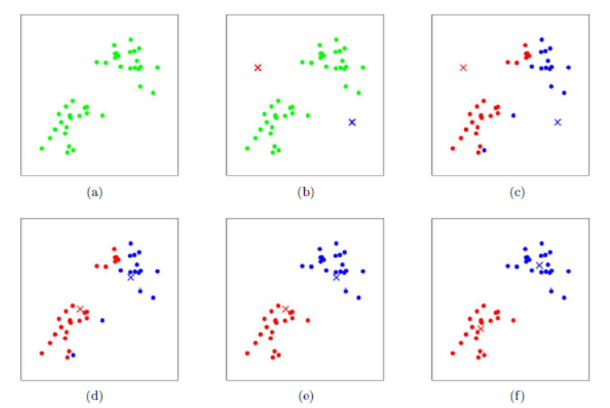 
根据 K-means，我们可以把已经提取的大量特征点聚类成一个含有k个单词的字典了。现在的问题，变为如何根据图像中某个特征点，查找字典中相应的单词？ 一般使用K叉树，步骤是：
在根节点，用k-means将所有样本聚成k类
对上层的每个父节点，把属于该节点的样本再次聚成k类，得到下一层。
以此类推，最后得到叶子层，也就是所谓的单词。
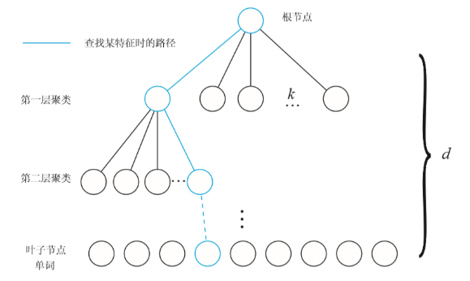 
### 添加签名到STM
调用的代码在[this->addSignatureToStm(signature, covariance)](./rtabmap/corelib/src/Memory.cpp),代码定义在 Memory::addSignatureToStm()中。   
更新neighbors，添加链接(signature->addLink),添加签名ID到_stMem  
### 更新权重   
函数调用在[this->rehearsal(signature, stats)](./rtabmap/corelib/src/Memory.cpp),代码主要在 Memory::rehearsal 中。   
#### 计算相似度
signature与STM中最新的签名比较，计算相似度(float sim = signature->compareTo(*sB))    
$$
similarity = \frac{pairs}{totalWords} 
$$ 
#### 更新权重
相似度 > 阈值_similarityThreshold，假设合并(Memory::rehearsalMerge)，更新权重(signature->setWeight)    
$$
\omega_A = \omega_A + \omega_B + 1
$$
```C++ 
if(sB)
{
    int id = sB->id();
    UDEBUG("Comparing with signature (%d)...", id);

    float sim = signature->compareTo(*sB);

    int merged = 0;
    if(sim >= _similarityThreshold)
    {
        if(_incrementalMemory)
        {
            //新旧签名合并
            if(this->rehearsalMerge(id, signature->id()))
            {
                merged = id;
            }
        }
        else
        {
            signature->setWeight(signature->getWeight() + 1 + sB->getWeight());
        }
    }

    if(stats) stats->addStatistic(Statistics::kMemoryRehearsal_merged(), merged);
    if(stats) stats->addStatistic(Statistics::kMemoryRehearsal_sim(), sim);
    if(stats) stats->addStatistic(Statistics::kMemoryRehearsal_id(), sim >= _similarityThreshold?id:0);
    UDEBUG("merged=%d, sim=%f t=%fs", merged, sim, timer.ticks());
}   
```     
### 签名转移 (STM->WM)    
将签名在短期内存转移到工作内存，Memory::moveSignatureToWMFromSTM:_workingMem.insert 和 _stMem.erase    
## 贝叶斯滤波更新   
**逆向索引表**对应着每个单词，记录着它出现在各个图像中的权重。比如，上图中 'Word 1' 在 'Image 68'、'Image 82' 等图像中出现了，在这两个图像中的权重分别是 0.79 和 0.73。 **DBoW2 以TF-IDF(Term Frequency - Inverse Document Frequency)的形式计算单词i出现在图像d中的权重(跟代码的还是有点区别)**:
$$
v_d^i = \frac{n_d^i}{n_d} \log {\frac{N}{N^i}}
$$
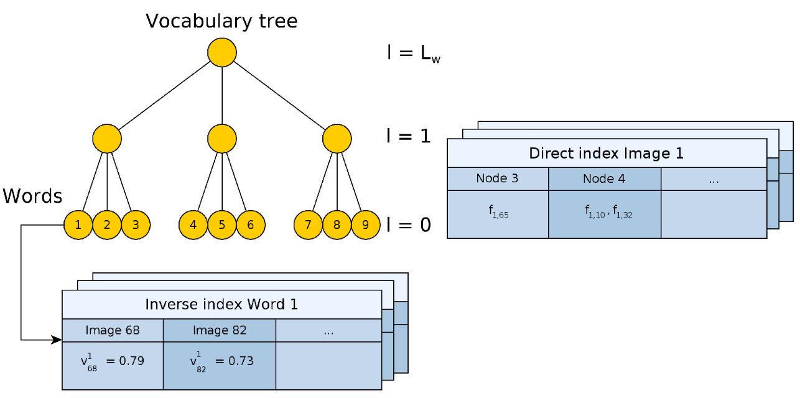         
其中，$n_d$表示图像d中特征点数量，$n^i_d$则是图像d中单词i出现的次数，$\frac{n_d^i}{n_d}$就是所谓的 TF(Term Frequency) 表示单词i出现的频率。 N为离线训练字典文件时所用的特征点数量，$N_i$是训练时单词i的数量，$\log {\frac{N}{N^i}}$是 IDF(Inverse Document Frequency)。IDF 的逻辑在于， 如果某个单词出现在字典中的频率越低，其辨识度就越高，权重应该更大。     
1、逆序索引单词涵盖了所有出现的单词
2、每一个单词指向包含它的一系列图像
3、采用投票机制选取候选者，加速搜索
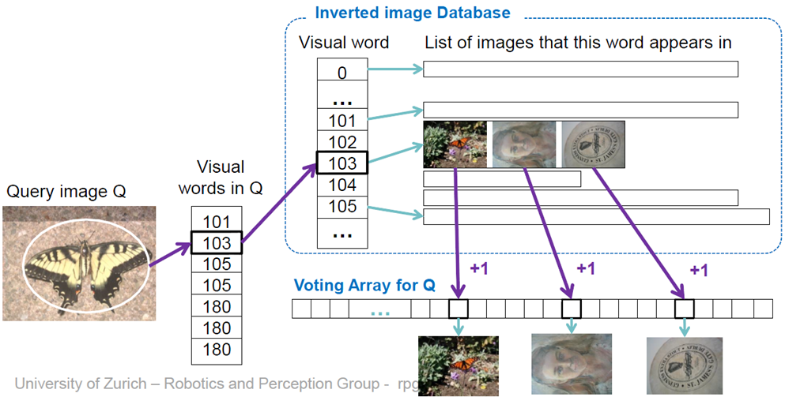    
**正向索引表**对应着每个图像，记录着它所包含的词汇树中的各级节点。对于图像d，计算出它的各个特征点，然后根据 Hamming 距离从词汇树的根节点到叶子节点， 将所有特征点的 BRIEF 描述子逐级遍历一遍，得到图像的特征向量$\boldsymbol{v_d} \in \mathbb{R}^W$。正向索引表记录了遍历到的各个节点计数，描述了***图像的特征***。 它可以用于加速特征匹配，前面提到的 SearchByBoW() 就是利用了这个数据结构，压缩了搜索空间。      
### 计算似然
计算似然（权重）(Memory::computeLikelihood)，得到 rawLikelihood
```C++ 
float nwi; // nwi 表示一个地点引用的某个特定单词的次数
float ni;  // ni 表示一个地点引用的所有单词的总数
float nw;  // nw 表示引用某个特定单词的地点数量
float N;   // N 表示数据集中地点的总数

float logNnw; // 用于计算 IDF（逆文档频率）的对数项
const VisualWord * vw; // 指向视觉词典中某个单词的指针

// 获取数据集中地点的总数（签名数量）
N = this->getSignatures().size();

// 检查数据集中是否存在地点
if(N)
{
    UDEBUG("processing... "); // 调试信息，指示处理开始
    
    // 遍历 SURF 签名中的每个单词 ID
    for(std::list<int>::const_iterator i=wordIds.begin(); i!=wordIds.end(); ++i)
    {
        // 只处理有效的单词 ID（大于 0）
        if(*i>0)
        {
            // 获取当前单词 ID 对应的 VisualWord 对象（倒排索引）
            vw = _vwd->getWord(*i);
            // 断言单词在词典中存在，如果不存在则显示错误信息
            UASSERT_MSG(vw!=0, uFormat("Word %d not found in dictionary!?", *i).c_str());

            // 获取该单词的引用（地点 ID 及其单词计数）
            const std::map<int, int> & refs = vw->getReferences();
            nw = refs.size(); // 该单词出现的地点数量
            
            // 如果该单词至少在一个地点中被引用
            if(nw)
            {
                // 计算 IDF：log(N/nw)，其中 N/nw 是单词在地点中的逆频率
                logNnw = log10(N/nw);
                
                // 仅当 IDF 非零时继续（避免除以零或无意义的值）
                if(logNnw)
                {
                    // 遍历引用该单词的每个地点
                    for(std::map<int, int>::const_iterator j=refs.begin(); j!=refs.end(); ++j)
                    {
                        // 查找该地点的 likelihood 条目
                        std::map<int, float>::iterator iter = likelihood.find(j->first);
                        if(iter != likelihood.end()) // 确保地点存在于 likelihood 映射中
                        {
                            nwi = j->second; // 获取该地点中该单词的出现次数
                            ni = this->getNi(j->first); // 获取该地点中的单词总数
                            
                            // 如果该地点的单词总数非零
                            if(ni != 0)
                            {
                                // TF-IDF 计算：(nwi * logNnw) / ni
                                // nwi/ni = 词频 (TF)
                                // logNnw = 逆文档频率 (IDF)
                                // 将计算结果累加到该地点的 likelihood 值(似然值)
                                iter->second += ( nwi  * logNnw ) / ni;
                                // 调试输出（已注释）用于显示单词 ID 和 TF-IDF 组件
                                //UDEBUG("%d, %f %f %f %f", vw->id(), logNnw, nwi, ni, ( nwi  * logNnw ) / ni);
                            }
                        }
                    }
                }
            }
        }
    }
}
```  
### 调整似然
调整似然[Rtabmap::adjustLikelihood](./rtabmap/corelib/src/Rtabmap.cpp) $v_d^i$，得到 likelihood，依据 似然均值$\mu$和 似然标准差$\sigma$ 。
$$
likelihood =
\begin{cases}
\frac{v_d^i-\mu}{\sigma}& v_d^i>=\mu + \sigma\\
max&  v_d^i >max
\end{cases}
$$            
```C++ 
// Adjust the likelihood (with mean and std dev)
likelihood = rawLikelihood;
this->adjustLikelihood(likelihood);

float mean = uMean(values);
	float stdDev = std::sqrt(uVariance(values, mean));


//Adjust likelihood with mean and standard deviation (see Angeli phd)
float epsilon = 0.0001;
float max = 0.0f;
int maxId = 0;
for(std::map<int, float>::iterator iter=++likelihood.begin(); iter!= likelihood.end(); ++iter)
{
    float value = iter->second;
    iter->second = 1.0f;
    if(value > mean+stdDev)
    {
        if(_virtualPlaceLikelihoodRatio==0 && mean)
        {
            iter->second = (value-(stdDev-epsilon))/mean;
        }
        else if(_virtualPlaceLikelihoodRatio!=0 && stdDev)
        {
            iter->second = (value-mean)/stdDev;
        }
    }

    if(value > max)
    {
        max = value;
        maxId = iter->first;
    }
}
```
### 计算后验
计算后验[_bayesFilter->computePosterior](./rtabmap/corelib/src/Rtabmap.cpp)，函数定义在[BayesFilter::computePosterior](./rtabmap/corelib/src/BayesFilter.cpp)，得到 posterior。 

```C++ 
//============================================================
// Apply the Bayes filter
//  Posterior = Likelihood x Prior
//============================================================
ULOGGER_INFO("getting posterior...");

// Compute the posterior
posterior = _bayesFilter->computePosterior(_memory, likelihood);
timePosteriorCalculation = timer.ticks();
ULOGGER_INFO("timePosteriorCalculation=%fs",timePosteriorCalculation);   

//计算后验
const std::map<int, float> & BayesFilter::computePosterior(const Memory * memory, const std::map<int, float> & likelihood)
{
	ULOGGER_DEBUG("");

	if(!memory)
	{
		ULOGGER_ERROR("Memory is Null!");
		return _posterior;
	}

	if(!likelihood.size())
	{
		ULOGGER_ERROR("likelihood is empty!");
		return _posterior;
	}

	if(_predictionLC.size() < 2)
	{
		ULOGGER_ERROR("Prediction is not valid!");
		return _posterior;
	}

	UTimer timer;
	timer.start();

	cv::Mat prior;
	cv::Mat posterior;

	float sum = 0;
	int j=0;
	// Recursive Bayes estimation...
	// STEP 1 - Prediction : Prior*lastPosterior
    //预测(Prediction : Prior*lastPosterior)得到_prediction
	_prediction = this->generatePrediction(memory, uKeys(likelihood));

	UDEBUG("STEP1-generate prior=%fs, rows=%d, cols=%d", timer.ticks(), _prediction.rows, _prediction.cols);
	//std::cout << "Prediction=" << _prediction << std::endl;

	// Adjust the last posterior if some images were
	// reactivated or removed from the working memory
    //更新后验(BayesFilter::updatePosterior)
	posterior = cv::Mat(likelihood.size(), 1, CV_32FC1);
	this->updatePosterior(memory, uKeys(likelihood));
	j=0;
	for(std::map<int, float>::const_iterator i=_posterior.begin(); i!= _posterior.end(); ++i)
	{
		((float*)posterior.data)[j++] = (*i).second;
	}
	ULOGGER_DEBUG("STEP1-update posterior=%fs, posterior=%d, _posterior size=%d", posterior.rows, _posterior.size());
	//std::cout << "LastPosterior=" << posterior << std::endl;

	// Multiply prediction matrix with the last posterior
	// (m,m) X (m,1) = (m,1)
    //计算先验(prior = _prediction * posterior)
	prior = _prediction * posterior;
	ULOGGER_DEBUG("STEP1-matrix mult time=%fs", timer.ticks());
	//std::cout << "ResultingPrior=" << prior << std::endl;

	ULOGGER_DEBUG("STEP1-matrix mult time=%fs", timer.ticks());
	std::vector<float> likelihoodValues = uValues(likelihood);
	//std::cout << "Likelihood=" << cv::Mat(likelihoodValues) << std::endl;

	// STEP 2 - Update : Multiply with observations (likelihood)
	j=0;
	for(std::map<int, float>::const_iterator i=likelihood.begin(); i!= likelihood.end(); ++i)
	{
		std::map<int, float>::iterator p =_posterior.find((*i).first);
		if(p!= _posterior.end())
		{
			//posterior=likelihood×prior
            (*p).second = (*i).second * ((float*)prior.data)[j++];
			sum+=(*p).second;
		}
		else
		{
			ULOGGER_ERROR("Problem1! can't find id=%d", (*i).first);
		}
	}
	ULOGGER_DEBUG("STEP2-likelihood time=%fs", timer.ticks());
	//std::cout << "Posterior (before normalization)=" << _posterior << std::endl;

	// Normalize后验归一化
	ULOGGER_DEBUG("sum=%f", sum);
	if(sum != 0)
	{
		for(std::map<int, float>::iterator i=_posterior.begin(); i!= _posterior.end(); ++i)
		{
			(*i).second /= sum;
		}
	}
	ULOGGER_DEBUG("normalize time=%fs", timer.ticks());
	//std::cout << "Posterior=" << _posterior << std::endl;

	return _posterior;
}
```     
## 回环假设选择      
RTAB-Map用离散贝叶斯过滤器来估计形成闭环的概率，将新的定位点与存储在WM中的定位点进行比较。当发现新旧定位点之间有高概率形成闭环时，一个闭环就被检测到了，新旧定位点也就被链接在一起。有两个关键个步骤，一个是“取回”:对于具有形成闭环概率最高的那个定位点，将它的那些没有在WM中的领接定位点，重新从LTM中取出放回到WM中。第二个步骤叫做“转移”:当闭环检测的处理时间超过阀值,具有最低权重的定位点中，存储时间最长的将被转移到LTM中，被转移的定位点的数量取决于当前依赖循环中的WM存储的定位点的数量。    

根据后验posterior，选择最高的假设_highestHypothesis   
```C++ 
//============================================================
// Select the highest hypothesis
//============================================================
ULOGGER_INFO("creating hypotheses...");
if(posterior.size())
{
    for(std::map<int, float>::const_reverse_iterator iter = posterior.rbegin(); iter != posterior.rend(); ++iter)
    {
        if(iter->first > 0 && iter->second > _highestHypothesis.second)
        {
            _highestHypothesis = *iter;
        }
    }
    // With the virtual place, use sum of LC probabilities (1 - virtual place hypothesis).
    _highestHypothesis.second = 1-posterior.begin()->second;
}
```
接受回环，条件如下：  
```C++ 
// Loop closure Threshold
if(_highestHypothesis.second >= loopThr)
{
    rejectedGlobalLoopClosure = true;
    if(posterior.size() <= 2 && loopThr>0.0f)
    {
        // Ignore loop closure if there is only one loop closure hypothesis
        UDEBUG("rejected hypothesis: single hypothesis");
    }
    //对极几何 检查(_epipolarGeometry->check)：1、单词匹配对数量(EpipolarGeometry::findPairsUnique) > _matchCountMinAccepted
    //2、对极约束内点数(EpipolarGeometry::findFFromWords) > _matchCountMinAccepted
    else if(_verifyLoopClosureHypothesis && !_epipolarGeometry->check(signature, _memory->getSignature(_highestHypothesis.first)))
    {
        UWARN("rejected hypothesis: by epipolar geometry");
    }
    else if(_loopRatio > 0.0f && lastHighestHypothesis.second && _highestHypothesis.second < _loopRatio*lastHighestHypothesis.second)
    {
        UWARN("rejected hypothesis: not satisfying hypothesis ratio (%f < %f * %f)",
                _highestHypothesis.second, _loopRatio, lastHighestHypothesis.second);
    }
    else if(_loopRatio > 0.0f && lastHighestHypothesis.second == 0)
    {
        UWARN("rejected hypothesis: last closure hypothesis is null (loop ratio is on)");
    }
    else
    {
        _loopClosureHypothesis = _highestHypothesis;
        rejectedGlobalLoopClosure = false;
    }

    timeHypothesesValidation = timer.ticks();
    ULOGGER_INFO("timeHypothesesValidation=%fs",timeHypothesesValidation);
}
```   
## 取回 Retrieval (LTM->WM)
对于形成回环概率最高的定位点，将他那些没有在WM中的邻接定位点，从LTM中取回放入到WM中。    
##  转移 Transfer (STM->LTM)  
具有最低权重的定位点中，存储时间最长的将被转移到LTM（数据库SQLite）中。

# 安装与运行
## 安装
由于存在软件冲突，最好在docker镜像中运行，先安装docker（推荐fishros），如果需要显示，安装NVIDIA Container Toolkit，这个需要离线安装，参考文档[Ubuntu 22.04离线安装Docker和NVIDIA Container Toolkit](https://zhuanlan.zhihu.com/p/15194336245),离线[安装包](https://github.com/NVIDIA/libnvidia-container/tree/gh-pages/stable/deb/amd64)目前安装版本是1.17.4-1。
## 运行
### ubuntu22.04运行ros2的rtabmap
输入命令用于显示
```shell
XAUTH=/tmp/.docker.xauth
touch $XAUTH
xauth nlist $DISPLAY | sed -e 's/^..../ffff/' | xauth -f $XAUTH nmerge -
```

运行rtabmap的docker程序（在镜像里运行），需要修改源码地址比如 -v /media/ahpc/Home1/rtabmap2_ros/src:/root/ros2_ws/src 
```shell
docker run -dit \
  --privileged \
  -e DISPLAY=$DISPLAY \
  -e QT_X11_NO_MITSHM=1 \
  -e NVIDIA_VISIBLE_DEVICES=all \
  -e NVIDIA_DRIVER_CAPABILITIES=all \
  -e XAUTHORITY=$XAUTH \
  --gpus=all \
  --network host \
  -v $XAUTH:$XAUTH \
  -v /tmp/.X11-unix:/tmp/.X11-unix \
  -v /media/ahpc/Home1/rtabmap2_ros/src:/root/ros2_ws/src \
  introlab3it/rtabmap:22.04 \
  /bin/bash 
```   
进入目录/root/ros2_ws
source /opt/ros/humble/setup.bash
sudo apt update
rosdep install -r --from-paths src --ignore-src --rosdistro humble -y(补全依赖)
sudo apt install ros-humble-imu-complementary-filter
sudo apt install ros-humble-image-proc
编译(不需要编译文件夹加**COLCON_IGNORE**文件)
colcon build --packages-select rtabmap --symlink-install --cmake-args -DWITH_TORCH=ON
colcon build --parallel-workers 2 --symlink-install --cmake-args -DRTABMAP_SYNC_MULTI_RGBD=ON -DRTABMAP_SYNC_USER_DATA=ON 
编译完成在容器内终端启动命令：
source install/setup.bash
ros2 launch rtabmap_examples euroc_datasets.launch.py gt:=true
在容器内开另外一个终端启动命令
ros2 bag play MH_01_easy/MH_01_easy.db3
ros2 bag play V1_01_easy/V1_01_easy.db3(存在回环，如下图)
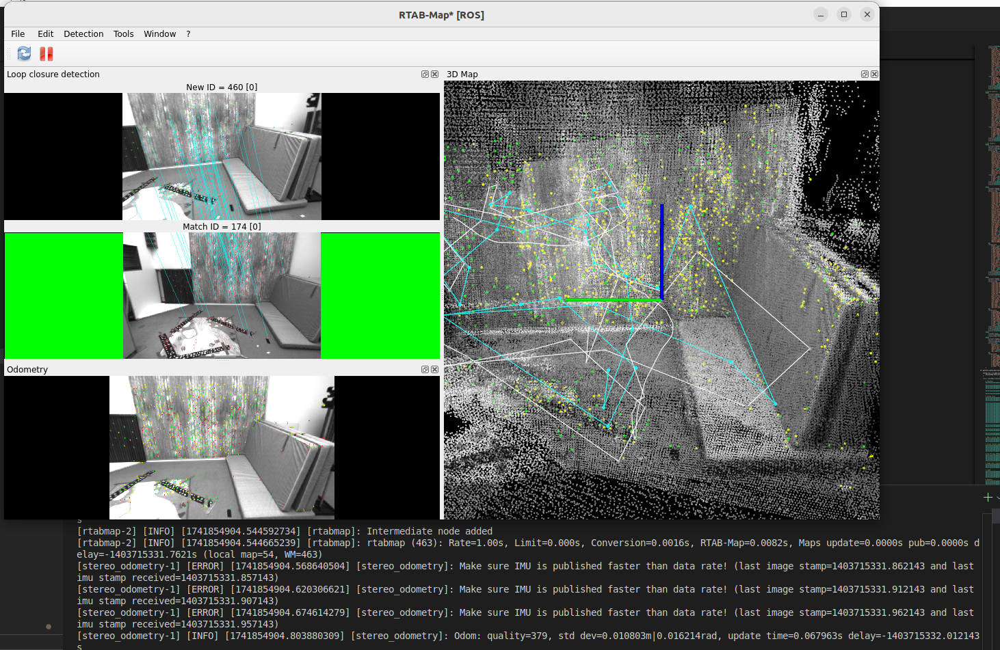


### 解决容器无法显示问题
xhost +local:docker

### gpu运行superpoint(ros1)
docker run -dit \
  --privileged \
  -e DISPLAY=$DISPLAY \
  -e QT_X11_NO_MITSHM=1 \
  -e NVIDIA_VISIBLE_DEVICES=all \
  -e NVIDIA_DRIVER_CAPABILITIES=all \
  -e XAUTHORITY=$XAUTH \
  --gpus=all --ipc=host --ulimit memlock=-1 --ulimit stack=67108864 \
  --network host \
  -v $XAUTH:$XAUTH \
  -v /tmp/.X11-unix:/tmp/.X11-unix \
  -v /media/ahpc/Home1/catkin_ws/src:/workspace/catkin_rtabmap/src \
  marimo117/rtabmap_noetic \
  /bin/bash

1. 进入rtabmap目录/workspace/catkin_rtabmap/src/rtabmap/build，然后进行cmake预编译
cmake -DTorch_DIR=/opt/conda/lib/python3.8/site-packages/torch/share/cmake/Torch -DWITH_TORCH=ON -DWITH_PYTHON=ON -DWITH_QT=ON ..
2. 再用make进行编译
3. 进入目录 ,输入命令进行编译ros程序
catkin_make -DPYTHON_EXECUTABLE=/usr/bin/python3 -DRTABMap_DIR=/workspace/catkin_rtabmap/src/rtabmap/build
4. 打开容器另外一个终端输入播放ros包程序rosbag play demo_mapping.bag 
5. 运行程序
```shell   
roslaunch rtabmap_demos superpoint_robot_mapping.launch args:="--delete_db_on_start  \
--SuperPoint/ModelPath /workspace/catkin_rtabmap/src/rtabmap/archive/2022-IlluminationInvariant/scripts/superpoint_v1.pt \
--SuperGlue/Path /workspace/catkin_rtabmap/src/rtabmap/archive/2022-IlluminationInvariant/scripts/SuperGluePretrainedNetwork/rtabmap_superglue.py \
--Reg/RepeatOnce false \
--Vis/CorGuessWinSize 0 \
--Kp/DetectorStrategy 11 \
--Vis/FeatureType 11 \
--Mem/UseOdomFeatures false \
--Vis/CorNNType 6"
```     
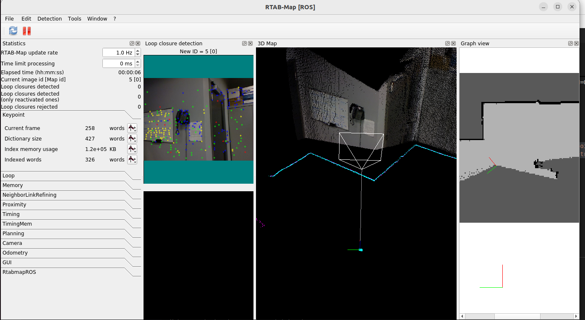


 


