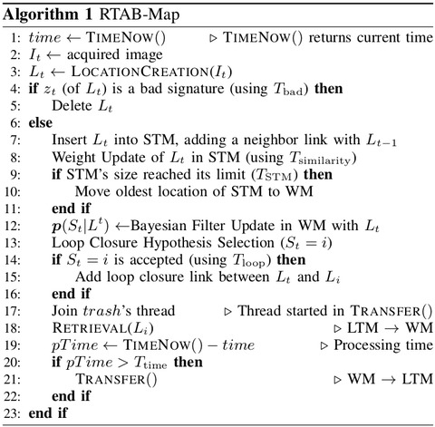
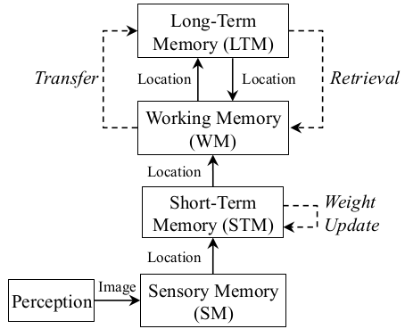
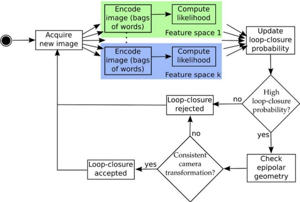
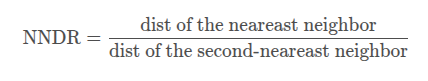

# <center> 视觉slam学习笔记 </center>
# RTABMAP    
Real‐Time Appearance‐Based Mapping (RTAB‐Map)是一种基于外观的闭环检测方法，具有良好的内存管理，以满足处理大场景和在线长周期管理要求。RTAB‐Map集成了视觉和激光雷达SLAM方案，并支持目前绝大多数的传感器,主要特点：
1. 基于外观（Appearance-Based），通过图像相似度查找回环
2. 贝叶斯滤波算法，估计回环的概率
3. 增量式在线构建视觉词典或词袋，针对一个特定环境不需要预训练过程
4. 内存管理模型，保证实时在线运行    
代码主要过程：
RTABMap（闭环检测）主入口函数 [Rtabmap::process](./rtabmap/corelib/src/Rtabmap.cpp)
输入图像image及其id（header.seq）被封装到SensorData类,还有里程计的信息
内存更新(Memory::update)
1. 创建签名(Memory::createSignature)
2. Add Signature To STM(Memory::addSignatureToStm)
3. Weight Update, Rehearsal(Memory::rehearsal)
4. Transfer the oldest signature from STM to WM(Memory::moveSignatureToWMFromSTM)
贝叶斯滤波器更新
1. 计算似然(Memory::computeLikelihood)
2. 调整似然(Rtabmap::adjustLikelihood)
3. 计算后验(BayesFilter::computePosterior)
4. 选择最高的闭环假设
RETRIEVAL（取出）
1. Loop closure neighbors reactivation
2. Load signatures from the database, from LTM to WM(Memory::reactivateSignatures)
Update loop closure links: make neighbors of the loop closure in RAM
TRANSFER: move the oldest signature from STM to LTM   
算法主要流程：  
    
内存管理模型：   
    
回环检测（若不考虑内存管理）过程：     
      
## 内存更新    
内存更新的过程包括Memory Update : Location creation + Add to STM + Weight Update (Rehearsal排演)，在主函数入口[Rtabmap::process](./rtabmap/corelib/src/Rtabmap.cpp)中的_memory->update()代码段进行调用，定义在[Memory::update()](./rtabmap/corelib/src/Memory.cpp) 函数中。
### 创建签名     
代码在 [Memory::createSignature](./rtabmap/corelib/src/Memory.cpp) 中，其主要过程为
1. 词典更新定义在[VWDictionary::update](./rtabmap/corelib/src/VWDictionary.cpp) ，调用如下线程:
    ```C++ 
   	if(_parallelized && !isIntermediateNode)
	{
		UDEBUG("Start dictionary update thread");
		preUpdateThread.start();
	}
    ```
   1. 构建FLANN索引，根据描述子构建KDTree索引词典 (_flannIndex->buildKDTreeIndex(descriptor, KDTREE_SIZE, useDistanceL1_, _rebalancingFactor))，KDTree的创建基于分层k-mean聚类。
   2. 更新_dataTree，将词典的描述子加入_dataTree.push_back(w->getDescriptor());
2. 角点(GFTT)检测调用代码为_feature2D->generateKeypoints，定义在[Feature2D::generateKeypoints](./rtabmap/corelib/src/Features2d.cpp)
   均匀分布(gridRows_, gridCols_)，限制点数(maxFeatures_)，亚像素提取(cv::cornerSubPix)
   ```C++ 
   	// Get keypoints
	int rowSize = globalRoi.height / gridRows_;
	int colSize = globalRoi.width / gridCols_;
	int maxFeatures =	maxFeatures_ / (gridRows_ * gridCols_);
	for (int i = 0; i<gridRows_; ++i)
	{
		for (int j = 0; j<gridCols_; ++j)
		{
			cv::Rect roi(globalRoi.x + j*colSize, globalRoi.y + i*rowSize, colSize, rowSize);
			std::vector<cv::KeyPoint> subKeypoints;
            //提取角点由配置文件决定，可以SURF ORB SIFT FAST都可以的
			subKeypoints = this->generateKeypointsImpl(image, roi, mask);
			if (this->getType() != Feature2D::Type::kFeaturePyDetector)
			{
				limitKeypoints(subKeypoints, maxFeatures, roi.size(), this->getSSC());
			}
			if(roi.x || roi.y)
			{
				// Adjust keypoint position to raw image
				for(std::vector<cv::KeyPoint>::iterator iter=subKeypoints.begin(); iter!=subKeypoints.end(); ++iter)
				{
					iter->pt.x += roi.x;
					iter->pt.y += roi.y;
				}
			}
			keypoints.insert( keypoints.end(), subKeypoints.begin(), subKeypoints.end() );
		}
	}
   ```
3. 描述子(BRIEF)计算，调用在_feature2D->generateDescriptors(imageMono, keypoints)，函数定义在[Feature2D::generateDescriptors](./rtabmap/corelib/src/Features2d.cpp)
4. 量化描述子转化为词典quantize descriptors to vocabulary函数调用在_vwd->addNewWords(descriptorsForQuantization, id)，函数定义在[VWDictionary::addNewWords](./rtabmap/corelib/src/VWDictionary.cpp)
描述子匹配(descriptors – dataTree)，调用函数_flannIndex->knnSearch(descriptors, results, dists, k, KNN_CHECKS);，并计算距离dists    
添加单词 或 参考+1
badDist=true（匹配数量特别少，或 NNDR(neareast neighbor distance ratio) 大于阈值_nndrRatio，然后创建VisualWord并添加到_visualWords      
 
```C++ 
if(_incrementalDictionary)
{
    bool badDist = false;
    if(fullResults.size() == 0)
    {
        badDist = true;
    }
    if(!badDist)
    {
        if(fullResults.size() >= 2)
        {
            // Apply NNDR
            if(fullResults.begin()->first > _nndrRatio * (++fullResults.begin())->first)
            {
                badDist = true; // Rejected
            }
        }
        else
        {
            badDist = true; // Rejected
        }
    }

    if(!badDist)
    {
        resultIds[i] = fullResults.begin()->second; // Accepted
    }
}
```   

5. 创建签名(new Signature)，函数定义在[Signature](./rtabmap/corelib/src/Signature.cpp)。

```C++ 
s = new Signature(id,
			_idMapCount,
			isIntermediateNode?-1:0, // tag intermediate nodes as weight=-1
			data.stamp(),
			"",
			pose,
			data.groundTruth(),
			!stereoCameraModels.empty()?
				SensorData(
						laserScan.angleIncrement() == 0.0f?
								LaserScan(compressedScan,
									laserScan.maxPoints(),
									laserScan.rangeMax(),
									laserScan.format(),
									laserScan.localTransform()):
								LaserScan(compressedScan,
									laserScan.format(),
									laserScan.rangeMin(),
									laserScan.rangeMax(),
									laserScan.angleMin(),
									laserScan.angleMax(),
									laserScan.angleIncrement(),
									laserScan.localTransform()),
						cv::Mat(),
						cv::Mat(),
						stereoCameraModels,
						id,
						0,
						compressedUserData):
				SensorData(
						laserScan.angleIncrement() == 0.0f?
								LaserScan(compressedScan,
									laserScan.maxPoints(),
									laserScan.rangeMax(),
									laserScan.format(),
									laserScan.localTransform()):
								LaserScan(compressedScan,
									laserScan.format(),
									laserScan.rangeMin(),
									laserScan.rangeMax(),
									laserScan.angleMin(),
									laserScan.angleMax(),
									laserScan.angleIncrement(),
									laserScan.localTransform()),
						cv::Mat(),
						cv::Mat(),
						cameraModels,
						id,
						0,
						compressedUserData));
```