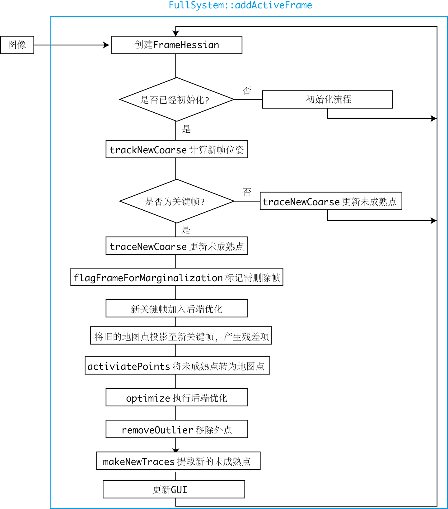
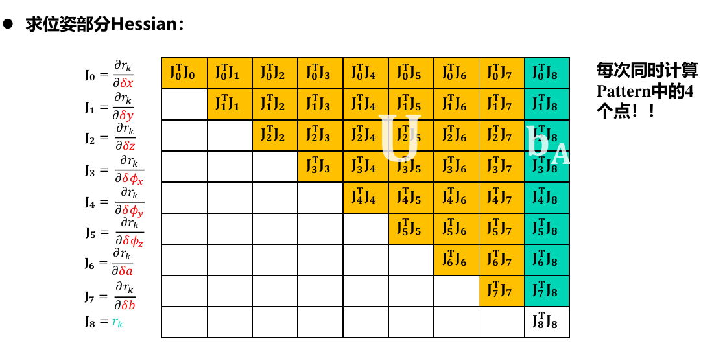
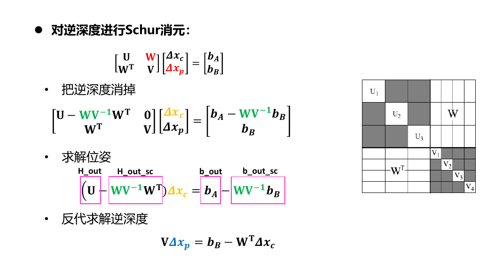
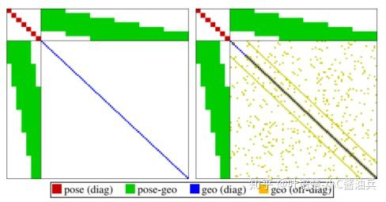

# <center> DSO notebook </center>    
- [ DSO notebook ](#-dso-notebook-)
  - [简介](#简介)
    - [直接法与间接法区别](#直接法与间接法区别)
    - [DSO的核心思想](#dso的核心思想)
  - [代码框架](#代码框架)
    - [整体介绍](#整体介绍)
    - [代码流程](#代码流程)
  - [直接法光度误差导数推导](#直接法光度误差导数推导)
    - [光度仿射变换](#光度仿射变换)
    - [光度误差](#光度误差)
    - [光度仿射变换导数](#光度仿射变换导数)
    - [CoarseInitializer::calcResAndGS代码中变量的含义](#coarseinitializercalcresandgs代码中变量的含义)
  - [边缘化(舒儿补)](#边缘化舒儿补)
  - [零空间](#零空间)
  - [FEJ](#fej)

## 简介  
DSO（Direct Sparse Odometry）是一种基于直接法和稀疏特征的视觉里程计（Visual Odometry, VO）方法，主要用于估计相机的运动轨迹。与传统的基于特征点的方法（如ORB-SLAM）不同，DSO直接利用图像像素的亮度信息进行运动估计，而不是依赖特征点的提取和匹配。 
DSO是少数使用纯直接法（Fully direct）计算视觉里程计的系统之一。相比之下，SVO[2]属于半直接法，仅在前端的Sparse model-based Image Alignment部分使用了直接法，之后的位姿估计、bundle adjustment，则仍旧使用传统的最小化重投影误差的方式。
     
### 直接法与间接法区别
直接法相比于特征点法，有两个非常不同的地方：   
- 特征点法通过最小化重投影误差来计算相机位姿与地图点的位置，而直接法则最小化[光度误差](#光度误差)（photometric error）。所谓光度误差是说，最小化的目标函数，通常由图像之间的光度误差来决定，而非重投影之后的几何误差。
- 直接法将数据关联（data association）与位姿估计（pose estimation）放在了一个统一的非线性优化问题中，而特征点法则分步求解，即，先通过匹配特征点求出数据之间关联，再根据关联来估计位姿。这两步通常是独立的，在第二步中，可以通过重投影误差来判断数据关联中的外点，也可以用于修正匹配结果

### DSO的核心思想
直接法：DSO通过最小化图像像素的亮度误差来估计相机的运动，而不是通过特征点的匹配。它直接利用图像中的像素信息，避免了特征提取和匹配的步骤。
稀疏性：DSO只选择图像中的一部分像素点（**通常是梯度较大的区域**）进行优化，而不是使用所有像素。这使得算法在保持较高精度的同时，计算效率较高。
光度标定：DSO考虑了相机的光度响应函数，能够处理不同光照条件下的图像亮度变化，从而提高鲁棒性。
联合优化：DSO同时对相机的位姿、地图点的深度以及光度参数进行优化，形成一个全局的优化问题。
DSO的缺点
对初始化敏感：DSO需要一个较好的初始位姿估计，否则容易陷入局部最优。
对纹理要求高：在纹理较少的场景中（如白墙、天空等），DSO的性能会下降，因为缺乏足够的梯度信息。
计算复杂度：虽然DSO是稀疏的，但在高分辨率图像上，计算量仍然较大，太耗时，所以项目上不用。  
## 代码框架   
DSO整体代码由四个部分组成：系统与各算法集成于src/FullSystem，后端优化位于src/OptimizationBackend，这二者组成了DSO大部分核心内容。src/utils和src/IOWrapper为一些去畸变、数据集读写和可视化UI代码。先来看核心部分的FullSystem和OptimizationBackend。也可以参考这篇博客[DSO-1-系统框架与初始化](http://epsilonjohn.club/2020/03/16/SLAM%E4%BB%A3%E7%A0%81%E8%AF%BE%E7%A8%8B/DSO/DSO-1-%E7%B3%BB%E7%BB%9F%E6%A1%86%E6%9E%B6%E4%B8%8E%E5%88%9D%E5%A7%8B%E5%8C%96/#%E5%88%9D%E5%A7%8B%E5%8C%96%E6%B5%81%E7%A8%8B%E6%80%BB%E7%BB%93)。
### 整体介绍   
 
如上图上半部分所示，在FullSystem里，DSO致力于维护一个滑动窗口内部的关键帧序列。每个帧的数据存储于FrameHessian结构体中，FrameHessian即是一个带着状态变量与Hessian信息的帧。然后，每个帧亦携带一些地图点的信息，包括：
1. pointHessians是所有活跃点的信息。所谓活跃点，是指它们在相机的视野中，其残差项仍在参与优化部分的计算；
2. pointHessiansMarginalized是已经边缘化的地图点。
3. pointHessiansOut是被判为外点（outlier）的地图点。
4. 以及immaturePoints为未成熟地图点的信息。       

在单目SLAM中，所有地图点在一开始被观测到时，都只有一个2D的像素坐标，其深度是未知的。这种点在DSO中称为未成熟的地图点：Immature Points。随着相机的运动，DSO会在每张图像上追踪这些未成熟的地图点，这个过程称为trace——实际上是一个沿着极线搜索的过程，十分类似于svo的depth filter。Trace的过程会确定每个Immature Point的逆深度和它的变化范围。如果Immature Point的深度（实际中为深度的倒数，即逆深度）在这个过程中收敛，那么我们就可以确定这个未成熟地图点的三维坐标，形成了一个正常的地图点。具有三维坐标的地图点，在DSO中称为PointHessian。与FrameHessian相对，PointHessian亦记录了这个点的三维坐标，以及Hessian信息。  
### 代码流程  
对于非关键帧，DSO仅计算它的位姿，并用该帧图像更新每个未成熟点的深度估计；后端仅处理关键帧部分的优化。除去一些内存维护操作，对每个关键帧主要做的处理有：增加新的残差项、去除错误的残差项、提取新未成熟点。整个流程在一个线程内，但内部可能有多线程的操作。  
    
在主函数中有函数[fullSystem->addActiveFrame(img, i)](../dso/src/main_dso_pangolin.cpp)将插入一帧图像和序号，此函数的定义[FullSystem::addActiveFrame](../dso/src/FullSystem/FullSystem.cpp)， 函数开头创建FrameHession。
```C++ 
	// =========================== add into allFrameHistory =========================
	FrameHessian* fh = new FrameHessian();
	FrameShell* shell = new FrameShell();
	shell->camToWorld = SE3(); 		// no lock required, as fh is not used anywhere yet.
	shell->aff_g2l = AffLight(0,0);
    shell->marginalizedAt = shell->id = allFrameHistory.size();
    shell->timestamp = image->timestamp;
    shell->incoming_id = id;
	fh->shell = shell;
	allFrameHistory.push_back(shell);  
```
如果是第一帧则需要进行初始化
```C++ 
if(!initialized)
{
    // use initializer!
    //它在影像的每一层选取点，作为后续第二帧匹配生成 pointHessians 和 immaturePoints 的候选点
    if(coarseInitializer->frameID<0)	// first frame set. fh is kept by coarseInitializer.
    {

        coarseInitializer->setFirst(&Hcalib, fh);
    }
    
    else if(coarseInitializer->trackFrame(fh, outputWrapper))	// if SNAPPED
    {

        initializeFromInitializer(fh);
        lock.unlock();
        //随后将第二帧作为 KeyFrame 输入到 FullSystem::deliverTrackedFrame，最终流入 FullSystem::makeKeyFrame。
        deliverTrackedFrame(fh, true);
    }
    else
    {
        // if still initializing
        fh->shell->poseValid = false;
        delete fh;
    }
    return;
}   
```      

函数的流程这样从**coarseInitializer->trackFrame()**==》 [CoarseInitializer::calcResAndGS()](../dso/src/FullSystem/CoarseInitializer.cpp) ，详细的推导过程在[直接法光度误差导数推导](#直接法光度误差导数推导)。   
将所有 points （第一帧上的点）的逆深度初始化为1。从金字塔最高层到最底层依次匹配，每一层的匹配都是高斯牛顿优化过程，在 CoarseIntializer::calcResAndGS 中计算Hessian矩阵等信息，计算出来的结果在 CoarseInitializer::trackFrame 中更新相对位姿。
初始化完成后开始计算新帧的位姿
```C++ 
else	// do front-end operation.
{
    // =========================== SWAP tracking reference?. =========================
    if(coarseTracker_forNewKF->refFrameID > coarseTracker->refFrameID)
    {
        boost::unique_lock<boost::mutex> crlock(coarseTrackerSwapMutex);
        CoarseTracker* tmp = coarseTracker; coarseTracker=coarseTracker_forNewKF; coarseTracker_forNewKF=tmp;
    }

    //跟踪新一帧
    Vec4 tres = trackNewCoarse(fh);
//........省略下面代码
}
```
跟踪函数[FullSystem::trackNewCoarse(FrameHessian* fh)](../dso/src/FullSystem/FullSystem.cpp)，其中里面有假设26种运动位姿
DSO会维护一个滑动窗口，通常由5-7个关键帧组成，流程如前所述。DSO试图将每个先前关键帧中的地图点投影到新关键帧中，形成残差项。同时，会在新关键帧中提取未成熟点，并希望它们演变成正常地图点。在实际当中，由于运动、遮挡的原因，部分残差项会被当作outlier，最终剔除；也有部分未成熟地图点无法演化成正常地图点，最终被剔除。滑动窗口内部构成了一个非线性最小二乘问题。表示成因子图（或图优化）的形式，如下所示：   
      
每一个关键帧的状态为八维：六自由度的运动位姿加上两个描述光度的参数；每个地图点的状态变量为一维，**即该点在主导帧（Host）里的逆深度**。于是，每个残差项（或能量项E），将关联两个关键帧与一个逆深度。事实上，还有一个全局的相机内参数亦参与了优化，但未在此图中表示。   
## 直接法光度误差导数推导   
DSO 代码中初始化的部分。CoarseInitializer 将第一帧作为 ref frame，第二帧作为 new frame。ref frame 的 idepth (inverse depth) 一开始的时候都设置为1，随后在确定 new frame 相对 ref frame 之间相对位姿、光度变化过程中设定为正确值。
new frame 相对 ref frame 之间存在 8 个参数需要确定，前 6 个参数是 se(3)，后 2 个参数是光度仿射变换的参数。  
函数实现在[CoarseInitializer::calcResAndGS()](../dso/src/FullSystem/CoarseInitializer.cpp) 。
### 光度仿射变换   
光度仿射变换是将两帧之间辐射值进行对应。对应的参数有两个$\begin{bmatrix} a, b \end{bmatrix}$   
将影像 1 的辐射值变换到影像 2 中：  
$$
\begin{align} I_2 = a_{21} I_1 + b_{21} \end{align}
$$   
$I_1$表示影像 1 中的辐射值，$I_2$表示影像 2 中的辐射值。  
系统中其他地方求光度误差的方法，是按照 AffLight::fromToVecExposure 和计算光度误差的语句计算的。所以实际上相对光度仿射变换参数应该是如下方法计算($\Delta t_1, \Delta t_2$是曝光时间):
$$
\begin{align} a_{21} &= {e^{a_2} \Delta t_2 \over e^{a_1} \Delta t_1} \\ 
b_{21} &= b_2 - a_{21} b_1  \end{align}
$$    
但是需要注意到现在是初始化$\begin{bmatrix} 0, 0 \end{bmatrix}$，设定了影像 1 的光度变换参数为。所以相对光度仿射变换参数可以退化成下面的形式：   
$$
\begin{align} a_{21} &= {e^{a_2} \Delta t_2 \over  \Delta t_1} \\ 
b_{21} &= b_2 \end{align}
$$    
### 光度误差  
光度误差可以用以下公式计算：   
$$
\begin{align} r = w_h (I_2[x_2] - (a_{21}I_1[x_1] + b_{21})) \end{align}
$$   
其中$w_h$是 Huber 权重，$I_1,I_2$分别是影像1、2，$x_1,x_2$分别是空间中一点X在影像上的像素坐标。   
其中$x_2$可以看作：   
$$
\begin{align} x_2 = f(x_1, \xi_{21}, \rho_1) \end{align}
$$    
$x_2$是由$x_1$投影而来，投影的过程中需要两帧之间的相对位姿$\xi_{21}$和$x_1$中的深度$\rho_1$。   
### 光度仿射变换导数   
1. 光度仿射变换导数${\partial r_{21} \over \partial a_{21}}, {\partial r_{21} \over \partial b_{21}}$    
从最简单的光度误差参数开始求导数：    
$$
\begin{align}
{\partial r_{21} \over \partial a_{21}} &= - w_h I_1[x_1] \\
{\partial r_{21} \over \partial b_{21}} &= -w_h
\end{align}
$$
按照 DSO 代码，应该如此：
$$
\begin{align} {\partial r_{21} \over \partial a_{21}} = - w_h a_{21}I_1[x_1] \end{align}
$$   
其实 DSO 优化$a_2$
$$
\begin{align} {\partial r_{21} \over \partial a_{2}} = - w_h a_{2}I_1[x_1] \end{align}
$$   
从这里将曝光时间加入到初始值中，就可以看出优化的参数就是相对光度变换参数    
2. 相对位姿导数${\partial r_{21} \over \partial \xi_{21}}$和逆深度导数${\partial r_{21} \over \partial \rho_{1}}$   
通过链式法则：    
$$
\begin{align}
{\partial r_{21} \over \partial \xi_{21}} &= {\partial r_{21} \over \partial x_{2}} {\partial x_{2} \over \partial \xi_{21}} \\ 
{\partial r_{21} \over \partial \rho_{1}} &= 
{\partial r_{21} \over \partial x_{2}} {\partial x_{2} \over \partial \rho_{1}}
\end{align}
$$
${\partial r_{21} \over \partial x_{2}}$可以方便求得：   
$$
\begin{align} {\partial r_{21} \over \partial x_{2}} = w_h {\partial I_2[x_2] \over \partial x_{2}} = w_h \begin{bmatrix} g_x \\ g_y\end{bmatrix} \end{align}
$$
$g_x, g_y$是影像$I_2$在坐标$x_2$处的梯度。
3. 现在，我们需要求的是${\partial x_{2} \over \partial \xi_{21}}$和${\partial x_{2} \over \partial \rho_1}$。   
分别列两张影像的投影方程如下：   
$$
\begin{align} \begin{cases} 
\rho_1^{-1} x_1 &= K X_1 \\
\rho_2^{-1} x_2 &= K (R_{21} X_1 + t_{21})
\end{cases} \end{align}
$$      
其中$X_1$是三维点，K是相机内参，整理一下得：
$$
\begin{align} X_1 &= \rho_1^{-1} K^{-1} x_1 \\
x_2 &= K \rho_2 (R_{21} \rho_1^{-1} K^{-1} x_1 + t_{21}) \notag \\ 
&= K x^{\prime}_2 \end{align}
$$   
上式中$x^{\prime}_2$就是归一化平面坐标，可以写作   
$x^{\prime}_2 = \begin{bmatrix}u^{\prime}_2, v^{\prime}_2, 1 \end{bmatrix} ^T$   
4. 通过链式法则，整理一下，我们需要计算的${\partial x_{2} \over \partial \xi_{21}}$和${\partial x_{2} \over \partial \rho_1}$  
$$
\begin{align}{\partial x_{2} \over \partial \xi_{21}} &= {\partial x_{2}\over \partial x^{\prime}_{2}} {\partial x^{\prime}_{2} \over \partial \xi_{21}} \\ 
{\partial x_{2} \over \partial \rho_1} &= {\partial  x_{2}\over \partial x^{\prime}_{2}} {\partial x^{\prime}_{2} \over \partial \rho_1} \end{align}
$$   
先计算两者的共同部分${\partial  x_{2}\over \partial x^{\prime}_{2}}$   
$$
\begin{align} x_2 &= K x^{\prime}_2 \\ 
\begin{bmatrix} u_2 \\ v_2 \\ 1 \end{bmatrix}&= \begin{bmatrix} f_x & 0 & c_x \\ 0 & f_y & c_y \\ 0 & 0 & 1\end{bmatrix} \begin{bmatrix} u^{\prime}_2 \\ v^{\prime}_2 \\ 1 \end{bmatrix} \end{align}
$$   
于是有   
$$
\begin{align}{\partial  x_{2}\over \partial x^{\prime}_{2}} &= \begin{bmatrix} {\partial  u_{2}\over \partial u^{\prime}_{2}} & {\partial  u_{2}\over \partial v^{\prime}_{2}} & {\partial  u_{2}\over \partial 1} \\ {\partial  v_{2}\over \partial u^{\prime}_{2}} & {\partial  v_{2}\over \partial v^{\prime}_{2}} & {\partial  v_{2}\over \partial 1} \\ {\partial  1\over \partial u^{\prime}_{2}} & {\partial  1\over \partial v^{\prime}_{2}} & {\partial  1\over \partial 1}\end{bmatrix}\notag \\ 
&= \begin{bmatrix} f_x & 0 & 0 \\ 0 & f_y & 0 \\ 0 & 0 & 0 \end{bmatrix} \end{align}
$$   
随后分别计算${\partial x^{\prime}_{2} \over \partial \xi_{21}}$和${\partial x^{\prime}_{2} \over \partial \rho_1}$。 
5. 推导${\partial x^{\prime}_{2} \over \partial \rho_1}$ 
$$
\begin{align} {\partial x^{\prime}_{2} \over \partial \rho_1} = \begin{bmatrix} {\partial u^{\prime}_{2} \over \partial \rho_1} \\ {\partial v^{\prime}_{2} \over \partial \rho_1} \\ 0\end{bmatrix} \end{align}
$$
$$
\begin{align} x^{\prime}_2 = \rho_2 (R_{21} \rho_1^{-1} K^{-1} x_1 + t_{21}) \end{align}
$$   
将$R_{21} K^{-1} x_1$看作是一个整体，矩阵A，矩阵 A有三行
$$
\begin{align} A = \begin{bmatrix} a_1^T \\ a_2^T \\ a_3^T \end{bmatrix} \end{align}
$$   
$x^{\prime}_2$就可以写成：
$$
\begin{align} \begin{bmatrix} u^{\prime}_2 \\ v^{\prime}_2 \\ 1 \end{bmatrix} = \rho_2 \begin{bmatrix} \rho_1^{-1} a_1^Tx_1 + t_{21}^x \\ \rho_1^{-1} a_2^Tx_1 + t_{21}^y \\ \rho_1^{-1} a_3^Tx_1 + t_{21}^z \end{bmatrix} \end{align}
$$  
可得2中的逆深度
$$
\begin{align} \rho_2 = (\rho_1^{-1} a_3^Tx_1 + t_{21}^z)^{-1} \end{align}
$$  
代入
$$
\begin{align} u^{\prime}_2 &= \rho_2(\rho_1^{-1}a_1^Tx_1 + t_{21}^x) \notag \\
&= {{\rho_1^{-1}a_1^Tx_1 + t_{21}^x} \over {\rho_1^{-1} a_3^Tx_1 + t_{21}^z}} \notag \\
&= {{a_1^Tx_1 + \rho_1 t_{21}^x} \over {a_3^Tx_1 + \rho_1 t_{21}^z}} \end{align}
$$   
$$
\begin{align} {\partial u^{\prime}_{2} \over \partial \rho_1} &= t_{21}^x {1 \over {a_3^Tx_1 + \rho_1 t_{21}^z}} \notag \\ &\ \  + (a_1^Tx_1 + \rho_1 t_{21}^x) {1 \over {(a_3^Tx_1 + \rho_1 t_{21}^z)^2}} (-1) t_{21}^z \notag \\ 
&= \rho_1^{-1} {1 \over {\rho_1^{-1}a_3^Tx_1 + t_{21}^z}}(t_{21}^x - {{a_1^Tx_1 + \rho_1 t_{21}^x} \over {a_3^Tx_1 + \rho_1 t_{21}^z}}t_{21}^z)\notag \\
&= \rho_1^{-1}\rho_2(t_{21}^x - u^{\prime}_2t_{21}^z) \end{align}
$$   
同理  
$$
\begin{align} {\partial v^{\prime}_{2} \over \partial \rho_1} = \rho_1^{-1}\rho_2(t_{21}^y - v^{\prime}_2t_{21}^z) \end{align}
$$   
结论   
$$
\begin{align} {\partial x^{\prime}_{2} \over \partial \rho_1} = \begin{bmatrix} \rho_1^{-1}\rho_2(t_{21}^x - u^{\prime}_2t_{21}^z) \\ \rho_1^{-1}\rho_2(t_{21}^y - v^{\prime}_2t_{21}^z) \\ 0\end{bmatrix} \end{align}
$$   
6. 推导${\partial x^{\prime}_{2} \over \partial \xi_{21}}$   
$$
\begin{align} x^{\prime}_2 = \rho_2(R_{21}X_1 + t_{21}) = \rho_2 X_2 \end{align}
$$    
参考高翔博士的《SLAM十四讲》推导的$\partial (Tp) \over \partial \xi$。   
$$
\begin{align}{\partial X_2 \over \partial \xi_{21}} &= \begin{bmatrix} {\partial X_2 \over \partial \xi_{21}} \\ {\partial Y_2 \over \partial \xi_{21}} \\ {\partial Z_2 \over \partial \xi_{21}}\end{bmatrix} \notag \\
&= \begin{bmatrix} 1 & 0 & 0 & 0 & Z_2 & - Y_2 \\ 0 & 1 & 0 & -Z_2 & 0 & X_2 \\ 0 & 0 & 1 & Y_2 & -X_2 & 0\end{bmatrix}  \end{align}    
$$
则可以推导到$(\rho_2 X_2)^{\prime}$的导数：
$$
\begin{align} {\partial x^{\prime}_{2} \over \partial \xi_{21}} = \begin{bmatrix} {\partial \rho_2 \over \partial \xi_{21}} X_2 \\ {\partial \rho_2 \over \partial \xi_{21}} Y_2 \\ {\partial \rho_2 \over \partial \xi_{21}} Z_2 \end{bmatrix} + \rho_2 {\partial X_2 \over \partial \xi_{21}} \end{align}
$$
$$
\begin{align} {\partial \rho_2 \over \partial \xi_{21}} = {\partial {1 \over Z_2}\over \partial \xi_{21}} = {-1 \over Z_2^2} \begin{bmatrix} 0 & 0 & 1 & Y_2 & -X_2 & 0\end{bmatrix} \end{align}
$$
$$
\begin{align} {\partial x^{\prime}_2 \over \partial \xi_{21}} &= \begin{bmatrix} 0 & 0 & -{X_2 \over Z_2^2} & - {X_2 Y_2\over Z_2^2} & {X_2^2 \over Z_2^2} & 0 \\ 0 & 0 & -{Y_2 \over Z_2^2} & -{Y_2^2 \over Z_2^2} & {X_2 Y_2 \over Z_2^2} & 0 \\ 0 & 0 & -{Z_2 \over Z_2^2} & -{Y_2 Z_2\over Z_2^2} & {X_2 Z_2 \over Z_2^2} & 0\end{bmatrix} \notag \\ 
& \ \ + \begin{bmatrix} {1 \over Z_2} & 0 & 0 & 0 & 1 & -{Y_2 \over Z_2} \\ 0 & {1 \over Z_2} & 0 & -1 & 0 & {X_2 \over Z_2} \\ 0 & 0 & {1 \over Z_2} & {Y_2 \over Z_2} & -{X_2 \over Z_2} & 0\end{bmatrix} \notag \\ 
&= \begin{bmatrix} {1 \over Z_2} & 0 & -{X_2 \over Z_2^2} & -{X_2 Y_2 \over Z_2^2} & 1 + {X_2^2 \over Z_2^2} & -{Y_2 \over Z_2} \\ 0 & {1 \over Z_2} & -{Y_2 \over Z_2^2} & -(1 + {Y_2^2 \over Z_2^2}) & {X_2 Y_2 \over Z_2^2} & {X_2 \over Z_2} \\ 0 & 0 & 0 & 0 & 0 & 0\end{bmatrix} \notag \\ 
&= \begin{bmatrix} \rho_2 & 0 & -\rho_2 u^{\prime}_2 & -u^{\prime}_2 v^{\prime}_2 & 1 + u^{\prime 2}_2 & -v^{\prime}_2 \\ 0 & \rho_2 & -\rho_2 v^{\prime}_2 & -(1 + v^{\prime 2}_2) & u^{\prime}_2 v^{\prime}_2 & u^{\prime}_2 \\ 0 & 0 & 0 & 0 & 0 & 0\end{bmatrix}  \end{align}
$$   
最后一步是将空间坐标系坐标$({X2,Y_2,Z_3})$用归一化坐标系坐标$(u^{\prime}_2,v^{\prime}_2)$和逆深度$u^{\prime}_2$来替换 。
7. 替换求得${\partial x_{2} \over \partial \xi_{21}}$和${\partial x_{2} \over \partial \rho_1}$   
$$
\begin{align} {\partial x_{2} \over \partial \rho_1} &= {\partial  x_{2}\over \partial x^{\prime}_{2}} {\partial x^{\prime}_{2} \over \partial \rho_1} \notag \\ 
&= \begin{bmatrix} f_x & 0 & 0 \\ 0 & f_y & 0 \\ 0 & 0 & 0 \end{bmatrix} \begin{bmatrix} \rho_1^{-1}\rho_2(t_{21}^x - u^{\prime}_2t_{21}^z) \\ \rho_1^{-1}\rho_2(t_{21}^y - v^{\prime}_2t_{21}^z) \\ 0\end{bmatrix} \notag \\
&= \begin{bmatrix} f_x \rho_1^{-1}\rho_2(t_{21}^x - u^{\prime}_2t_{21}^z) \\ f_y \rho_1^{-1}\rho_2(t_{21}^y - v^{\prime}_2t_{21}^z) \\ 0\end{bmatrix} \end{align}
$$    
$$
\begin{align} {\partial x_{2} \over \partial \xi_{21}} &= {\partial  x_{2}\over \partial x^{\prime}_{2}} {\partial x^{\prime}_{2} \over \partial \xi_{21}} \notag \\ 
&= \begin{bmatrix} f_x & 0 & 0 \\ 0 & f_y & 0 \\ 0 & 0 & 0 \end{bmatrix} \begin{bmatrix} \rho_2 & 0 & -\rho_2 u^{\prime}_2 & -u^{\prime}_2 v^{\prime}_2 & 1 + u^{\prime 2}_2 & -v^{\prime}_2 \\ 0 & \rho_2 & -\rho_2 v^{\prime}_2 & -(1 + v^{\prime 2}_2) & u^{\prime}_2 v^{\prime}_2 & u^{\prime}_2 \\ 0 & 0 & 0 & 0 & 0 & 0\end{bmatrix} \notag \\
&= \begin{bmatrix} f_x \rho_2 & 0 & -f_x \rho_2 u^{\prime}_2 & -f_xu^{\prime}_2 v^{\prime}_2 & f_x(1 + u^{\prime 2}_2) & -f_x v^{\prime}_2 \\ 0 & f_y\rho_2 & -f_y \rho_2 v^{\prime}_2 & -f_y(1 + v^{\prime 2}_2) & f_y u^{\prime}_2 v^{\prime}_2 & f_y u^{\prime}_2 \\ 0 & 0 & 0 & 0 & 0 & 0\end{bmatrix} \end{align}
$$     
8. 最终求得${\partial r_{21} \over \partial \xi_{21}}$和${\partial r_{21} \over \partial \rho_{1}}$   
$$
\begin{align}
{\partial r_{21} \over \partial \rho_1} &= {\partial r_{21} \over \partial x_{2}} {\partial x_{2} \over \partial \rho_1} \notag \\
&= w_h {\partial I_2[x_2] \over \partial x_2} {\partial x_2 \over \partial \rho_1} \notag \\
&= w_h \begin{bmatrix} g_x & g_y & 0\end{bmatrix} \begin{bmatrix} f_x \rho_1^{-1}\rho_2(t_{21}^x - u^{\prime}_2t_{21}^z) \\ f_y \rho_1^{-1}\rho_2(t_{21}^y - v^{\prime}_2t_{21}^z) \\ 0\end{bmatrix} \notag \\
&= w_h(g_x f_x \rho_1^{-1}\rho_2(t_{21}^x - u^{\prime}_2t_{21}^z) + g_y f_y \rho_1^{-1}\rho_2(t_{21}^y - v^{\prime}_2t_{21}^z))
\end{align}
$$
$$
\begin{align}
{\partial r_{21} \over \partial \xi_{21}} &= {\partial r_{21} \over \partial x_{2}} {\partial x_{2} \over \partial \xi_{21}} \notag \\
&= w_h {\partial I_2[x_2] \over \partial x_2} {\partial x_2 \over \partial \xi_{21}} \notag \\ 
&= w_h \begin{bmatrix} g_x & g_y & 0\end{bmatrix} \notag \\ 
& \ \ \begin{bmatrix} f_x \rho_2 & 0 & -f_x \rho_2 u^{\prime}_2 & -f_x u^{\prime}_2 v^{\prime}_2 & f_x(1 + u^{\prime 2}_2) & -f_x v^{\prime}_2 \\ 0 & f_y \rho_2 & -f_y \rho_2 v^{\prime}_2 & -f_y(1 + v^{\prime 2}_2) & f_y u^{\prime}_2 v^{\prime}_2 & f_y u^{\prime}_2 \\ 0 & 0 & 0 & 0 & 0 & 0\end{bmatrix}\notag \\
&= w_h \begin{bmatrix} g_x f_x \rho_2 \\ g_y f_y \rho_2 \\ -g_x f_x \rho_2 u^{\prime}_2 - g_y f_y \rho_2 v^{\prime}_2 \\ -g_x f_x u^{\prime}_2 v^{\prime}_2 -g_y f_y(1 + v^{\prime 2}_2) \\ g_x f_x(1 + u^{\prime 2}_2) + g_y f_y u^{\prime}_2 v^{\prime}_2 \\ -g_x f_x v^{\prime}_2 + g_y f_y u^{\prime}_2\end{bmatrix}^T  
\end{align}
$$     
DSO代码中初始化时候的雅克比:
$$
\begin{aligned}
    J &= 
    \begin{bmatrix}
        \frac{\partial e}{\partial \delta x} &
        \frac{\partial e}{\partial \delta y} &
        \frac{\partial e}{\partial \delta z} &
        \frac{\partial e}{\partial \delta \phi_x} &
        \frac{\partial e}{\partial \delta \phi_y} &
        \frac{\partial e}{\partial \delta \phi_z} &
        \frac{\partial e}{\partial a} &
        \frac{\partial e}{\partial b} &
        \frac{\partial e}{\partial d_{pi_1}} &
        0 & \cdots &
        0 \\
        \frac{\partial e}{\partial \delta x} &
        \frac{\partial e}{\partial \delta y} &
        \frac{\partial e}{\partial \delta z} &
        \frac{\partial e}{\partial \delta \phi_x} &
        \frac{\partial e}{\partial \delta \phi_y} &
        \frac{\partial e}{\partial \delta \phi_z} &
        \frac{\partial e}{\partial a} &
        \frac{\partial e}{\partial b} &
        0 &
        \frac{\partial e}{\partial d_{pi_2}} & \cdots &
        0 \\
        \frac{\partial e}{\partial \delta x} &
        \frac{\partial e}{\partial \delta y} &
        \frac{\partial e}{\partial \delta z} &
        \frac{\partial e}{\partial \delta \phi_x} &
        \frac{\partial e}{\partial \delta \phi_y} &
        \frac{\partial e}{\partial \delta \phi_z} &
        \frac{\partial e}{\partial a} &
        \frac{\partial e}{\partial b} &
        0 &
        0 & \ddots &
        0
        \\
        \frac{\partial e}{\partial \delta x} &
        \frac{\partial e}{\partial \delta y} &
        \frac{\partial e}{\partial \delta z} &
        \frac{\partial e}{\partial \delta \phi_x} &
        \frac{\partial e}{\partial \delta \phi_y} &
        \frac{\partial e}{\partial \delta \phi_z} &
        \frac{\partial e}{\partial a} &
        \frac{\partial e}{\partial b} &
        0 &
        0 & \cdots &
        \frac{\partial e}{\partial d_{pi_n}}
    \end{bmatrix} \\
    &= 
    \begin{bmatrix}
        \begin{bmatrix}
         & & & & & & & J_{c} & & & & & & & &  & & 
        \end{bmatrix} 
        & 
        \frac{\partial e}{\partial d_{pi_1}} &
        0 & \cdots &
        0 \\
        \begin{bmatrix}
         & & & & & & & J_{c} & & & & & & & &  & & 
        \end{bmatrix} 
        & 
        0 &
        \frac{\partial e}{\partial d_{pi_2}} & \cdots &
        0 \\
        \begin{bmatrix}
         & & & & & & & J_{c} & & & & & & & &  & & 
        \end{bmatrix} 
        & 
        0 &
        0 & \ddots &
        0
        \\
        \begin{bmatrix}
         & & & & & & & J_{c} & & & & & & & &  & & 
        \end{bmatrix} 
        & 
        0 &
        0 & \cdots &
        \frac{\partial e}{\partial d_{pi_n}}
    \end{bmatrix}
\end{aligned}
$$   
其中，前6个是残差对位姿(SE3)的偏导，继续后两个是残差对光度参数(a,b)的偏导，然后就是残差对该层图像各个点的逆深度的偏导。   

### CoarseInitializer::calcResAndGS代码中变量的含义    
dp0, dp1, dp2, dp3, dp4, dp5是光度误差对se(3)的六个量的导数${\partial r_{21} \over \partial \xi_{2}}$   
```C++ 
dp0[idx] = new_idepth*dxInterp;
dp1[idx] = new_idepth*dyInterp;
dp2[idx] = -new_idepth*(u*dxInterp + v*dyInterp);
dp3[idx] = -u*v*dxInterp - (1+v*v)*dyInterp;
dp4[idx] = (1+u*u)*dxInterp + u*v*dyInterp;
dp5[idx] = -v*dxInterp + u*dyInterp;
```  
dp6, dp7 是光度误差对辐射仿射变换的参数的导数，即${\partial r_{21} \over \partial a_{2}}$和${\partial r_{21} \over \partial b_{2}}$     
```C++ 
dp6[idx] = - hw*r2new_aff[0] * rlR;
dp7[idx] = - hw*1;
```
dd 是光度误差对逆深度的导数，即${\partial r_{21} \over \partial \rho_1}$
```C++ 
dd[idx] = dxInterp * dxdd  + dyInterp * dydd;
```
求位姿部分的hession矩阵

```C++ 
// update Hessian matrix.
for(int i=0;i+3<patternNum;i+=4)
    acc9.updateSSE(
            _mm_load_ps(((float*)(&dp0))+i),
            _mm_load_ps(((float*)(&dp1))+i),
            _mm_load_ps(((float*)(&dp2))+i),
            _mm_load_ps(((float*)(&dp3))+i),
            _mm_load_ps(((float*)(&dp4))+i),
            _mm_load_ps(((float*)(&dp5))+i),
            _mm_load_ps(((float*)(&dp6))+i),
            _mm_load_ps(((float*)(&dp7))+i),
            _mm_load_ps(((float*)(&r))+i));
```
求逆深度部分HSC
  
```C++ 
// immediately compute dp*dd' and dd*dd' in JbBuffer1.
JbBuffer_new[i][0] += dp0[idx]*dd[idx];
JbBuffer_new[i][1] += dp1[idx]*dd[idx];
JbBuffer_new[i][2] += dp2[idx]*dd[idx];
JbBuffer_new[i][3] += dp3[idx]*dd[idx];
JbBuffer_new[i][4] += dp4[idx]*dd[idx];
JbBuffer_new[i][5] += dp5[idx]*dd[idx];
JbBuffer_new[i][6] += dp6[idx]*dd[idx];
JbBuffer_new[i][7] += dp7[idx]*dd[idx];
JbBuffer_new[i][8] += r[idx]*dd[idx];
JbBuffer_new[i][9] += dd[idx]*dd[idx];
```   
  
## 边缘化(舒儿补)    
在滑动窗口的优化中，随着新的关键帧和点的加入，滑动窗口的大小会不断增大，最终失去它灵活高效的功能。为了保持固定大小的窗口（DSO默认值是7个关键帧和2000个激活点），DSO采用边缘化策略将旧帧和旧点剔除。如图3左图所示，优化问题中的海塞矩阵具有良好的稀疏性，
这种稀疏性可以使得SLAM问题的求解更加高效。但是，有些错误的操作通常会导致海塞矩阵的稀疏结构被破坏。参考所长（贺一家）的博文：[SLAM中的marginalization 和 Schur complement](https://blog.csdn.net/heyijia0327/article/details/52822104)，
由于同一个点，可以被不同的关键帧观测到，会产生约束关系。若我们贸然地将某个状态给边缘化了，会得到图3右图所示的结果，即稀疏性被完全破坏了。而在DSO中，对于被多个关键帧观测到的点，若已经到了需要边缘化的阶段，通常会选择直接舍弃。并且，DSO采用先边缘化点，
再边缘化关键帧的目的也是为了保证海塞矩阵的稀疏性。

众所周知，这个形状是由BA本身的结构导致的。把它的分块记为：
$$
\begin{bmatrix} B & E \\ E^T &C\end{bmatrix} \begin{bmatrix}\Delta x_c \\ \Delta x_p\end{bmatrix} = \begin{bmatrix} v\\ w \end{bmatrix}
$$
那么右下角的C是一个对角块矩阵（因为没有结构的先验，即点——点的残差）。块的大小取决于地图点的参数化维度，在DSO中是一维，在ORB-SLAM2中是三维。接下来，在传统BA中（类似于ORB-SLAM2）的做法是这样的：    
- 通过图优化构建这个H；
- 用高斯消元法（即舒尔补）将右下角部分消元：

$$
\begin{bmatrix}I & -EC^{-1}\\0 & I \end{bmatrix}\begin{bmatrix} B & E \\ E^T &C\end{bmatrix} \begin{bmatrix}\Delta x_c \\ \Delta x_p\end{bmatrix} 
= \begin{bmatrix}I & -EC^{-1}\\0 & I \end{bmatrix}\begin{bmatrix} v\\ w \end{bmatrix}
$$
即   
$$
\begin{bmatrix} B - EC^{-1}E^T & 0 \\ E^T &C\end{bmatrix} \begin{bmatrix}\Delta x_c \\ \Delta x_p\end{bmatrix} 
= \begin{bmatrix} v - EC^{-1}w\\ w \end{bmatrix}
$$    
此时方程解耦，于是先解左上部分（维度很小）；再用左上部分的结果解右下部分。
$$
\begin{bmatrix} B - EC^{-1}E^T\end{bmatrix}\Delta x_c = v - EC^{-1}w  \\
\Delta x_p = C^{-1}(w - E^T\Delta x_c )
$$    
这个过程也称为边缘化（Marginalization），此时我们边缘化掉了所有的点，将他们的信息归到了位姿部分中，形成了相机位姿部分的先验。   
## 零空间   
在SLAM中，GN或LM优化过程中，状态变量事实上是存在零空间（nullspace）的。所谓零空间，就是说，如果在这个子空间内改变状态变量的值，不会影响到优化的目标函数取值。    
在纯视觉SLAM中，典型的零空间就是场景的绝对尺度，以及相机的绝对位姿。可以想象，如果将相机和地图同时扩大一个尺度，或者同时作一次旋转和平移，整个目标函数应该不发生改变。
零空间的存在也会导致在优化过程中，线性方程的解不唯一。尽管每次迭代的步长都很小，但是时间长了，也容易让整个系统在这个零空间中游荡，令尺度发生漂移。
   
在这个例子中，我们最小化 $ E = E_1 + E_2 = (xy -1)^2 + (xy -1)^2$，那么显然xy = 1这条曲线就是优化问题的最优解，正好是一维的零空间。但是，如果$E_1$和$E_2$在不同点上线性化，那么求得的E可能会让这一维的零空间消失（如图例），这时最优解变成了一个点。
## FEJ
在DSO实际使用时，**仅在优化的初始时刻计算几何和光度的雅可比**，并让它们在随后的迭代过程中保持不变，即First-Estimate-Jacobian。FEJ强制让每个点在同一个时刻线性化，从而回避了零空间降维的问题，同时可以降低很多计算量。DSO中的每个地图点，由前面定义的pattern产生8个残差项，这些残差项也会共享FEJ。由于几何和光度函数都比较光滑，实践当中FEJ近似是十分好用的。

