# <center> IMU preintegrarion </center>
- [ IMU preintegrarion ](#-imu-preintegrarion-)
- [预积分的概念和性质](#预积分的概念和性质)
  - [IMU器件的测量模型与运动模型](#imu器件的测量模型与运动模型)
    - [测量模型](#测量模型)
    - [运动模型](#运动模型)
  - [orbslam3预积分](#orbslam3预积分)
    - [获取当前帧与上一帧之间的IMU数据，存放在mvImuFromLastFrame](#获取当前帧与上一帧之间的imu数据存放在mvimufromlastframe)
    - [中值积分](#中值积分)
    - [IMU状态更新](#imu状态更新)
  - [预积分的误差传播](#预积分的误差传播)
  - [IMU参与优化](#imu参与优化)
    - [偏差不变时预积分测量值更新](#偏差不变时预积分测量值更新)
    - [偏差更新时的预积分测量值更新](#偏差更新时的预积分测量值更新)
    - [要点](#要点)
  - [视觉和imu联合优化实践](#视觉和imu联合优化实践)

# 预积分的概念和性质 
主要的参考文档[邱博-预积分总结与公式推导.pdf](./orbslam_docs/邱博-预积分总结与公式推导.pdf)。  
1. 特殊正交群so(3)
$$
\boldsymbol{\omega}^{\wedge}=\left[\begin{array}{c}
\omega_{1} \\
\omega_{2} \\
\omega_{3}
\end{array}\right]^{\wedge}=\left[\begin{array}{ccc}
0 & -\omega_{3} & \omega_{2} \\
\omega_{3} & 0 & -\omega_{1} \\
-\omega_{2} & \omega_{1} & 0
\end{array}\right] \in \mathfrak{s o}(3) .
$$
2. 关于上述运算的相关性质
$\mathbf{a}^{\wedge} \mathbf{b}=-\mathbf{b}^{\wedge} \mathbf{a}, \quad \forall \mathbf{a}, \mathbf{b} \in \mathbb{R}^{3}$   
3. 数映射exp将so(3)中的元素映射到SO(3)上:
$\exp \left(\phi^{\wedge}\right)=\mathbf{I}+\frac{\sin (\|\phi\|)}{\|\phi\|} \phi^{\wedge}+\frac{1-\cos (\|\phi\|)}{\|\phi\|^{2}}\left(\phi^{\wedge}\right)^{2}$   
4. 当$\vec{\phi}$是小量时，有一阶近似如下(泰勒近似)：
$\exp \left(\phi^{\wedge}\right) \approx \mathbf{I}+\phi^{\wedge}$  
5. 对位姿进行求导
$$
\begin{aligned}
\frac{\partial\left(\exp \left(\phi^{\wedge}\right) \mathrm{p}\right)}{\partial \phi} &=\lim _{\delta \phi \rightarrow 0} \frac{\exp \left((\phi+\delta \phi)^{\wedge}\right) \mathrm{p}-\exp \left(\phi^{\wedge}\right) \mathrm{p}}{\delta \phi} \\
1: &=\lim _{\delta \phi \rightarrow 0} \frac{\exp \left(\left(\mathrm{J}_{1} \delta \phi\right)^{\wedge}\right) \exp \left(\phi^{\wedge}\right) \mathrm{p}-\exp \left(\phi^{\wedge}\right) \mathrm{p}}{\delta \phi} \\
2: & \approx \lim _{\delta \phi \rightarrow 0} \frac{\left(\mathrm{I}+\left(\mathrm{J}_{1} \delta \phi\right)^{\wedge}\right) \exp \left(\phi^{\wedge}\right) \mathrm{p}-\exp \left(\phi^{\wedge}\right) \mathrm{p}}{\delta \phi} \\
3: &=\lim _{\delta \phi \rightarrow 0} \frac{\left(\mathrm{J}_{1} \delta \phi\right)^{\wedge} \exp \left(\phi^{\wedge}\right) \mathrm{p}}{\delta \phi} \\
4: &=\lim _{\delta \phi \rightarrow 0} \frac{-\left(\exp \left(\phi^{\wedge}\right) \mathrm{p}\right)^{\wedge} \mathrm{J}_{1} \delta \phi}{\delta \phi} \\
5: &=-(\mathrm{Rp})^{\wedge} \mathrm{J}_{1}
\end{aligned}
$$
## IMU器件的测量模型与运动模型
### 测量模型  
$$
\begin{aligned}
\tilde{\boldsymbol{\omega}}^{b}_{wb} &=\boldsymbol{\omega}^{b}_{wb}+\mathbf{b}_{g}(t)+\mathbf{\eta}_{g}(t) \\
{\mathbf{f}}^{b}(t) &=\mathbf{R}^{wT}_b\left(\mathbf{a}^{w}-\mathbf{g}^{w}\right)+\mathbf{b}_{a}(t)+\mathbf{\eta}_{a}(t)
\end{aligned}
$$
IMU的陀螺仪测量值为$\tilde{\boldsymbol{\omega}}^{b}_{wb}$, 加速度计测量值$\mathbf{f}^{b}(t)$，真实值为${\omega}^{b}_{wb}$和$\mathbf{a}^{w}$ ，​ $\mathbf{R}^{wT}_b$是 IMU 的旋转矩阵（从世界坐标系到 IMU 坐标系），$\mathbf{g}^{w}$是重力加速度，$\mathbf{b}_{g}(t),\mathbf{b}_{a}(t)$是加速度计和陀螺仪的偏置（bias），$\mathbf{\eta}_{g}(t),\mathbf{\eta}_{a}(t)$是测量噪声。小标g表示gyro，a表示acc， w表示在世界坐标系world ， b表示imu机体坐标body系 。    
### 运动模型  
IMU 的运动学模型描述了位姿、速度和加速度之间的关系，对时间的导数可写成:
$$
\begin{array}{l}
\dot{\mathbf{p}}^w_{b_{t}}=\mathbf{v}_{t}^{w} \\
\dot{\mathbf{v}}_{t}^{w}=\mathbf{a}_{t}^{w} \\
\dot{\mathbf{R}}^w_{b_{t}}=\mathbf{R}^w_{b_{t}}({\omega}^{b}_{wb}){^\wedge}\\
\end{array}
$$    
其中，$(.)^{\wedge}$表示将向量转换为反对称矩阵。         
## orbslam3预积分    
在实际应用中，IMU 数据是离散采样的，因此预积分需要通过离散形式计算。使用欧拉积分（Euler Integration，三角形积分）可得到运动方程的离散形式如下,积分公式中的积分项则变成相对于第k时刻的姿态:
$$
\begin{array}{l}
\mathbf{p}^w_{b_{k+1}}=\mathbf{p}^w_{b_{k}}+\mathbf{v}_{k}^{w} \Delta t+\frac{1}{2} \mathbf{g}^{w} \Delta t^{2}+\frac{1}{2}R_k(\tilde{f_k}-b^a_k-{\eta}^{ad}_{k})\Delta t^{2} \\
\mathbf{v}_{k+1}^{w}=\mathbf{v}_{k}^{w}+\mathbf{g}^{w} \Delta t+ R_k(\tilde{f_k}-b^a_k-{\eta}^{ad}_{k})\Delta t \\
\mathbf{R}^w_{b_{k+1}}=\mathbf{R}^w_{b_{k+1}}.Exp(（\tilde{w_k}-b^g_k-{\eta}^{gd}_{k}）\Delta t)
\end{array}
$$  
ORB-SLAM3中预积分的实现过程在[Tracking::Track()](../ORB_SLAM3/src/Tracking.cc)函数里有实现，主要涉及两个函数：PreintegrateIMU和IntegrateNewMeasurement。调用流程以及对应的功能如下：  
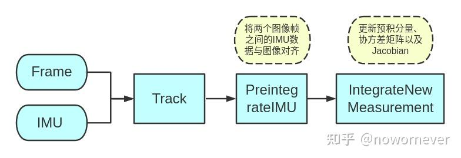    
下面介绍下[Tracking::PreintegrateIMU](../ORB_SLAM3/src/Tracking.cc)函数，主要实现1、获得两帧之间的IMU；2、数据中值积分；3、IMU状态更新。 
### 获取当前帧与上一帧之间的IMU数据，存放在mvImuFromLastFrame    
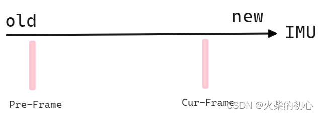   
```C++ 
    while(true)
    {
        // 数据还没有时,会等待一段时间,直到mlQueueImuData中有imu数据.一开始不需要等待
        bool bSleep = false;
        {
            unique_lock<mutex> lock(mMutexImuQueue);
            if(!mlQueueImuData.empty())
            {
                // 拿到第一个imu数据作为起始数据
                IMU::Point* m = &mlQueueImuData.front();
                cout.precision(17);
                // imu起始数据会比当前帧的前一帧时间戳早,如果相差0.001则舍弃这个imu数据
                if(m->t<mCurrentFrame.mpPrevFrame->mTimeStamp-mImuPer)
                {
                    mlQueueImuData.pop_front();
                }
                // 同样最后一个的imu数据时间戳也不能理当前帧时间间隔多余0.001
                else if(m->t<mCurrentFrame.mTimeStamp-mImuPer)
                {
                    mvImuFromLastFrame.push_back(*m);
                    mlQueueImuData.pop_front();
                }
                else
                {
                    // 得到两帧间的imu数据放入mvImuFromLastFrame中,得到后面预积分的处理数据
                    mvImuFromLastFrame.push_back(*m);
                    break;
                }
            }
            else
            {
                break;
                bSleep = true;
            }
        }
        if(bSleep)
            usleep(500);
    }  
```   
### 中值积分    
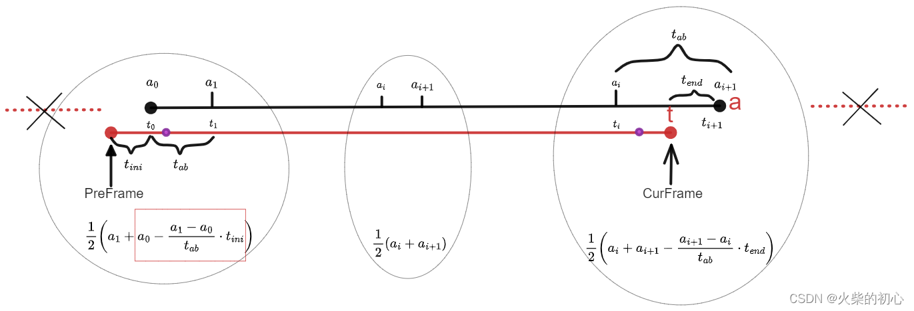     
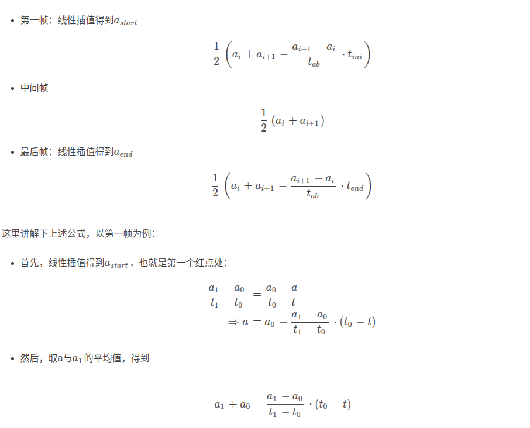
```C++ 
    IMU::Preintegrated* pImuPreintegratedFromLastFrame = new IMU::Preintegrated(mLastFrame.mImuBias,mCurrentFrame.mImuCalib);
    // 针对预积分位置的不同做不同中值积分的处理
    /**
     *  根据上面imu帧的筛选，IMU与图像帧的时序如下：
     *  Frame---IMU0---IMU1---IMU2---IMU3---IMU4---------------IMUx---Frame---IMUx+1
     *  T_------T0-----T1-----T2-----T3-----T4-----------------Tx-----_T------Tx+1
     *  A_------A0-----A1-----A2-----A3-----A4-----------------Ax-----_T------Ax+1
     *  W_------W0-----W1-----W2-----W3-----W4-----------------Wx-----_T------Wx+1
     *  T_和_T分别表示上一图像帧和当前图像帧的时间戳，A(加速度数据)，W(陀螺仪数据)，同理
     */
    for(int i=0; i<n; i++)
    {
        float tstep;
        Eigen::Vector3f acc, angVel;
        // 第一帧数据但不是最后两帧,imu总帧数大于2
        if((i==0) && (i<(n-1)))
        {
            // 获取相邻两段imu的时间间隔
            float tab = mvImuFromLastFrame[i+1].t-mvImuFromLastFrame[i].t;
            // 获取当前imu到上一帧的时间间隔
            float tini = mvImuFromLastFrame[i].t-mCurrentFrame.mpPrevFrame->mTimeStamp;
            // 设当前时刻imu的加速度a0，下一时刻加速度a1，时间间隔tab 为t10，tini t0p
            // 正常情况下时为了求上一帧到当前时刻imu的一个平均加速度，但是imu时间不会正好落在上一帧的时刻，需要做补偿，要求得a0时刻到上一帧这段时间加速度的改变量
            // 有了这个改变量将其加到a0上之后就可以表示上一帧时的加速度了。其中a0 - (a1-a0)*(tini/tab) 为上一帧时刻的加速度再加上a1 之后除以2就为这段时间的加速度平均值
            // 其中tstep表示a1到上一帧的时间间隔，a0 - (a1-a0)*(tini/tab)这个式子中tini可以是正也可以是负表示时间上的先后，(a1-a0)也是一样，多种情况下这个式子依然成立
            acc = (mvImuFromLastFrame[i].a+mvImuFromLastFrame[i+1].a-
                    (mvImuFromLastFrame[i+1].a-mvImuFromLastFrame[i].a)*(tini/tab))*0.5f;
            // 计算过程类似加速度
            angVel = (mvImuFromLastFrame[i].w+mvImuFromLastFrame[i+1].w-
                    (mvImuFromLastFrame[i+1].w-mvImuFromLastFrame[i].w)*(tini/tab))*0.5f;
            tstep = mvImuFromLastFrame[i+1].t-mCurrentFrame.mpPrevFrame->mTimeStamp;
        }
        else if(i<(n-1))
        {
            // 中间的数据不存在帧的干扰，正常计算
            acc = (mvImuFromLastFrame[i].a+mvImuFromLastFrame[i+1].a)*0.5f;
            angVel = (mvImuFromLastFrame[i].w+mvImuFromLastFrame[i+1].w)*0.5f;
            tstep = mvImuFromLastFrame[i+1].t-mvImuFromLastFrame[i].t;
        }
        // 直到倒数第二个imu时刻时，计算过程跟第一时刻类似，都需要考虑帧与imu时刻的关系
        else if((i>0) && (i==(n-1)))
        {
            float tab = mvImuFromLastFrame[i+1].t-mvImuFromLastFrame[i].t;
            float tend = mvImuFromLastFrame[i+1].t-mCurrentFrame.mTimeStamp;
            acc = (mvImuFromLastFrame[i].a+mvImuFromLastFrame[i+1].a-
                    (mvImuFromLastFrame[i+1].a-mvImuFromLastFrame[i].a)*(tend/tab))*0.5f;
            angVel = (mvImuFromLastFrame[i].w+mvImuFromLastFrame[i+1].w-
                    (mvImuFromLastFrame[i+1].w-mvImuFromLastFrame[i].w)*(tend/tab))*0.5f;
            tstep = mCurrentFrame.mTimeStamp-mvImuFromLastFrame[i].t;
        }
         // 就两个数据时使用第一个时刻的，这种情况应该没有吧，，回头应该试试看
        else if((i==0) && (i==(n-1)))
        {
            acc = mvImuFromLastFrame[i].a;
            angVel = mvImuFromLastFrame[i].w;
            tstep = mCurrentFrame.mTimeStamp-mCurrentFrame.mpPrevFrame->mTimeStamp;
        }
        // Step 3.依次进行预积分计算
        // 应该是必存在的吧，一个是相对上一关键帧，一个是相对上一帧
        if (!mpImuPreintegratedFromLastKF)
            cout << "mpImuPreintegratedFromLastKF does not exist" << endl;
        mpImuPreintegratedFromLastKF->IntegrateNewMeasurement(acc,angVel,tstep);
        pImuPreintegratedFromLastFrame->IntegrateNewMeasurement(acc,angVel,tstep);
    }
```   
### IMU状态更新
执行函数在**mpImuPreintegratedFromLastKF->IntegrateNewMeasurement**和**pImuPreintegratedFromLastFrame->IntegrateNewMeasurement**，函数的定义在[Preintegrated::IntegrateNewMeasurement](../ORB_SLAM3/src/ImuTypes.cc)，在此过程中，视IMU的bias不变，更新的顺序如下，主要和每个变量相互之间的依赖关系有关，其依赖关系如图所示    
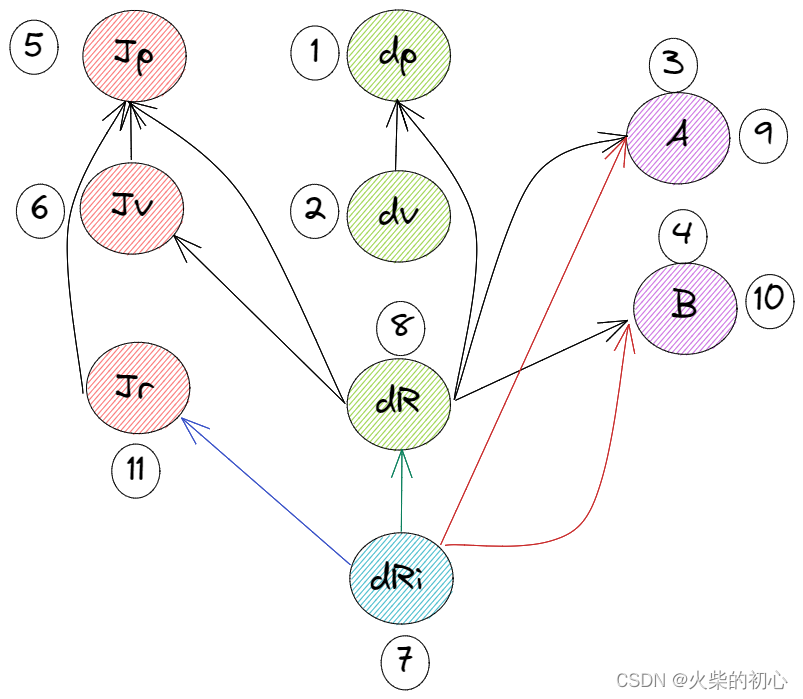
1. 更新预积分测量值更新中的**dP、dV**，dP包含上一次的dV和dR，dV包含上一次的dR；
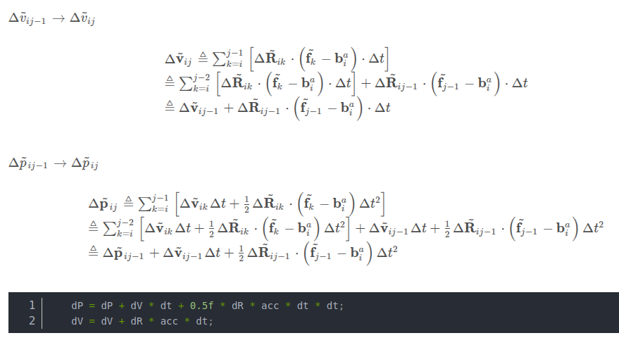      
2. 更新噪声更新中的A、B，主要是与$\Delta{\tilde{R}_{ij-1}}$有关部分:
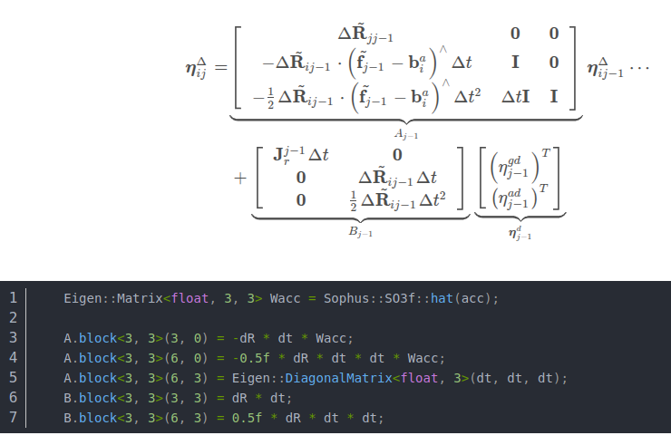     
3. 更新Jacobian更新中的JPa、JPg、JVa、JVg     
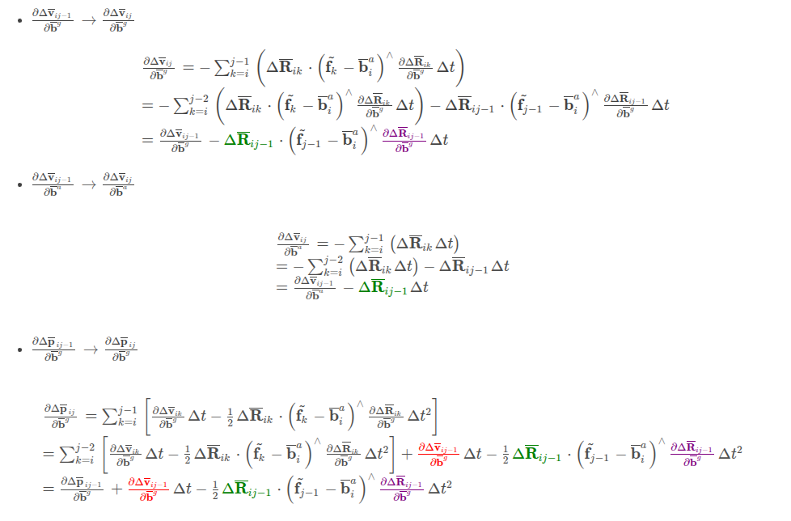   
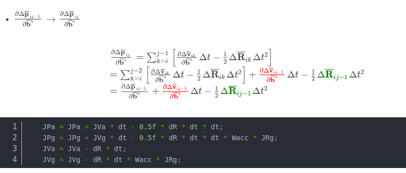
4. 更新dRi，由**罗德里格公式**计算$\Delta{\tilde{R}_{j-1}}$   
```C++
IntegratedRotation::IntegratedRotation(const Eigen::Vector3f &angVel, const Bias &imuBias, const float &time)
{
    // 得到考虑偏置后的角度旋转
    const float x = (angVel(0) - imuBias.bwx) * time;
    const float y = (angVel(1) - imuBias.bwy) * time;
    const float z = (angVel(2) - imuBias.bwz) * time;

    // 计算旋转矩阵的模值，后面用罗德里格公式计算旋转矩阵时会用到
    const float d2 = x * x + y * y + z * z;
    const float d = sqrt(d2);

    Eigen::Vector3f v;
    v << x, y, z;

    // 角度转成叉积的矩阵形式
    Eigen::Matrix3f W = Sophus::SO3f::hat(v);
    // eps = 1e-4 是一个小量，根据罗德里格斯公式求极限，后面的高阶小量忽略掉得到此式
    if (d < eps)
    {
        deltaR = Eigen::Matrix3f::Identity() + W;
        rightJ = Eigen::Matrix3f::Identity();
    }
    else
    {
        deltaR = Eigen::Matrix3f::Identity() + W * sin(d) / d + W * W * (1.0f - cos(d)) / d2;
        rightJ = Eigen::Matrix3f::Identity() - W * (1.0f - cos(d)) / d2 + W * W * (d - sin(d)) / (d2 * d);
    }
}
```
5. 更新预积分测量值更新中的dR   
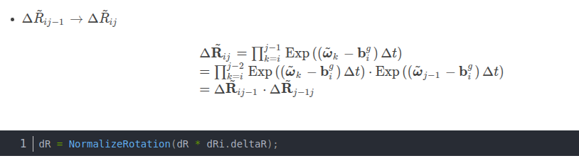      
6. 更新噪声更新中的A、B   
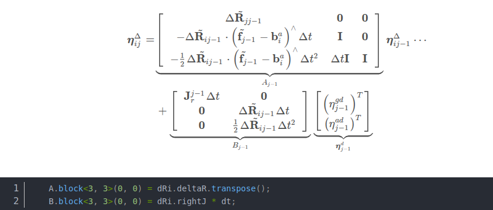  
7. 更新Jacobian更新中的JRg    
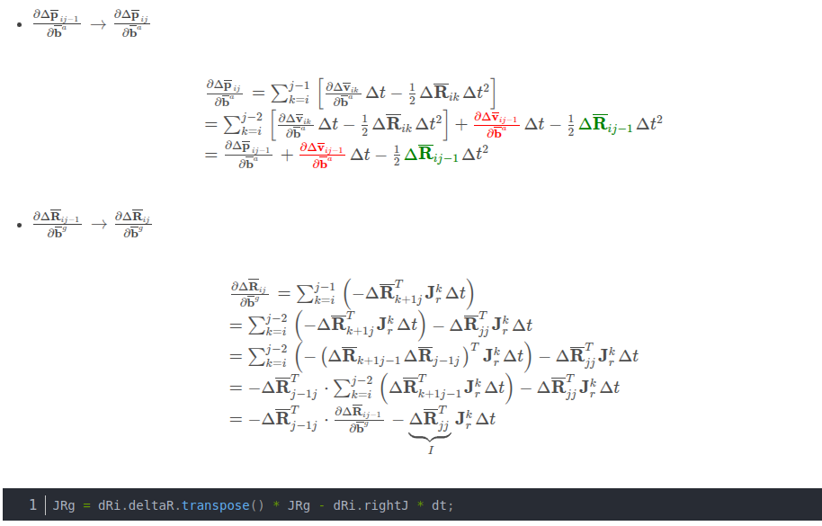
```C++ 
void Preintegrated::IntegrateNewMeasurement(const Eigen::Vector3f &acceleration, const Eigen::Vector3f &angVel, const float &dt)
{
    // 保存imu数据，利用中值积分的结果构造一个预积分类保存在mvMeasurements中
    mvMeasurements.push_back(integrable(acceleration, angVel, dt));

    // Position is updated firstly, as it depends on previously computed velocity and rotation.
    // Velocity is updated secondly, as it depends on previously computed rotation.
    // Rotation is the last to be updated.

    // Matrices to compute covariance
    // Step 1.构造协方差矩阵
    // 噪声矩阵的传递矩阵，这部分用于计算i到j-1历史噪声或者协方差
    Eigen::Matrix<float, 9, 9> A;
    A.setIdentity();
    // 噪声矩阵的传递矩阵，这部分用于计算j-1新的噪声或协方差，这两个矩阵里面的数都是当前时刻的，计算主要是为了下一时刻使用
    Eigen::Matrix<float, 9, 6> B;
    B.setZero();

    // 考虑偏置后的加速度、角速度
    Eigen::Vector3f acc, accW;
    acc << acceleration(0) - b.bax, acceleration(1) - b.bay, acceleration(2) - b.baz;
    accW << angVel(0) - b.bwx, angVel(1) - b.bwy, angVel(2) - b.bwz;

    // 记录平均加速度和角速度
    avgA = (dT * avgA + dR * acc * dt) / (dT + dt);
    avgW = (dT * avgW + accW * dt) / (dT + dt);

    // Update delta position dP and velocity dV (rely on no-updated delta rotation)
    // 根据没有更新的dR来更新dP与dV  eq.(38)
    dP = dP + dV * dt + 0.5f * dR * acc * dt * dt;
    dV = dV + dR * acc * dt;

    // Compute velocity and position parts of matrices A and B (rely on non-updated delta rotation)
    // 根据η_ij = A * η_i,j-1 + B_j-1 * η_j-1中的Ａ矩阵和Ｂ矩阵对速度和位移进行更新
    Eigen::Matrix<float, 3, 3> Wacc = Sophus::SO3f::hat(acc);

    A.block<3, 3>(3, 0) = -dR * dt * Wacc;
    A.block<3, 3>(6, 0) = -0.5f * dR * dt * dt * Wacc;
    A.block<3, 3>(6, 3) = Eigen::DiagonalMatrix<float, 3>(dt, dt, dt);
    B.block<3, 3>(3, 3) = dR * dt;
    B.block<3, 3>(6, 3) = 0.5f * dR * dt * dt;

    // Update position and velocity jacobians wrt bias correction
    // 因为随着时间推移，不可能每次都重新计算雅克比矩阵，所以需要做J(k+1) = j(k) + (~)这类事，分解方式与AB矩阵相同
    // 论文作者对forster论文公式的基础上做了变形，然后递归更新，参见 https://github.com/UZ-SLAMLab/ORB_SLAM3/issues/212
    JPa = JPa + JVa * dt - 0.5f * dR * dt * dt;
    JPg = JPg + JVg * dt - 0.5f * dR * dt * dt * Wacc * JRg;
    JVa = JVa - dR * dt;
    JVg = JVg - dR * dt * Wacc * JRg;

    // Update delta rotation
    // Step 2. 构造函数，会根据更新后的bias进行角度积分
    IntegratedRotation dRi(angVel, b, dt);
    // 强行归一化使其符合旋转矩阵的格式
    dR = NormalizeRotation(dR * dRi.deltaR);

    // Compute rotation parts of matrices A and B
    // 补充AB矩阵
    A.block<3, 3>(0, 0) = dRi.deltaR.transpose();
    B.block<3, 3>(0, 0) = dRi.rightJ * dt;

    // 小量delta初始为0，更新后通常也为0，故省略了小量的更新
    // Update covariance
    // Step 3.更新协方差，frost经典预积分论文的第63个公式，推导了噪声（ηa, ηg）对dR dV dP 的影响
    C.block<9, 9>(0, 0) = A * C.block<9, 9>(0, 0) * A.transpose() + B * Nga * B.transpose();  // B矩阵为9*6矩阵 Nga 6*6对角矩阵，3个陀螺仪噪声的平方，3个加速度计噪声的平方
    // 这一部分最开始是0矩阵，随着积分次数增加，每次都加上随机游走，偏置的信息矩阵
    C.block<6, 6>(9, 9) += NgaWalk;

    // Update rotation jacobian wrt bias correction
    // 计算偏置的雅克比矩阵，r对bg的导数，∂ΔRij/∂bg = (ΔRjj-1) * ∂ΔRij-1/∂bg - Jr(j-1)*t
    // 论文作者对forster论文公式的基础上做了变形，然后递归更新，参见 https://github.com/UZ-SLAMLab/ORB_SLAM3/issues/212
    // ? 为什么先更新JPa、JPg、JVa、JVg最后更新JRg? 答：这里必须先更新dRi才能更新到这个值，但是为什么JPg和JVg依赖的上一个JRg值进行更新的？
    JRg = dRi.deltaR.transpose() * JRg - dRi.rightJ * dt;

    // Total integrated time
    // 更新总时间
    dT += dt;
}
```     
## 预积分的误差传播  
由于 IMU 测量存在噪声和偏置，预积分的结果也会受到误差的影响。为了在优化中使用预积分结果，需要对误差进行建模和传播。
偏置误差：IMU 的偏置通常是缓慢变化的，可以建模为随机游走过程。
噪声误差：IMU 的测量噪声，通常假设为高斯白噪声。
通过误差传播公式，可以得到预积分结果的协方差矩阵，用于后续的优化。
## IMU参与优化  
对于视觉惯导SLAM而言，我们通过对IMU的测量进行预积分，可以获得连续两帧（如第i到第i+1帧）之间的相对位姿测量$\Delta{\tilde{p}_{ij}},\Delta{\tilde{v}_{ij}},\Delta{\tilde{R}_{ij}}$，图优化的核心是构造误差函数，通过最小化观测值和估计值之间的误差来建立优化。加入IMU之后，这一问题就变为图优化中的一条边，可以认为IMU的积分得到了新的观测值。而估计值可以是通过特征匹配等方式得到的。同时，在以BA优化的算法中一般是建立在关键帧上的约束，也就是PVQ相对于上一关键帧的增量是比较重要的。
$error_{ij}=PVQ增量估计值_{ij}-PVQ增量观测值_{ij}$
设k=i时，积分得到的PVQ(指位置、速度和姿态)为$p_i,v_i,R_i$，则直接用i到j之间的IMU真值更新的公式应该为：
$\mathbf{R}_j=\mathbf{R}_i\cdot\prod\limits_{k=i}^{j-1}\mathrm{Exp}\Big(\Big(\tilde{\boldsymbol{\omega}}_k-\mathbf{b}_k^g-\boldsymbol{\eta}_k^{gd}\Big)\cdot\Delta t\Big)$   
$\mathbf{v}_j=\mathbf{v}_i+\sum_{k=i}^ja^w\Delta t=\mathbf{v}_i+\mathbf{g}\cdot\Delta t_{ij}+\sum_{k=i}^{j-1}\mathbf{R}_k\cdot\left(\mathbf{\tilde{a}}_k-\mathbf{b}_k^a-\eta_k^{ad}\right)\cdot\Delta t$
$\mathbf{p}_j=\mathbf{p}_i+\sum_{k=i}^j\mathbf{v}_k\cdot\Delta t+\frac{1}{2}a^w\Delta t^2=\mathbf{p}_i+\sum_{k=i}^{j-1}\left[\mathbf{v}_k\cdot\Delta t+\frac{1}{2}\mathbf{g}\cdot\Delta t^2+\frac{1}{2}\mathbf{R}_k\cdot\left(\mathbf{\tilde{a}}_k-\mathbf{b}_k^a-\eta_k^{ad}\right)\cdot\Delta t^2\right]$   
因为目标是找到bias之间的关系，使用:
$\begin{aligned}
\Delta\mathbf{R}_{ij}& \triangleq\mathbf{R}_i^T\mathbf{R}_j=\prod_{k=i}^{j-1}\mathrm{Exp}\Big(\Big(\tilde{\boldsymbol{\omega}}_k-\mathbf{b}_k^g-\boldsymbol{\eta}_k^{gd}\Big)\cdot\Delta t\Big)
\end{aligned}$    
$\begin{aligned}
\Delta\mathbf{v}_{ij}& \triangleq\mathbf{R}_{i}^{T}\left(\mathbf{v}_{j}-\mathbf{v}_{i}-\mathbf{g}\cdot\Delta t_{ij}\right)=\sum_{k=i}^{j-1}\Delta\mathbf{R}_{ik}\cdot\left(\tilde{\mathbf{a}}_k-\mathbf{b}_k^a-\eta_k^{ad}\right)\cdot\Delta t
\end{aligned}$  
$\begin{aligned}
\Delta\mathbf{p}_{ij}& \triangleq\mathbf{R}_{i}^{T}\left(\mathbf{p}_{j}-\mathbf{p}_{i}-\mathbf{v}_{i}\cdot\Delta t_{ij}-\frac{1}{2}\mathbf{g}\cdot\Delta t_{ij}^{2}\right) =\sum_{k=i}^{j-1}\left[\Delta\mathbf{v}_{ik}\cdot\Delta t+\frac{1}{2}\Delta\mathbf{R}_{ik}\cdot\left(\mathbf{\tilde{a}}_k-\mathbf{b}_k^a-\boldsymbol{\eta}_k^{ad}\right)\cdot\Delta t^2\right]
\end{aligned}$     
上面是普通的IMU积分过程，我们的核心其实是找到增量和bias之间的关系，可以视为要找到:
$\Delta R_{ij}\triangleq\Delta\tilde{\mathbf{R}}_{ij}(b^g_i)exp(-\delta \phi_{ij})$    
$\Delta v_{ij}\triangleq\Delta\tilde{\mathbf{v}}_{ij}(b^g_i,b^a_i)-\delta v_{ij}$   
$\Delta p_{ij}\triangleq\Delta\tilde{\mathbf{p}}_{ij}(b^g_i,b^a_i)-\delta p_{ij}$     
### 偏差不变时预积分测量值更新  
因此，假设在预积分的区间内，两帧的偏差是相等的，即$b^g_i=b^g_{i+1}=...=b^g_j$以及$b^a_i=b^a_{i+1}=...=b^a_j$。
$$
\begin{aligned}
\Delta\mathbf{R}_{ij}& =\prod_{k=i}^{j-1}\mathrm{Exp}\Big(\left(\tilde{\boldsymbol{\omega}}_k-\mathbf{b}_i^g\right)\Delta t-\eta_k^{gd}\Delta t\Big)  \\
&\overset{1}{\approx}\prod_{k=i}^{j-1}\left\{\mathrm{Exp}\big(\left(\tilde{\omega}_k-\mathbf{b}_i^g\right)\Delta t\big)\cdot\mathrm{Exp}\Big(-\mathbf{J}_r\left(\left(\tilde{\omega}_k-\mathbf{b}_i^g\right)\Delta t\right)\cdot\eta_k^{gd}\Delta t\Big)\right\}\\
&\overset{2}{=}\operatorname{Exp}\big(\left(\tilde{\boldsymbol{\omega}}_i-\mathbf{b}_i^g\right)\Delta t\big)\cdot\operatorname{Exp}\bigg(-\mathbf{J}_r^i\cdot\eta_i^{gd}\Delta t\bigg)\cdot\operatorname{Exp}\big(\left(\tilde{\boldsymbol{\omega}}_{i+1}-\mathbf{b}_i^g\right)\Delta t\bigg)\cdot\operatorname{Exp}\bigg(-\mathbf{J}_r^{i+1}\cdot \eta_{i+1}^{gd}\Delta t\bigg)...\\
& =\Delta\tilde{\mathbf{R}}_{i,i+1}\cdot\mathrm{Exp}\left(-\mathbf{J}_{r}^{i}\cdot\eta_{i}^{gd}\Delta t\right)\cdot\Delta\tilde{\mathbf{R}}_{i+1,i+2}\cdot\mathrm{Exp}\left(-\mathbf{J}_{r}^{i+1}\cdot\eta_{i+1}^{gd}\Delta t\right)\cdot\Delta\tilde{\mathbf{R}}_{i+2,i+3}\ldots \\
& \overset{3}{\operatorname*{=}}\Delta\tilde{\mathbf{R}}_{i,i+1}\cdot\Delta\tilde{\mathbf{R}}_{i+1,i+2}\cdot\mathrm{Exp}\left(-\Delta\tilde{\mathbf{R}}_{i+1,i+2}^T\cdot\mathbf{J}_r^i\cdot\eta_i^{gd}\Delta t\right)\cdot\mathrm{Exp}\left(-\mathbf{J}_r^{i+1}\cdot\eta_{i+1}^{gd}\Delta t\right)\cdot\Delta\tilde{\mathbf{R}}_{i+2,i+3}\ldots \\
& \overset{4}{=}\Delta\tilde{\mathbf{R}}_{i,j}\cdot\mathrm{Exp}\Big(-\Delta\tilde{\mathbf{R}}_{i+1,j}^T\cdot\mathbf{J}_r^i\cdot\eta_i^{gd}\Delta t\Big)\cdot\mathrm{Exp}\Big(-\Delta\tilde{\mathbf{R}}_{i+2,j}^T\cdot\mathbf{J}_r^{i+1}\cdot\eta_{i+1}^{gd}\Delta t\Big)\ldots \\
& =\Delta\tilde{\mathbf{R}}_{ij}\cdot\prod_{k=i}^{j-1}\operatorname{Exp}\Big(-\Delta\tilde{\mathbf{R}}_{k+1j}^T\cdot\mathbf{J}_r^k\cdot\boldsymbol{\eta}_k^{gd}\Delta t\Big)
\end{aligned}
$$   
其中，1处使用了性质，当$\delta \vec{\phi}$是小量时:  
$\mathrm{Exp}(\vec{\phi}+\delta\vec{\phi})\approx\mathrm{Exp}(\vec{\phi})\cdot\mathrm{Exp}\Big(\mathbf{J}_r(\vec{\phi})\cdot\delta\vec{\phi}\Big)$  
2处将累乘展开，3和4处利用Adjoint性质，将$\Delta\tilde{\mathbf{R}}$换到最左侧：   
$\mathrm{Exp}(\vec{\phi})\cdot\mathbf{R}=\mathbf{R}\cdot\mathrm{Exp}\Big(\mathbf{R}^T\vec{\phi}\Big)$    
其中，令：    
$\mathbf{J}_r^k=\mathbf{J}_r\left(\left(\tilde{\boldsymbol{\omega}}_k-\mathbf{b}_i^g\right)\Delta t\right)$    
$\Delta\tilde{\mathbf{R}}_{ij}=\prod_{k=i}^{j-1}\operatorname{Exp}(\left(\tilde{\boldsymbol{\omega}}_k-\mathbf{b}_i^g\right)\Delta t)$    
$\mathrm{Exp}\Big(-\delta\vec{\phi}_{ij}\Big)=\prod_{k=i}^{j-1}\mathrm{Exp}\Big(-\Delta\tilde{\mathbf{R}}_{k+1j}^T\cdot\mathbf{J}_r^k\cdot\eta_k^{gd}\Delta t\Big)$   
则有：
$\Delta\mathbf{R}_{ij}\triangleq\Delta\mathbf{\tilde{\mathbf{R}}}_{ij}\cdot\mathrm{Exp}\Big(-\delta\vec{\phi}_{ij}\Big)$   
这样的话，$\Delta\tilde{\mathbf{R}}_{ij}$即P增量测量值，它由陀螺仪测量值和对陀螺仪偏差的估计得到，而$\delta\vec{\phi}_{ij}$或$Exp(\vec{\phi}_{ij})$即为测量噪声。  
$$
\begin{aligned}
\Delta\mathbf{v}_{ij}& =\sum_{k=i}^{j-1}\Delta\mathbf{R}_{ik}\cdot\left(\mathbf{\tilde{f}}_k-\mathbf{b}_i^a-\eta_k^{ad}\right)\cdot\Delta t  \\
&\approx\sum_{k=i}^{j-1}\Delta\tilde{\mathbf{R}}_{ik}\cdot\mathrm{Exp}\Big(-\delta\vec{\phi}_{ik}\Big)\cdot\left(\tilde{\mathbf{f}}_{k}-\mathbf{b}_{i}^{a}-\eta_{k}^{ad}\right)\cdot\Delta t \\
&\overset{1}{\approx}\sum_{k=i}^{j-1}\Delta\tilde{\mathbf{R}}_{ik}\cdot\left(\mathbf{I}-\delta\vec{\phi}_{ik}^{\wedge}\right)\cdot\left(\tilde{\mathbf{f}}_{k}-\mathbf{b}_{i}^{a}-\boldsymbol{\eta}_{k}^{ad}\right)\cdot\Delta t \\
&\overset{2}{\approx}\sum_{k=i}^{j-1}\left[\Delta\tilde{\mathbf{R}}_{ik}\cdot\left(\mathbf{I}-\delta\vec{\phi}_{ik}^{\wedge}\right)\cdot\left(\tilde{\mathbf{f}}_{k}-\mathbf{b}_{i}^{a}\right)\cdot\Delta t-\Delta\tilde{\mathbf{R}}_{ik}\eta_{k}^{ad}\Delta t\right]\\
& \stackrel{3}{=}\sum_{k=i}^{j-1}\left[\Delta\tilde{\mathbf{R}}_{ik}\cdot\left(\tilde{\mathbf{f}}_k-\mathbf{b}_i^a\right)\cdot\Delta t+\Delta\tilde{\mathbf{R}}_{ik}\cdot\left(\tilde{\mathbf{f}}_k-\mathbf{b}_i^a\right)^\wedge\cdot\delta\vec{\phi}_{ik}\cdot\Delta t-\right. \Delta\tilde{\mathbf{R}}_{ik}\eta_{k}^{ad}\Delta t\Big]\\
& =\sum_{k=i}^{j-1}\left[\Delta\tilde{\mathbf{R}}_{ik}\cdot\left(\tilde{\mathbf{f}}_k-\mathbf{b}_i^a\right)\cdot\Delta t\right]+\sum_{k=i}^{j-1}\left[\Delta\tilde{\mathbf{R}}_{ik}\cdot\left(\tilde{\mathbf{f}}_k-\mathbf{b}_i^a\right)^{\wedge}\cdot\delta\vec{\phi}_{ik}\cdot\Delta t-\Delta\tilde{\mathbf{R}}_{ik}\eta_k^{ad}\Delta t\right]
\end{aligned}
$$    
其中1处使用了，当$\vec\phi$是小量时，有一阶近似：$\exp\left(\vec{\phi}^{\wedge}\right)\approx\mathbf{I}+\vec{\phi}^{\wedge}$或$\operatorname{Exp}(\vec{\phi})\approx\mathbf{I}+\vec{\phi}^{\wedge}$的性质。    
2处忽略高阶小项，$\delta\vec{\phi}_{ik}^{\wedge}\eta_{k}^{ad}$。
3处使用$\mathbf{a}^{\wedge}\mathbf{b}=-\mathbf{b}^{\wedge}\mathbf{a}$  
再令：     
$\begin{aligned}
&\Delta\tilde{\mathbf{v}}_{ij} \triangleq\sum_{k=i}^{j-1}\left[\Delta\tilde{\mathbf{R}}_{ik}\cdot\left(\tilde{\mathbf{f}}_k-\mathbf{b}_i^a\right)\cdot\Delta t\right]  \\
&\delta\mathbf{v}_{ij} \triangleq\sum_{k=i}^{j-1}\left[\Delta\tilde{\mathbf{R}}_{ik}\eta_{k}^{ad}\Delta t-\Delta\tilde{\mathbf{R}}_{ik}\cdot\left(\tilde{\mathbf{f}}_{k}-\mathbf{b}_{i}^{a}\right)^{\wedge}\cdot\delta\vec{\phi}_{ik}\cdot\Delta t\right] 
\end{aligned}$   
得到：   
$\Delta\mathbf{v}_{ij}\triangleq\Delta\tilde{\mathbf{v}}_{ij}-\delta\mathbf{v}_{ij}$   
$\tilde{\mathbf{v}}_{ij}$即速度增量测量值，它由IMU测量值和对偏差的估计或猜测计算得到。$\delta\mathbf{v}_{ij}$是其测量噪声。    
$$
\begin{aligned}
\Delta\mathbf{p}_{ij}& =\sum_{k=i}^{j-1}\left[\Delta\mathbf{v}_{ik}\cdot\Delta t+\frac{1}{2}\Delta\mathbf{R}_{ik}\cdot\left(\tilde{\mathbf{f}}_k-\mathbf{b}_i^a-\boldsymbol{\eta}_k^{ad}\right)\cdot\Delta t^2\right]  \\
&\approx\sum_{k=i}^{j-1}\left[(\Delta\tilde{\mathbf{v}}_{ik}-\delta\mathbf{v}_{ik})\cdot\Delta t+\frac{1}{2}\Delta\tilde{\mathbf{R}}_{ik}\cdot\mathrm{Exp}\Big(-\delta\vec{\phi}_{ik}\Big)\cdot\left(\tilde{\mathbf{f}}_{k}-\mathbf{b}_{i}^{a}-\boldsymbol{\eta}_{k}^{ad}\right)\cdot\Delta t^{2}\right.  \\
&\stackrel{(1)}{\approx}\sum_{k=i}^{j-1}\left[(\Delta\tilde{\mathbf{v}}_{ik}-\delta\mathbf{v}_{ik})\cdot\Delta t+\frac{1}{2}\Delta\tilde{\mathbf{R}}_{ik}\cdot\left(\mathbf{I}-\delta\vec{\phi}_{ik}^{\wedge}\right)\cdot\left(\tilde{\mathbf{f}}_{k}-\mathbf{b}_{i}^{a}-\boldsymbol{\eta}_{k}^{ad}\right)\cdot\Delta t^{2}\right] \\
&\stackrel{(2)}{\approx}\sum_{k=i}^{j-1}\left[(\Delta\tilde{\mathbf{v}}_{ik}-\delta\mathbf{v}_{ik})\cdot\Delta t\right. \\
&\left.+\frac12\Delta\tilde{\mathbf{R}}_{ik}\cdot\left(\mathbf{I}-\delta\vec{\phi}_{ik}^{\wedge}\right)\cdot\left(\tilde{\mathbf{f}}_{k}-\mathbf{b}_{i}^{a}\right)\cdot\Delta t^{2}-\frac12\Delta\tilde{\mathbf{R}}_{ik}\boldsymbol{\eta}_{k}^{ad}\Delta t^{2}\right]\\
&\overset{(3)}{=}\sum_{k=i}^{j-1}\left[\Delta\tilde{\mathbf{v}}_{ik}\Delta t+\frac12\Delta\tilde{\mathbf{R}}_{ik}\cdot\left(\tilde{\mathbf{f}}_k-\mathbf{b}_i^a\right)\Delta t^2\right.  \\
&+\frac{1}{2}\Delta\tilde{\mathbf{R}}_{ik}\cdot\left(\tilde{\mathbf{f}}_{k}-\mathbf{b}_{i}^{a}\right)^{\wedge}\delta\vec{\phi}_{ik}\Delta t^{2}-\frac{1}{2}\Delta\tilde{\mathbf{R}}_{ik}\eta_{k}^{ad}\Delta t^{2}-\delta\mathbf{v}_{ik}\Delta t
\end{aligned}
$$    
其中1处使用了，当$\vec\phi$是小量时，有一阶近似：$\exp\left(\vec{\phi}^{\wedge}\right)\approx\mathbf{I}+\vec{\phi}^{\wedge}$或$\operatorname{Exp}(\vec{\phi})\approx\mathbf{I}+\vec{\phi}^{\wedge}$的性质。    
2处忽略高阶小项，$\delta\vec{\phi}_{ik}^{\wedge}\eta_{k}^{ad}$。
3处使用$\mathbf{a}^{\wedge}\mathbf{b}=-\mathbf{b}^{\wedge}\mathbf{a}$  
再令：    
$\Delta\tilde{\mathbf{p}}_{ij}\triangleq\sum_{k=i}^{j-1}\left[\Delta\tilde{\mathbf{v}}_{ik}\Delta t+\frac{1}{2}\Delta\tilde{\mathbf{R}}_{ik}\cdot\left(\tilde{\mathbf{f}}_k-\mathbf{b}_i^a\right)\Delta t^2\right]$
$\delta\mathbf{p}_{ij}\triangleq\sum_{k=i}^{j-1}\left[\delta\mathbf{v}_{ik}\Delta t-\frac{1}{2}\Delta\mathbf{\tilde{R}}_{ik}\cdot\left(\mathbf{\tilde{f}}_k-\mathbf{b}_i^a\right)^{\wedge}\delta\vec{\phi}_{ik}\Delta t^2+\frac{1}{2}\Delta\mathbf{\tilde{R}}_{ik}\eta_k^{ad}\Delta t^2\right]$   
得到：   
$\Delta\mathbf{p}_{ij}\triangleq\Delta\mathbf{\tilde{p}}_{ij}-\delta\mathbf{p}_{ij}$       
$\tilde{\mathbf{p}}_{ij}$即位置增量测量值，它由IMU测量值和对偏差的估计或猜测计算得到。$\delta\mathbf{p}_{ij}$是其测量噪声。   
因此，得到了**PVQ增量真值和测量值的关系**：
$\Delta R_{ij}\triangleq\Delta\tilde{\mathbf{R}}_{ij}(b^g_i)exp(-\delta \phi_{ij})$   
$\Delta v_{ij}\triangleq\Delta\tilde{\mathbf{v}}_{ij}(b^g_i,b^a_i)-\delta v_{ij}$
$\Delta p_{ij}\triangleq\Delta\tilde{\mathbf{p}}_{ij}(b^g_i,b^a_i)-\delta p_{ij}$    
代入PVQ增量真值表达式得到：    
$\begin{aligned}&\Delta\tilde{\mathbf{R}}_{ij}\approx\Delta\mathbf{R}_{ij}\operatorname{Exp}\Big(\delta\vec{\phi}_{ij}\Big)=\mathbf{R}_i^T\mathbf{R}_j\operatorname{Exp}\Big(\delta\vec{\phi}_{ij}\Big)\\&\Delta\tilde{\mathbf{v}}_{ij}\approx\Delta\mathbf{v}_{ij}+\delta\mathbf{v}_{ij}=\mathbf{R}_i^T\left(\mathbf{v}_j-\mathbf{v}_i-\mathbf{g}\cdot\Delta t_{ij}\right)+\delta\mathbf{v}_{ij}\\&\Delta\tilde{\mathbf{p}}_{ij}\approx\Delta\mathbf{p}_{ij}+\delta\mathbf{p}_{ij}=\mathbf{R}_i^T\left(\mathbf{p}_j-\mathbf{p}_i-\mathbf{v}_i\cdot\Delta t_{ij}-\frac12\mathbf{g}\cdot\Delta t_{ij}^2\right)+\delta\mathbf{p}_{ij}\end{aligned}$   
上述表达式即为PVQ增量测量值（含IMU测量值及偏差估计值）与真值之间的关系，即形如“测量值=真值+噪声”的形式。     
### 偏差更新时的预积分测量值更新
前面的预积分计算，都是在假设积分区间内陀螺和加计的偏差恒定的基础上推导的。当 bias 发生变化时，若仍按照前述公式，预积分测量值需要整个重新计算一遍，这将非常的耗费算力。为了解决这个问题，提出了利用线性化来进行偏差变化时预积分项的一阶近似更新方法。   
使用$_{\mathbf{b}_i}^{-g}$和$_{\mathbf{b}_i}^{-a}$表示的旧的偏差，新的偏差$\hat{\mathbf{b}}_i^g$和$\hat{\mathbf{b}}_i^a$由旧偏差和更新量$\delta\mathbf{b}_i^g$和$\delta\mathbf{b}_i^a$相机$\hat{\mathbf{b}}_{i}^{a}\leftarrow\overline{\mathbf{b}}_{i}^{a}+\delta\mathbf{b}_{i}^{a}$得到的，于是有预积分关于偏差估计值变化的一阶近似更新公式如下：   
$$
\begin{aligned}
&\Delta\tilde{\mathbf{R}}_{ij}\left(\hat{\mathbf{b}}_{i}^{g}\right)\approx\Delta\tilde{\mathbf{R}}_{ij}\left(\overline{\mathbf{b}}_{i}^{g}\right)\cdot\mathrm{Exp}\left(\frac{\partial\Delta\overline{\mathbf{R}}_{ij}}{\partial\overline{\mathbf{b}}^{g}}\delta\mathbf{b}_{i}^{g}\right) \\
&\Delta\tilde{\mathbf{v}}_{ij}\left(\hat{\mathbf{b}}_{i}^{g},\hat{\mathbf{b}}_{i}^{a}\right)\approx\Delta\tilde{\mathbf{v}}_{ij}\left(\overline{\mathbf{b}}_{i}^{g},\overline{\mathbf{b}}_{i}^{a}\right)+\frac{\partial\Delta\overline{\mathbf{v}}_{ij}}{\partial\overline{\mathbf{b}}^{g}}\delta\mathbf{b}_{i}^{g}+\frac{\partial\Delta\overline{\mathbf{v}}_{ij}}{\partial\overline{\mathbf{b}}^{a}}\delta\mathbf{b}_{i}^{a} \\
&\Delta\tilde{\mathbf{p}}_{ij}\left(\hat{\mathbf{b}}_{i}^{g},\hat{\mathbf{b}}_{i}^{a}\right)\approx\Delta\tilde{\mathbf{p}}_{ij}\left(\overline{\mathbf{b}}_{i}^{g},\overline{\mathbf{b}}_{i}^{a}\right)+\frac{\partial\Delta\overline{\mathbf{p}}_{ij}}{\partial\overline{\mathbf{b}}^{-g}}\delta\mathbf{b}_{i}^{g}+\frac{\partial\Delta\overline{\mathbf{p}}_{ij}}{\partial\overline{\mathbf{b}}^{-a}}\delta\mathbf{b}_{i}^{a}
\end{aligned}
$$   
为了便于理解，做符号简化如下：  
$\begin{aligned}&\Delta\hat{\mathbf{R}}_{ij}\doteq\Delta\tilde{\mathbf{R}}_{ij}\left(\hat{\mathbf{b}}_i^g\right),\quad\Delta\overline{\mathbf{R}}_{ij}\doteq\Delta\tilde{\mathbf{R}}_{ij}\left(\overline{\mathbf{b}}_i^g\right)\\&\Delta\hat{\mathbf{v}}_{ij}\doteq\Delta\tilde{\mathbf{v}}_{ij}\left(\hat{\mathbf{b}}_i^g,\hat{\mathbf{b}}_i^a\right),\quad\Delta\overline{\mathbf{v}}_{ij}\doteq\Delta\tilde{\mathbf{v}}_{ij}\left(\overline{\mathbf{b}}_i^g,\overline{\mathbf{b}}_i^a\right)\\&\Delta\hat{\mathbf{p}}_{ij}\doteq\Delta\tilde{\mathbf{p}}_{ij}\left(\hat{\mathbf{b}}_i^g,\hat{\mathbf{b}}_i^a\right),\quad\Delta\overline{\mathbf{p}}_{ij}\doteq\Delta\tilde{\mathbf{p}}_{ij}\left(\overline{\mathbf{b}}_i^g,\overline{\mathbf{b}}_i^a\right)\end{aligned}$   
得到简化后的公式如下：   
$$
\begin{aligned}
&\Delta\hat{\mathbf{R}}_{ij}\approx\Delta\overline{{\mathbf{R}}}_{ij}\cdot\mathrm{Exp}\left(\frac{\partial\Delta\overline{{\mathbf{R}}}_{ij}}{\partial\overline{{\mathbf{b}}}^{g}}\delta\mathbf{b}_{i}^{g}\right) \\
&\Delta\hat{\mathbf{v}}_{ij}\approx\Delta\overline{\mathbf{v}}_{ij}+\frac{\partial\Delta\bar{\mathbf{v}}_{ij}}{\partial\overline{\mathbf{b}}^{g}}\delta\mathbf{b}_{i}^{g}+\frac{\partial\Delta\overline{\mathbf{v}}_{ij}}{\partial\overline{\mathbf{b}}^{a}}\delta\mathbf{b}_{i}^{a} \\
&\Delta\hat{\mathbf{p}}_{ij}\approx\Delta\overline{\mathbf{p}}_{ij}+\frac{\partial\Delta\overline{\mathbf{p}}_{ij}}{\partial\overline{\mathbf{b}}^{-g}}\delta\mathbf{b}_{i}^{g}+\frac{\partial\Delta\overline{\mathbf{p}}_{ij}}{\partial\overline{\mathbf{b}}^{-a}}\delta\mathbf{b}_{i}^{a}
\end{aligned}
$$      
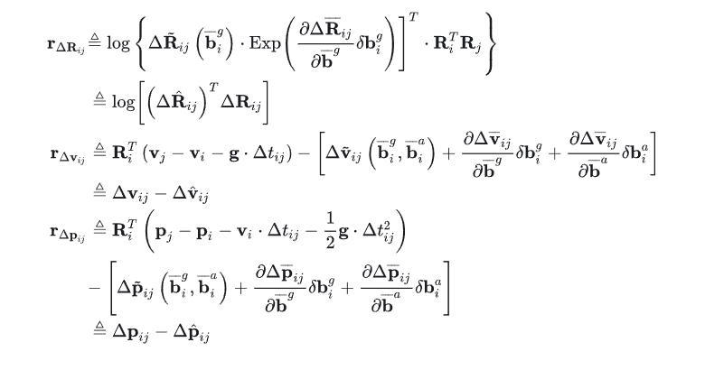       
```C++ 
//EdgeInertial建立相邻帧之间速度和位置的边
void EdgeInertial::computeError()
{
    // TODO Maybe Reintegrate inertial measurments when difference between linearization point and current estimate is too big
    const VertexPose* VP1 = static_cast<const VertexPose*>(_vertices[0]);           //位置p1
    const VertexVelocity* VV1= static_cast<const VertexVelocity*>(_vertices[1]);    //速度v1
    const VertexGyroBias* VG1= static_cast<const VertexGyroBias*>(_vertices[2]);    //陀螺仪零偏Bgi
    const VertexAccBias* VA1= static_cast<const VertexAccBias*>(_vertices[3]);      //加速度计零偏Bai
    const VertexPose* VP2 = static_cast<const VertexPose*>(_vertices[4]);           //位置p2
    const VertexVelocity* VV2 = static_cast<const VertexVelocity*>(_vertices[5]);   //速度v2
    const IMU::Bias b1(VA1->estimate()[0],VA1->estimate()[1],VA1->estimate()[2],VG1->estimate()[0],VG1->estimate()[1],VG1->estimate()[2]);
    const Eigen::Matrix3d dR = mpInt->GetDeltaRotation(b1).cast<double>();
    const Eigen::Vector3d dV = mpInt->GetDeltaVelocity(b1).cast<double>();
    const Eigen::Vector3d dP = mpInt->GetDeltaPosition(b1).cast<double>();

    const Eigen::Vector3d er = LogSO3(dR.transpose()*VP1->estimate().Rwb.transpose()*VP2->estimate().Rwb);
    const Eigen::Vector3d ev = VP1->estimate().Rwb.transpose()*(VV2->estimate() - VV1->estimate() - g*dt) - dV;
    const Eigen::Vector3d ep = VP1->estimate().Rwb.transpose()*(VP2->estimate().twb - VP1->estimate().twb
                                                               - VV1->estimate()*dt - g*dt*dt/2) - dP;

    _error << er, ev, ep;
}
```
该式说明了IMU预积分是如何修正测量值的，为什么雅可比能够起到修正值的作用？   
**新偏差=旧偏差+更新量，如果把测量值当做偏差的函数，只需要在旧的测量值上添加一个近似的修正量就可以获得近似的新测量值，而不需要重新积分。而这个修正量（增量）就是用偏差的更新量乘以函数的导数（即斜率，雅可比）获得。**  
这样一来，对于i、j两帧之间的IMU积分我们只需要做一次就可以了($\Delta\overline{\mathbf{R}}_{ij},\Delta\overline{\mathbf{v}}_{ij},\Delta\overline{\mathbf{p}}_{ij}$)通过测量值函数对偏差的偏导数（即雅可比）和偏差更新量$\delta\mathbf{b}_i^g,\delta\mathbf{b}_i^a$就可以近似的计算出修正量，获得新测量值的近似值，而不需要重新积分。   
如果优化过程中起始位姿发生了变化，则雅可比也相应更新。而偏差更新量$\delta\mathbf{b}_i^g,\delta\mathbf{b}_i^a$,本身就是待优化的变量之一，自然也是相应更新。从而测量值的修正量实现了自动更新。   
以上就是IMU预积分避免重新积分，降低运算量的关键。其中的偏导项定义如下：   
$$
\begin{aligned}
&\frac{\partial\Delta\overline{\mathbf{R}}_{ij}}{\partial\vec{\mathbf{b}}^g} =\sum_{k=i}^{j-1}\left(-\Delta\overline{\mathbf{R}}_{k+1j}^T\mathbf{J}_r^k\Delta t\right)  \\
&\frac{\partial\Delta\overline{\mathbf{v}}_{ij}}{\partial\vec{\mathbf{b}}^{g}} =-\sum_{k=i}^{j-1}\left(\Delta\overline{\mathbf{R}}_{ik}\cdot\left(\tilde{\mathbf{f}}_k-\overline{\mathbf{b}}_i^a\right)^\wedge\frac{\partial\Delta\overline{\mathbf{R}}_{ik}}{\partial\overline{\mathbf{b}}^g}\Delta t\right)  \\
&\frac{\partial\Delta\overline{\mathbf{v}}_{ij}}{\partial\overline{\mathbf{b}}^a} =-\sum_{k=i}^{j-1}\left(\Delta\overline{\mathbf{R}}_{ik}\Delta t\right)  \\
&\frac{\partial\Delta\overline{\mathbf{p}}_{ij}}{\partial\overline{\mathbf{b}}^g} =\sum_{k=i}^{j-1}\left[\frac{\partial\Delta\overline{\mathbf{v}}_{ik}}{\partial\overline{\mathbf{b}}^g}\Delta t-\frac12\Delta\overline{\mathbf{R}}_{ik}\cdot\left(\tilde{\mathbf{f}}_k-\overline{\mathbf{b}}_i^a\right)^\wedge\frac{\partial\Delta\overline{\mathbf{R}}_{ik}}{\partial\overline{\mathbf{b}}^g}\Delta t^2\right]  \\
&\frac{\partial\Delta\overline{\mathbf{p}}_{ij}}{\partial\vec{\mathbf{b}}^a} =\sum_{k=i}^{j-1}\left[\frac{\partial\Delta\overline{\mathbf{v}}_{ik}}{\partial\overline{\mathbf{b}}^{-a}}\Delta t-\frac12\Delta\overline{\mathbf{R}}_{ik}\Delta t^2\right] 
\end{aligned}
$$   
其中$\mathbf{J}_r^k=\mathbf{J}_r\left(\left(\tilde{\boldsymbol{\omega}}_k-\mathbf{b}_i^g\right)\Delta t\right)$       
```C++ 
// 计算雅克比矩阵
void EdgeInertial::linearizeOplus()
{
    const VertexPose* VP1 = static_cast<const VertexPose*>(_vertices[0]);
    const VertexVelocity* VV1= static_cast<const VertexVelocity*>(_vertices[1]);
    const VertexGyroBias* VG1= static_cast<const VertexGyroBias*>(_vertices[2]);
    const VertexAccBias* VA1= static_cast<const VertexAccBias*>(_vertices[3]);
    const VertexPose* VP2 = static_cast<const VertexPose*>(_vertices[4]);
    const VertexVelocity* VV2= static_cast<const VertexVelocity*>(_vertices[5]);
    const IMU::Bias b1(VA1->estimate()[0],VA1->estimate()[1],VA1->estimate()[2],VG1->estimate()[0],VG1->estimate()[1],VG1->estimate()[2]);
    const IMU::Bias db = mpInt->GetDeltaBias(b1);
    Eigen::Vector3d dbg;
    dbg << db.bwx, db.bwy, db.bwz;

    const Eigen::Matrix3d Rwb1 = VP1->estimate().Rwb;  // Ri
    const Eigen::Matrix3d Rbw1 = Rwb1.transpose();     // Ri.t()
    const Eigen::Matrix3d Rwb2 = VP2->estimate().Rwb;  // Rj

    const Eigen::Matrix3d dR = mpInt->GetDeltaRotation(b1).cast<double>();
    const Eigen::Matrix3d eR = dR.transpose()*Rbw1*Rwb2;        // r△Rij
    const Eigen::Vector3d er = LogSO3(eR);                      // r△φij
    const Eigen::Matrix3d invJr = InverseRightJacobianSO3(er);  // Jr^-1(log(△Rij))

    // 就很神奇，_jacobianOplus个数等于边的个数，里面的大小等于观测值维度（也就是残差）× 每个节点待优化值的维度
    // Jacobians wrt Pose 1
    // _jacobianOplus[0] 9*6矩阵 总体来说就是三个残差分别对pose1的旋转与平移（p）求导
    _jacobianOplus[0].setZero();
    // rotation
    // (0,0)起点的3*3块表示旋转残差对pose1的旋转求导
    _jacobianOplus[0].block<3,3>(0,0) = -invJr*Rwb2.transpose()*Rwb1; // OK
    // (3,0)起点的3*3块表示速度残差对pose1的旋转求导
    _jacobianOplus[0].block<3,3>(3,0) = Sophus::SO3d::hat(Rbw1*(VV2->estimate() - VV1->estimate() - g*dt)); // OK
    // (6,0)起点的3*3块表示位置残差对pose1的旋转求导
    _jacobianOplus[0].block<3,3>(6,0) = Sophus::SO3d::hat(Rbw1*(VP2->estimate().twb - VP1->estimate().twb
                                                   - VV1->estimate()*dt - 0.5*g*dt*dt)); // OK
    // translation
    // (6,3)起点的3*3块表示位置残差对pose1的位置求导
    _jacobianOplus[0].block<3,3>(6,3) = -Eigen::Matrix3d::Identity(); // OK

    // Jacobians wrt Velocity 1
    // _jacobianOplus[1] 9*3矩阵 总体来说就是三个残差分别对pose1的速度求导
    _jacobianOplus[1].setZero();
    _jacobianOplus[1].block<3,3>(3,0) = -Rbw1; // OK
    _jacobianOplus[1].block<3,3>(6,0) = -Rbw1*dt; // OK

    // Jacobians wrt Gyro 1
    // _jacobianOplus[2] 9*3矩阵 总体来说就是三个残差分别对陀螺仪偏置的速度求导
    _jacobianOplus[2].setZero();
    _jacobianOplus[2].block<3,3>(0,0) = -invJr*eR.transpose()*RightJacobianSO3(JRg*dbg)*JRg; // OK
    _jacobianOplus[2].block<3,3>(3,0) = -JVg; // OK
    _jacobianOplus[2].block<3,3>(6,0) = -JPg; // OK

    // Jacobians wrt Accelerometer 1
    // _jacobianOplus[3] 9*3矩阵 总体来说就是三个残差分别对加速度计偏置的速度求导
    _jacobianOplus[3].setZero();
    _jacobianOplus[3].block<3,3>(3,0) = -JVa; // OK
    _jacobianOplus[3].block<3,3>(6,0) = -JPa; // OK

    // Jacobians wrt Pose 2
    // _jacobianOplus[4] 9*6矩阵 总体来说就是三个残差分别对pose2的旋转与平移（p）求导
    _jacobianOplus[4].setZero();
    // rotation
    _jacobianOplus[4].block<3,3>(0,0) = invJr; // OK
    // translation
    _jacobianOplus[4].block<3,3>(6,3) = Rbw1*Rwb2; // OK

    // Jacobians wrt Velocity 2
    // _jacobianOplus[5] 9*3矩阵 总体来说就是三个残差分别对pose2的速度求导
    _jacobianOplus[5].setZero();
    _jacobianOplus[5].block<3,3>(3,0) = Rbw1; // OK
}
```  
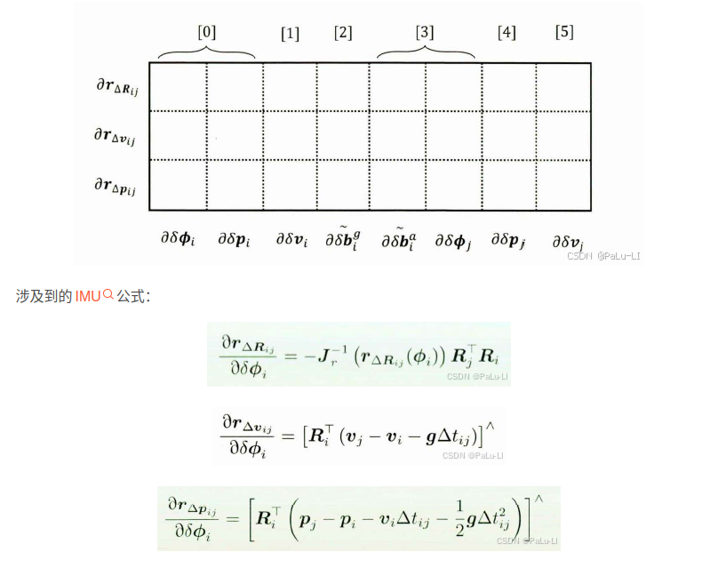
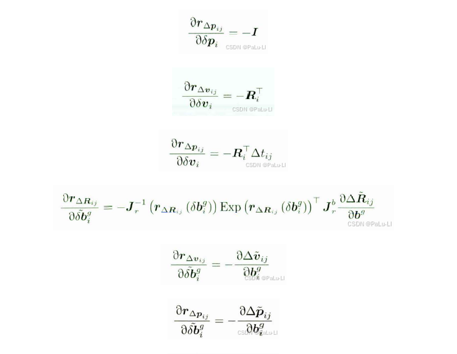   
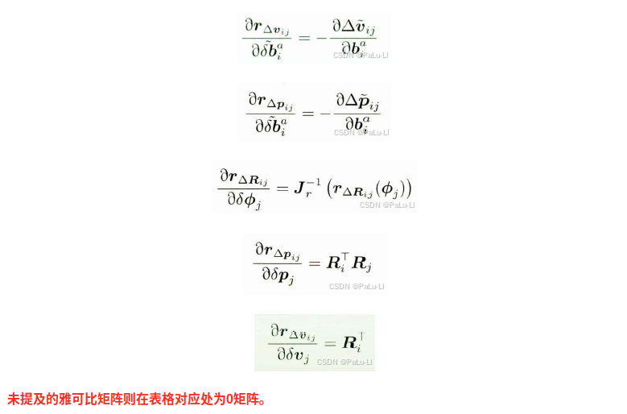
### 要点  
IMU的测量值和通过非IMU方式获得的预测值之间建立优化问题，完成非线性优化。
而在这中间通过近似修正的方式避免了重新积分，这是预积分降低计算量的关键。(优化更新偏差，偏差修正之前的积分，积分再反馈到新的优化中）   
## 视觉和imu联合优化实践    
使用上一普通帧以及当前帧的视觉信息和IMU信息联合优化当前帧位姿、速度和IMU零偏，调用如下：  
[Tracking::Track()](../ORB_SLAM3/src/Tracking.cc) -> TrackLocalMap() -> [Optimizer::PoseInertialOptimizationLastFrame()](../ORB_SLAM3/src/Optimizer.cc)
使用上一关键帧以及当前帧的视觉信息和IMU信息联合优化当前帧位姿、速度和IMU零偏，调用如下:    
[Tracking::Track()](../ORB_SLAM3/src/Tracking.cc) -> TrackLocalMap() -> [Optimizer::PoseInertialOptimizationLastKeyFrame()](../ORB_SLAM3/src/Optimizer.cc)   
区别在于，前者使用上一普通帧位姿作为顶点，后者使用上一关键帧位姿作为顶点    
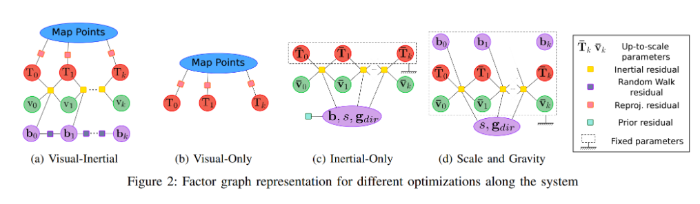
```C++ 
//上一普通帧位姿作为顶点
Frame* pFp = pFrame->mpPrevFrame;
VertexPose* VPk = new VertexPose(pFp);
//上一关键帧位姿作为顶点
KeyFrame* pKF = pFrame->mpLastKeyFrame;
VertexPose* VPk = new VertexPose(pKF);  
```    
使用上一关键帧+当前帧的视觉信息和IMU信息，优化当前帧位姿
可分为以下几个步骤：
Step 1：创建g2o优化器，初始化顶点和边
Step 2：启动多轮优化，剔除外点
Step 3：更新当前帧位姿、速度、IMU偏置
Step 4：记录当前帧的优化状态，包括参数信息和对应的海森矩阵
```C++ 
int Optimizer::PoseInertialOptimizationLastKeyFrame(Frame *pFrame, bool bRecInit)
{
    // 1. 创建g2o优化器，初始化顶点和边
    //构建一个稀疏求解器
    g2o::SparseOptimizer optimizer;
    g2o::BlockSolverX::LinearSolverType *linearSolver;
 
    // 使用dense的求解器，（常见非dense求解器有cholmod线性求解器和shur补线性求解器）
    linearSolver = new g2o::LinearSolverDense<g2o::BlockSolverX::PoseMatrixType>();
 
    g2o::BlockSolverX *solver_ptr = new g2o::BlockSolverX(linearSolver);
    //使用高斯牛顿求解器
    g2o::OptimizationAlgorithmGaussNewton *solver = new g2o::OptimizationAlgorithmGaussNewton(solver_ptr);
    optimizer.setVerbose(false);
    optimizer.setAlgorithm(solver);
 
    //当前帧单（左）目地图点数目
    int nInitialMonoCorrespondences = 0;
    int nInitialStereoCorrespondences = 0;
    //上面两项的和，即参与优化的地图点总数目
    int nInitialCorrespondences = 0;
 
    // Set Frame vertex
    // 2. 确定节点
    // 当前帧的位姿，旋转+平移，6-dim
    VertexPose *VP = new VertexPose(pFrame);
    VP->setId(0);
    VP->setFixed(false);
    optimizer.addVertex(VP);
    //当前帧的速度，3-dim
    VertexVelocity *VV = new VertexVelocity(pFrame);
    VV->setId(1);
    VV->setFixed(false);
    optimizer.addVertex(VV);
    //当前帧的陀螺仪偏置，3-dim
    VertexGyroBias *VG = new VertexGyroBias(pFrame);
    VG->setId(2);
    VG->setFixed(false);
    optimizer.addVertex(VG);
    //当前帧的加速度偏置，3-dim
    VertexAccBias *VA = new VertexAccBias(pFrame);
    VA->setId(3);
    VA->setFixed(false);
    optimizer.addVertex(VA);
    // setFixed(false)这个设置使以上四个顶点（15个参数）在优化时更新
 
    // Set MapPoint vertices
    // 当前帧的特征点总数
    const int N = pFrame->N;
    // 当前帧左目的特征点总数
    const int Nleft = pFrame->Nleft;
    // 当前帧是否存在右目（即是否为双目）
    const bool bRight = (Nleft != -1);
 
    vector<EdgeMonoOnlyPose *> vpEdgesMono;
    vector<EdgeStereoOnlyPose *> vpEdgesStereo;
    vector<size_t> vnIndexEdgeMono;
    vector<size_t> vnIndexEdgeStereo;
    vpEdgesMono.reserve(N);
    vpEdgesStereo.reserve(N);
    vnIndexEdgeMono.reserve(N);
    vnIndexEdgeStereo.reserve(N);
 
    // 自由度为2的卡方分布，显著性水平为0.05，对应的临界阈值5.991
    const float thHuberMono = sqrt(5.991);
    // 自由度为3的卡方分布，显著性水平为0.05，对应的临界阈值7.815
    const float thHuberStereo = sqrt(7.815);
 
    {
        // 锁定地图点。由于需要使用地图点来构造顶点和边,因此不希望在构造的过程中部分地图点被改写造成不一致甚至是段错误
        // 3. 投影边
        unique_lock<mutex> lock(MapPoint::mGlobalMutex);
 
        for (int i = 0; i < N; i++)
        {
            MapPoint *pMP = pFrame->mvpMapPoints[i];
            if (pMP)
            {
                cv::KeyPoint kpUn;
 
                // Left monocular observation
                // 这里说的Left monocular包含两种情况：1.单目情况 2.双目情况下的左目
                if ((!bRight && pFrame->mvuRight[i] < 0) || i < Nleft)
                {
                    //如果是双目情况下的左目
                    if (i < Nleft) // pair left-right
                        //使用未畸变校正的特征点
                        kpUn = pFrame->mvKeys[i];
                    //如果是单目
                    else
                        //使用畸变校正过的特征点
                        kpUn = pFrame->mvKeysUn[i];
 
                    //单目地图点计数增加
                    nInitialMonoCorrespondences++;
                    //当前地图点默认设置为不是外点
                    pFrame->mvbOutlier[i] = false;
 
                    Eigen::Matrix<double, 2, 1> obs;
                    obs << kpUn.pt.x, kpUn.pt.y;
 
                    //***第一种边(视觉重投影约束)：地图点投影到该帧图像的坐标与特征点坐标偏差尽可能小
                    EdgeMonoOnlyPose *e = new EdgeMonoOnlyPose(pMP->GetWorldPos(), 0);
 
                    //将位姿作为第一个顶点
                    e->setVertex(0, VP);
 
                    //设置观测值，即去畸变后的像素坐标
                    e->setMeasurement(obs);
 
                    // Add here uncerteinty
                    // 获取不确定度，这里调用uncertainty2返回固定值1.0
                    // ?这里的1.0是作为缺省值的意思吗？是否可以根据对视觉信息的信任度动态修改这个值，比如标定的误差？
                    const float unc2 = pFrame->mpCamera->uncertainty2(obs);
 
                    // invSigma2 = (Inverse(协方差矩阵))^2，表明该约束在各个维度上的可信度
                    //  图像金字塔层数越高，可信度越差
                    const float invSigma2 = pFrame->mvInvLevelSigma2[kpUn.octave] / unc2;
                    //设置该约束的信息矩阵
                    e->setInformation(Eigen::Matrix2d::Identity() * invSigma2);
 
                    g2o::RobustKernelHuber *rk = new g2o::RobustKernelHuber;
                    // 设置鲁棒核函数，避免其误差的平方项出现数值过大的增长 注：后续在优化2次后会用e->setRobustKernel(0)禁掉鲁棒核函数
                    e->setRobustKernel(rk);
 
                    //重投影误差的自由度为2，设置对应的卡方阈值
                    rk->setDelta(thHuberMono);
 
                    //将第一种边加入优化器
                    optimizer.addEdge(e);
 
                    //将第一种边加入vpEdgesMono
                    vpEdgesMono.push_back(e);
                    //将对应的特征点索引加入vnIndexEdgeMono
                    vnIndexEdgeMono.push_back(i);
                }
                // Stereo observation
                else if (!bRight)
                {
                    nInitialStereoCorrespondences++;
                    pFrame->mvbOutlier[i] = false;
 
                    kpUn = pFrame->mvKeysUn[i];
                    const float kp_ur = pFrame->mvuRight[i];
                    Eigen::Matrix<double, 3, 1> obs;
                    obs << kpUn.pt.x, kpUn.pt.y, kp_ur;
 
                    EdgeStereoOnlyPose *e = new EdgeStereoOnlyPose(pMP->GetWorldPos());
 
                    e->setVertex(0, VP);
                    e->setMeasurement(obs);
 
                    // Add here uncerteinty
                    const float unc2 = pFrame->mpCamera->uncertainty2(obs.head(2));
 
                    const float &invSigma2 = pFrame->mvInvLevelSigma2[kpUn.octave] / unc2;
                    e->setInformation(Eigen::Matrix3d::Identity() * invSigma2);
 
                    g2o::RobustKernelHuber *rk = new g2o::RobustKernelHuber;
                    e->setRobustKernel(rk);
                    rk->setDelta(thHuberStereo);
 
                    optimizer.addEdge(e);
 
                    vpEdgesStereo.push_back(e);
                    vnIndexEdgeStereo.push_back(i);
                }
 
                // Right monocular observation
                if (bRight && i >= Nleft)
                {
                    nInitialMonoCorrespondences++;
                    pFrame->mvbOutlier[i] = false;
 
                    kpUn = pFrame->mvKeysRight[i - Nleft];
                    Eigen::Matrix<double, 2, 1> obs;
                    obs << kpUn.pt.x, kpUn.pt.y;
 
                    EdgeMonoOnlyPose *e = new EdgeMonoOnlyPose(pMP->GetWorldPos(), 1);
 
                    e->setVertex(0, VP);
                    e->setMeasurement(obs);
 
                    // Add here uncerteinty
                    const float unc2 = pFrame->mpCamera->uncertainty2(obs);
 
                    const float invSigma2 = pFrame->mvInvLevelSigma2[kpUn.octave] / unc2;
                    e->setInformation(Eigen::Matrix2d::Identity() * invSigma2);
 
                    g2o::RobustKernelHuber *rk = new g2o::RobustKernelHuber;
                    e->setRobustKernel(rk);
                    rk->setDelta(thHuberMono);
 
                    optimizer.addEdge(e);
 
                    vpEdgesMono.push_back(e);
                    vnIndexEdgeMono.push_back(i);
                }
            }
        }
    }
    //统计参与优化的地图点总数目
    nInitialCorrespondences = nInitialMonoCorrespondences + nInitialStereoCorrespondences;
 
    // 4. 上一个关键帧节点
    // pKF为上一关键帧
    KeyFrame *pKF = pFrame->mpLastKeyFrame;
    //VertexPose：位姿节点，VertexVelocity：速度节点，VertexGyroBias：陀螺仪偏置节点，VertexAccBias：加速度计偏置节点
    //上一关键帧的位姿，旋转+平移，6-dim
    VertexPose *VPk = new VertexPose(pKF);
    VPk->setId(4);
    VPk->setFixed(true);
    optimizer.addVertex(VPk);
    //上一关键帧的速度，3-dim
    VertexVelocity *VVk = new VertexVelocity(pKF);
    VVk->setId(5);
    VVk->setFixed(true);
    optimizer.addVertex(VVk);
    //上一关键帧的陀螺仪偏置，3-dim
    VertexGyroBias *VGk = new VertexGyroBias(pKF);
    VGk->setId(6);
    VGk->setFixed(true);
    optimizer.addVertex(VGk);
    //上一关键帧的加速度偏置，3-dim
    VertexAccBias *VAk = new VertexAccBias(pKF);
    VAk->setId(7);
    VAk->setFixed(true);
    optimizer.addVertex(VAk);
    // setFixed(true)这个设置使以上四个顶点（15个参数）的值在优化时保持固定
    //既然被选为关键帧，就不能太善变
 
    // 5. ***第二种边（IMU预积分约束）：两帧之间位姿的变化量与IMU预积分的值偏差尽可能小
    // EdgeInertial：惯性边（误差为残差）
    EdgeInertial *ei = new EdgeInertial(pFrame->mpImuPreintegrated);
 
    //将上一关键帧四个顶点（P、V、BG、BA）和当前帧两个顶点（P、V）加入第二种边
    ei->setVertex(0, VPk);
    ei->setVertex(1, VVk);
    ei->setVertex(2, VGk);
    ei->setVertex(3, VAk);
    ei->setVertex(4, VP);
    ei->setVertex(5, VV);
    //把第二种边加入优化器
    optimizer.addEdge(ei);
 
    // 6. ***第三种边（陀螺仪随机游走约束）：陀螺仪的随机游走值在相近帧间不会相差太多  residual=VG-VGk
    // 用大白话来讲就是用固定的VGK拽住VG，防止VG在优化中放飞自我
    EdgeGyroRW *egr = new EdgeGyroRW();
 
    // 将上一关键帧的BG加入第三种边
    egr->setVertex(0, VGk);
    //将当前帧的BG加入第三种边
    egr->setVertex(1, VG);
    // C值在预积分阶段更新，range(9,12)对应陀螺仪偏置的协方差，最终cvInfoG值为inv(∑(GyroRW^2/freq))
    cv::Mat cvInfoG = pFrame->mpImuPreintegrated->C.rowRange(9, 12).colRange(9, 12).inv(cv::DECOMP_SVD);
    Eigen::Matrix3d InfoG;
    for (int r = 0; r < 3; r++)
        for (int c = 0; c < 3; c++)
            InfoG(r, c) = cvInfoG.at<float>(r, c);
 
    // 设置信息矩阵
    egr->setInformation(InfoG);
    // 把第三种边加入优化器
    optimizer.addEdge(egr);
 
    // 7. ***第四种边（加速度随机游走约束）：加速度的随机游走值在相近帧间不会相差太多  residual=VA-VAk
    // 用大白话来讲就是用固定的VAK拽住VA，防止VA在优化中放飞自我
    EdgeAccRW *ear = new EdgeAccRW();
    // 将上一关键帧的BA加入第四种边
    ear->setVertex(0, VAk);
    // 将当前帧的BA加入第四种边
    ear->setVertex(1, VA);
    // C值在预积分阶段更新，range(12,15)对应加速度偏置的协方差，最终cvInfoG值为inv(∑(AccRW^2/freq))
    cv::Mat cvInfoA = pFrame->mpImuPreintegrated->C.rowRange(12, 15).colRange(12, 15).inv(cv::DECOMP_SVD);
    Eigen::Matrix3d InfoA;
    for (int r = 0; r < 3; r++)
        for (int c = 0; c < 3; c++)
            InfoA(r, c) = cvInfoA.at<float>(r, c);
    // 设置信息矩阵
    ear->setInformation(InfoA);
    // 把第四种边加入优化器
    optimizer.addEdge(ear);
 
    // 8. 启动多轮优化，剔除外点
 
    // We perform 4 optimizations, after each optimization we classify observation as inlier/outlier
    // At the next optimization, outliers are not included, but at the end they can be classified as inliers again.
    // 卡方检验值呈递减趋势，目的是让检验越来越苛刻
    float chi2Mono[4] = {12, 7.5, 5.991, 5.991};
    float chi2Stereo[4] = {15.6, 9.8, 7.815, 7.815};
    // 4次优化的迭代次数都为10
    int its[4] = {10, 10, 10, 10};
 
    // 坏点数
    int nBad = 0;
    // 单目坏点数
    int nBadMono = 0;
    // 双目坏点数
    int nBadStereo = 0;
    // 单目内点数
    int nInliersMono = 0;
    // 双目内点数
    int nInliersStereo = 0;
    // 内点数
    int nInliers = 0;
    bool bOut = false;
 
    // 进行4次优化
    for (size_t it = 0; it < 4; it++)
    {
        // 初始化优化器,这里的参数0代表只对level为0的边进行优化（不传参数默认也是0）
        optimizer.initializeOptimization(0);
        // 每次优化迭代十次
        optimizer.optimize(its[it]);
 
        // 每次优化都重新统计各类点的数目
        nBad = 0;
        nBadMono = 0;
        nBadStereo = 0;
        nInliers = 0;
        nInliersMono = 0;
        nInliersStereo = 0;
 
        // 使用1.5倍的chi2Mono作为“近点”的卡方检验值，意味着地图点越近，检验越宽松
        // 地图点如何定义为“近点”在下面的代码中有解释
        float chi2close = 1.5 * chi2Mono[it];
 
        // For monocular observations
        for (size_t i = 0, iend = vpEdgesMono.size(); i < iend; i++)
        {
            EdgeMonoOnlyPose *e = vpEdgesMono[i];
 
            const size_t idx = vnIndexEdgeMono[i];
 
            // 如果这条误差边是来自于outlier
            if (pFrame->mvbOutlier[idx])
            {
                // 计算这条边上次优化后的误差
                e->computeError();
            }
 
            // 就是error*\Omega*error，表示了这条边考虑置信度以后的误差大小
            const float chi2 = e->chi2();
 
            // 当地图点在当前帧的深度值小于10时，该地图点属于close（近点）
            // mTrackDepth是在Frame.cc的isInFrustum函数中计算出来的
            bool bClose = pFrame->mvpMapPoints[idx]->mTrackDepth < 10.f;
 
            // 判断某地图点为外点的条件有以下三种：
            // 1.该地图点不是近点并且误差大于卡方检验值chi2Mono[it]
            // 2.该地图点是近点并且误差大于卡方检验值chi2close
            // 3.深度不为正
            // 每次优化后，用更小的卡方检验值，原因是随着优化的进行，对划分为内点的信任程度越来越低
            if ((chi2 > chi2Mono[it] && !bClose) || (bClose && chi2 > chi2close) || !e->isDepthPositive())
            {
                // 将该点设置为外点
                pFrame->mvbOutlier[idx] = true;
                // 外点不参与下一轮优化
                e->setLevel(1);
                // 单目坏点数+1
                nBadMono++;
            }
            else
            {
                // 将该点设置为内点（暂时）
                pFrame->mvbOutlier[idx] = false;
                // 内点继续参与下一轮优化
                e->setLevel(0);
                // 单目内点数+1
                nInliersMono++;
            }
 
            // 从第三次优化开始就不设置鲁棒核函数了，原因是经过两轮优化已经趋向准确值，不会有太大误差
            if (it == 2)
                e->setRobustKernel(0);
        }
 
        // For stereo observations
        for (size_t i = 0, iend = vpEdgesStereo.size(); i < iend; i++)
        {
            EdgeStereoOnlyPose *e = vpEdgesStereo[i];
 
            const size_t idx = vnIndexEdgeStereo[i];
 
            if (pFrame->mvbOutlier[idx])
            {
                e->computeError();
            }
 
            const float chi2 = e->chi2();
 
            if (chi2 > chi2Stereo[it])
            {
                pFrame->mvbOutlier[idx] = true;
                e->setLevel(1); // not included in next optimization
                nBadStereo++;
            }
            else
            {
                pFrame->mvbOutlier[idx] = false;
                e->setLevel(0);
                nInliersStereo++;
            }
 
            if (it == 2)
                e->setRobustKernel(0);
        }
 
        // 内点总数=单目内点数+双目内点数
        nInliers = nInliersMono + nInliersStereo;
        // 坏点数=单目坏点数+双目坏点数
        nBad = nBadMono + nBadStereo;
 
        if (optimizer.edges().size() < 10)
        {
            cout << "PIOLKF: NOT ENOUGH EDGES" << endl;
            break;
        }
    }
 
    // If not too much tracks, recover not too bad points
    // 9. 若4次优化后内点数小于30，尝试恢复一部分不那么糟糕的坏点
    if ((nInliers < 30) && !bRecInit)
    {
        //重新从0开始统计坏点数
        nBad = 0;
        //单目可容忍的卡方检验最大值（如果误差比这还大就不要挣扎了...）
        const float chi2MonoOut = 18.f;
        const float chi2StereoOut = 24.f;
        EdgeMonoOnlyPose *e1;
        EdgeStereoOnlyPose *e2;
        //遍历所有单目特征点
        for (size_t i = 0, iend = vnIndexEdgeMono.size(); i < iend; i++)
        {
            const size_t idx = vnIndexEdgeMono[i];
            //获取这些特征点对应的边
            e1 = vpEdgesMono[i];
            e1->computeError();
            //判断误差值是否超过单目可容忍的卡方检验最大值，是的话就把这个点保下来
            if (e1->chi2() < chi2MonoOut)
                pFrame->mvbOutlier[idx] = false;
            else
                nBad++;
        }
        for (size_t i = 0, iend = vnIndexEdgeStereo.size(); i < iend; i++)
        {
            const size_t idx = vnIndexEdgeStereo[i];
            e2 = vpEdgesStereo[i];
            e2->computeError();
            if (e2->chi2() < chi2StereoOut)
                pFrame->mvbOutlier[idx] = false;
            else
                nBad++;
        }
    }
 
    // 10. 更新当前帧位姿、速度、IMU偏置
 
    // Recover optimized pose, velocity and biases
    // 给当前帧设置优化后的旋转、位移、速度，用来更新位姿
    pFrame->SetImuPoseVelocity(Converter::toCvMat(VP->estimate().Rwb), Converter::toCvMat(VP->estimate().twb), Converter::toCvMat(VV->estimate()));
    Vector6d b;
    b << VG->estimate(), VA->estimate();
    // 给当前帧设置优化后的bg，ba
    pFrame->mImuBias = IMU::Bias(b[3], b[4], b[5], b[0], b[1], b[2]);
 
    // 11. 记录当前帧的优化状态，包括参数信息和对应的海森矩阵
    // Recover Hessian, marginalize keyFframe states and generate new prior for frame
    Eigen::Matrix<double, 15, 15> H;
    H.setZero();
 
    // H(x)=J(x).t()*info*J(x)
 
    // J(x)取的是EdgeInertial中的_jacobianOplus[4]和_jacobianOplus[5]，即EdgeInertial::computeError计算出来的er,ev,ep对当前帧Pose和Velocity的偏导
    //因此ei->GetHessian2的结果为：
    // H(∂er/∂r) H(∂er/∂t) H(∂er/∂v)
    // H(∂ev/∂r) H(∂ev/∂t) H(∂ev/∂v)
    // H(∂ep/∂r) H(∂ep/∂t) H(∂ep/∂v)
    //每项H都是3x3，故GetHessian2的结果是9x9
    H.block<9, 9>(0, 0) += ei->GetHessian2();
 
    // J(x)取的是EdgeGyroRW中的_jacobianOplusXj，即EdgeGyroRW::computeError计算出来的_error(ebg)对当前帧bg的偏导
    //因此egr->GetHessian2的结果为：
    // H(∂ebg/∂bg) ，3x3
    H.block<3, 3>(9, 9) += egr->GetHessian2();
 
    // J(x)取的是EdgeAccRW中的_jacobianOplusXj，即EdgeAccRW::computeError计算出来的_error(ebg)对当前帧ba的偏导
    //因此ear->GetHessian2的结果为：
    // H(∂eba/∂ba)  ，3x3
    H.block<3, 3>(12, 12) += ear->GetHessian2();
 
    //经过前面几步，Hessian Matrix长这个样子（注：省略了->GetHessian2()）
    // ei ei ei ei ei ei ei ei ei   0      0     0    0     0    0
    // ei ei ei ei ei ei ei ei ei   0      0     0    0     0    0
    // ei ei ei ei ei ei ei ei ei   0      0     0    0     0    0
    // ei ei ei ei ei ei ei ei ei   0      0     0    0     0    0
    // ei ei ei ei ei ei ei ei ei   0      0     0    0     0    0
    // ei ei ei ei ei ei ei ei ei   0      0     0    0     0    0
    // ei ei ei ei ei ei ei ei ei   0      0     0    0     0    0
    // ei ei ei ei ei ei ei ei ei   0      0     0    0     0    0
    // ei ei ei ei ei ei ei ei ei   0      0     0    0     0    0
    // 0  0  0  0  0  0  0   0  0  egr egr egr  0     0     0
    // 0  0  0  0  0  0  0   0  0  egr egr egr  0     0     0
    // 0  0  0  0  0  0  0   0  0  egr egr egr  0     0     0
    // 0  0  0  0  0  0  0   0  0    0     0      0  ear ear ear
    // 0  0  0  0  0  0  0   0  0    0     0      0  ear ear ear
    // 0  0  0  0  0  0  0   0  0    0     0      0  ear ear ear
 
    int tot_in = 0, tot_out = 0;
    for (size_t i = 0, iend = vpEdgesMono.size(); i < iend; i++)
    {
        EdgeMonoOnlyPose *e = vpEdgesMono[i];
 
        const size_t idx = vnIndexEdgeMono[i];
 
        if (!pFrame->mvbOutlier[idx])
        {
            H.block<6, 6>(0, 0) += e->GetHessian();
            tot_in++;
        }
        else
            tot_out++;
    }
 
    for (size_t i = 0, iend = vpEdgesStereo.size(); i < iend; i++)
    {
        EdgeStereoOnlyPose *e = vpEdgesStereo[i];
 
        const size_t idx = vnIndexEdgeStereo[i];
 
        if (!pFrame->mvbOutlier[idx])
        {
            H.block<6, 6>(0, 0) += e->GetHessian();
            tot_in++;
        }
        else
            tot_out++;
    }
 
    //设eie = ei->GetHessian2()+∑(e->GetHessian())
    //则最终Hessian Matrix长这样
    // eie eie eie eie eie eie         ei ei ei   0      0     0    0     0    0
    // eie eie eie eie eie eie         ei ei ei   0      0     0    0     0    0
    // eie eie eie eie eie eie         ei ei ei   0      0     0    0     0    0
    // eie eie eie eie eie eie         ei ei ei   0      0     0    0     0    0
    // eie eie eie eie eie eie         ei ei ei   0      0     0    0     0    0
    // eie eie eie eie eie eie         ei ei ei   0      0     0    0     0    0
    // ei    ei    ei    ei   ei   ei  ei ei ei   0      0     0    0     0    0
    // ei    ei    ei    ei   ei   ei  ei ei ei   0      0     0    0     0    0
    // ei    ei    ei    ei   ei   ei  ei ei ei   0      0     0    0     0    0
    //  0     0     0     0     0    0   0   0  0  egr egr egr  0     0     0
    //  0     0     0     0     0    0   0   0  0  egr egr egr  0     0     0
    //  0     0     0     0     0    0   0   0  0  egr egr egr  0     0     0
    //  0     0     0     0     0    0   0   0  0    0     0      0  ear ear ear
    //  0     0     0     0     0    0   0   0  0    0     0      0  ear ear ear
    //  0     0     0     0     0    0   0   0  0    0     0      0  ear ear ear
 
    //构造一个ConstraintPoseImu对象，为下一帧提供先验约束
    //构造对象所使用的参数是当前帧P、V、BG、BA的估计值和H矩阵
    pFrame->mpcpi = new ConstraintPoseImu(VP->estimate().Rwb, VP->estimate().twb, VV->estimate(), VG->estimate(), VA->estimate(), H);
    //在PoseInertialOptimizationLastFrame函数中，会将ConstraintPoseImu信息作为“上一帧先验约束”生成一条优化边
 
    //返回值：内点数 = 总地图点数目 - 坏点（外点）数目
    return nInitialCorrespondences - nBad;
}
```    
使用上一帧+当前帧的视觉信息和IMU信息，优化当前帧位姿
可分为以下几个步骤：
Step 1：创建g2o优化器，初始化顶点和边
Step 2：启动多轮优化，剔除外点
Step 3：更新当前帧位姿、速度、IMU偏置
Step 4：记录当前帧的优化状态，包括参数信息和边缘化后的海森矩阵
```C++ 
int Optimizer::PoseInertialOptimizationLastFrame(Frame *pFrame, bool bRecInit)
{
    // Step 1：创建g2o优化器，初始化顶点和边
    //构建一个稀疏求解器
    g2o::SparseOptimizer optimizer;
    g2o::BlockSolverX::LinearSolverType *linearSolver;
 
    // 使用dense的求解器，（常见非dense求解器有cholmod线性求解器和shur补线性求解器）
    linearSolver = new g2o::LinearSolverDense<g2o::BlockSolverX::PoseMatrixType>();
 
    g2o::BlockSolverX *solver_ptr = new g2o::BlockSolverX(linearSolver);
 
    //使用高斯牛顿求解器
    g2o::OptimizationAlgorithmGaussNewton *solver = new g2o::OptimizationAlgorithmGaussNewton(solver_ptr);
    optimizer.setAlgorithm(solver);
    optimizer.setVerbose(false);
 
    //当前帧单（左）目地图点数目
    int nInitialMonoCorrespondences = 0;
    int nInitialStereoCorrespondences = 0;
    int nInitialCorrespondences = 0;
 
    // Set Current Frame vertex
    //当前帧的位姿，旋转+平移，6-dim
    VertexPose *VP = new VertexPose(pFrame);
    VP->setId(0);
    VP->setFixed(false); //需要优化，所以不固定
    optimizer.addVertex(VP);
    //当前帧的速度，3-dim
    VertexVelocity *VV = new VertexVelocity(pFrame);
    VV->setId(1);
    VV->setFixed(false);
    optimizer.addVertex(VV);
    //当前帧的陀螺仪偏置，3-dim
    VertexGyroBias *VG = new VertexGyroBias(pFrame);
    VG->setId(2);
    VG->setFixed(false);
    optimizer.addVertex(VG);
    //当前帧的加速度偏置，3-dim
    VertexAccBias *VA = new VertexAccBias(pFrame);
    VA->setId(3);
    VA->setFixed(false);
    optimizer.addVertex(VA);
 
    // Set MapPoint vertices
    //当前帧的特征点总数 N = Nleft + Nright
    //对于单目 N!=0, Nleft=-1，Nright=-1
    //对于双目 N!=0, Nleft!=-1，Nright!=-1
    const int N = pFrame->N;
    //当前帧左目的特征点总数
    const int Nleft = pFrame->Nleft;
    //当前帧是否存在右目（即是否为双目），存在为true
    //?感觉可以更直接点啊 bRight = (Nright!=-1)
    const bool bRight = (Nleft != -1);
 
    vector<EdgeMonoOnlyPose *> vpEdgesMono;
    vector<EdgeStereoOnlyPose *> vpEdgesStereo;
    vector<size_t> vnIndexEdgeMono;
    vector<size_t> vnIndexEdgeStereo;
    vpEdgesMono.reserve(N);
    vpEdgesStereo.reserve(N);
    vnIndexEdgeMono.reserve(N);
    vnIndexEdgeStereo.reserve(N);
 
    // 自由度为2的卡方分布，显著性水平为0.05，对应的临界阈值5.991
    const float thHuberMono = sqrt(5.991);
    // 自由度为3的卡方分布，显著性水平为0.05，对应的临界阈值7.815
    const float thHuberStereo = sqrt(7.815);
 
    {
        // 锁定地图点。由于需要使用地图点来构造顶点和边,因此不希望在构造的过程中部分地图点被改写造成不一致甚至是段错误
        unique_lock<mutex> lock(MapPoint::mGlobalMutex);
 
        for (int i = 0; i < N; i++)
        {
            MapPoint *pMP = pFrame->mvpMapPoints[i];
            if (pMP)
            {
                cv::KeyPoint kpUn;
                // Left monocular observation
                // 这里说的Left monocular包含两种情况：1.单目情况 2.双目情况下的左目
                if ((!bRight && pFrame->mvuRight[i] < 0) || i < Nleft)
                {
                    //如果是双目情况下的左目
                    if (i < Nleft) // pair left-right
                        //使用未畸变校正的特征点
                        kpUn = pFrame->mvKeys[i];
                    //如果是单目
                    else
                        //使用畸变校正过的特征点
                        kpUn = pFrame->mvKeysUn[i];
 
                    //单目地图点计数增加
                    nInitialMonoCorrespondences++;
                    //当前地图点默认设置为不是外点
                    pFrame->mvbOutlier[i] = false;
                    // 观测的特征点
                    Eigen::Matrix<double, 2, 1> obs;
                    obs << kpUn.pt.x, kpUn.pt.y;
 
                    //第一种边(视觉重投影约束)：地图点投影到该帧图像的坐标与特征点坐标偏差尽可能小
                    EdgeMonoOnlyPose *e = new EdgeMonoOnlyPose(pMP->GetWorldPos(), 0);
 
                    //将位姿作为第一个顶点
                    e->setVertex(0, VP);
 
                    //设置观测值，即去畸变后的像素坐标
                    e->setMeasurement(obs);
 
                    // Add here uncerteinty
                    // 获取不确定度，这里调用uncertainty2返回固定值1.0
                    // ?这里返回1.0是作为缺省值，是否可以根据对视觉信息的信任度动态修改这个值，比如标定的误差？
                    const float unc2 = pFrame->mpCamera->uncertainty2(obs);
 
                    // invSigma2 = (Inverse(协方差矩阵))^2，表明该约束在各个维度上的可信度
                    //  图像金字塔层数越高，可信度越差
                    const float invSigma2 = pFrame->mvInvLevelSigma2[kpUn.octave] / unc2;
                    //设置该约束的信息矩阵
                    e->setInformation(Eigen::Matrix2d::Identity() * invSigma2);
 
                    g2o::RobustKernelHuber *rk = new g2o::RobustKernelHuber;
                    // 设置鲁棒核函数，避免其误差的平方项出现数值过大的增长 注：后续在优化2次后会用e->setRobustKernel(0)禁掉鲁棒核函数
                    e->setRobustKernel(rk);
                    //重投影误差的自由度为2，设置对应的卡方阈值
                    rk->setDelta(thHuberMono);
 
                    //将第一种边加入优化器
                    optimizer.addEdge(e);
 
                    //将第一种边加入vpEdgesMono
                    vpEdgesMono.push_back(e);
                    //将对应的特征点索引加入vnIndexEdgeMono
                    vnIndexEdgeMono.push_back(i);
                }
                // Stereo observation
                else if (!bRight) //? 为什么是双目
                {
                    nInitialStereoCorrespondences++;
                    pFrame->mvbOutlier[i] = false;
 
                    kpUn = pFrame->mvKeysUn[i];
                    const float kp_ur = pFrame->mvuRight[i];
                    Eigen::Matrix<double, 3, 1> obs;
                    obs << kpUn.pt.x, kpUn.pt.y, kp_ur;
 
                    EdgeStereoOnlyPose *e = new EdgeStereoOnlyPose(pMP->GetWorldPos());
 
                    e->setVertex(0, VP);
                    e->setMeasurement(obs);
 
                    // Add here uncerteinty
                    const float unc2 = pFrame->mpCamera->uncertainty2(obs.head(2));
 
                    const float &invSigma2 = pFrame->mvInvLevelSigma2[kpUn.octave] / unc2;
                    e->setInformation(Eigen::Matrix3d::Identity() * invSigma2);
 
                    g2o::RobustKernelHuber *rk = new g2o::RobustKernelHuber;
                    e->setRobustKernel(rk);
                    rk->setDelta(thHuberStereo);
 
                    optimizer.addEdge(e);
 
                    vpEdgesStereo.push_back(e);
                    vnIndexEdgeStereo.push_back(i);
                }
 
                // Right monocular observation
                if (bRight && i >= Nleft)
                {
                    nInitialMonoCorrespondences++;
                    pFrame->mvbOutlier[i] = false;
 
                    kpUn = pFrame->mvKeysRight[i - Nleft];
                    Eigen::Matrix<double, 2, 1> obs;
                    obs << kpUn.pt.x, kpUn.pt.y;
 
                    EdgeMonoOnlyPose *e = new EdgeMonoOnlyPose(pMP->GetWorldPos(), 1);
 
                    e->setVertex(0, VP);
                    e->setMeasurement(obs);
 
                    // Add here uncerteinty
                    const float unc2 = pFrame->mpCamera->uncertainty2(obs);
 
                    const float invSigma2 = pFrame->mvInvLevelSigma2[kpUn.octave] / unc2;
                    e->setInformation(Eigen::Matrix2d::Identity() * invSigma2);
 
                    g2o::RobustKernelHuber *rk = new g2o::RobustKernelHuber;
                    e->setRobustKernel(rk);
                    rk->setDelta(thHuberMono);
 
                    optimizer.addEdge(e);
 
                    vpEdgesMono.push_back(e);
                    vnIndexEdgeMono.push_back(i);
                }
            }
        }
    }
    //统计参与优化的地图点总数目
    nInitialCorrespondences = nInitialMonoCorrespondences + nInitialStereoCorrespondences;
 
    // Set Previous Frame Vertex
    // pFp为上一帧
    Frame *pFp = pFrame->mpPrevFrame;
 
    //上一帧的位姿，旋转+平移，6-dim
    VertexPose *VPk = new VertexPose(pFp);
    VPk->setId(4);
    VPk->setFixed(false);
    optimizer.addVertex(VPk);
    //上一帧的速度，3-dim
    VertexVelocity *VVk = new VertexVelocity(pFp);
    VVk->setId(5);
    VVk->setFixed(false);
    optimizer.addVertex(VVk);
    //上一帧的陀螺仪偏置，3-dim
    VertexGyroBias *VGk = new VertexGyroBias(pFp);
    VGk->setId(6);
    VGk->setFixed(false);
    optimizer.addVertex(VGk);
    //上一帧的加速度偏置，3-dim
    VertexAccBias *VAk = new VertexAccBias(pFp);
    VAk->setId(7);
    VAk->setFixed(false);
    optimizer.addVertex(VAk);
    // setFixed(false)这个设置使以上四个顶点（15个参数）的值随优化而变，这样做会给上一帧再提供一些优化空间
    //但理论上不应该优化过多，否则会有不良影响，故后面的代码会用第五种边来约束上一帧的变化量
 
    //第二种边（IMU预积分约束）：两帧之间位姿的变化量与IMU预积分的值偏差尽可能小
    EdgeInertial *ei = new EdgeInertial(pFrame->mpImuPreintegratedFrame);
 
    //将上一帧四个顶点（P、V、BG、BA）和当前帧两个顶点（P、V）加入第二种边
    ei->setVertex(0, VPk);
    ei->setVertex(1, VVk);
    ei->setVertex(2, VGk);
    ei->setVertex(3, VAk);
    ei->setVertex(4, VP);
    ei->setVertex(5, VV);
    //把第二种边加入优化器
    optimizer.addEdge(ei);
 
    //第三种边（陀螺仪随机游走约束）：陀螺仪的随机游走值在相邻帧间不会相差太多  residual=VG-VGk
    //用大白话来讲就是用固定的VGK拽住VG，防止VG在优化中放飞自我
    EdgeGyroRW *egr = new EdgeGyroRW();
    //将上一帧的BG加入第三种边
    egr->setVertex(0, VGk);
    //将当前帧的BG加入第三种边
    egr->setVertex(1, VG);
    // C值在预积分阶段更新，range(9,12)对应陀螺仪偏置的协方差，最终cvInfoG值为inv(∑(GyroRW^2/freq))
    cv::Mat cvInfoG = pFrame->mpImuPreintegratedFrame->C.rowRange(9, 12).colRange(9, 12).inv(cv::DECOMP_SVD);
    Eigen::Matrix3d InfoG;
    for (int r = 0; r < 3; r++)
        for (int c = 0; c < 3; c++)
            InfoG(r, c) = cvInfoG.at<float>(r, c);
 
    //设置信息矩阵
    egr->setInformation(InfoG);
    //把第三种边加入优化器
    optimizer.addEdge(egr);
 
    //第四种边（加速度随机游走约束）：加速度的随机游走值在相近帧间不会相差太多  residual=VA-VAk
    //用大白话来讲就是用固定的VAK拽住VA，防止VA在优化中放飞自我
    EdgeAccRW *ear = new EdgeAccRW();
    //将上一帧的BA加入第四种边
    ear->setVertex(0, VAk);
    //将当前帧的BA加入第四种边
    ear->setVertex(1, VA);
    // C值在预积分阶段更新，range(12,15)对应加速度偏置的协方差，最终cvInfoG值为inv(∑(AccRW^2/freq))
    cv::Mat cvInfoA = pFrame->mpImuPreintegratedFrame->C.rowRange(12, 15).colRange(12, 15).inv(cv::DECOMP_SVD);
    Eigen::Matrix3d InfoA;
    for (int r = 0; r < 3; r++)
        for (int c = 0; c < 3; c++)
            InfoA(r, c) = cvInfoA.at<float>(r, c);
    //设置信息矩阵
    ear->setInformation(InfoA);
    //把第四种边加入优化器
    optimizer.addEdge(ear);
 
    // ?既然有判空的操作，可以区分一下有先验信息（五条边）和无先验信息（四条边）的情况
    if (!pFp->mpcpi)
        Verbose::PrintMess("pFp->mpcpi does not exist!!!\nPrevious Frame " + to_string(pFp->mnId), Verbose::VERBOSITY_NORMAL);
 
    //第五种边（先验约束）：上一帧信息随优化的改变量要尽可能小
    EdgePriorPoseImu *ep = new EdgePriorPoseImu(pFp->mpcpi);
 
    //将上一帧的四个顶点（P、V、BG、BA）加入第五种边
    ep->setVertex(0, VPk);
    ep->setVertex(1, VVk);
    ep->setVertex(2, VGk);
    ep->setVertex(3, VAk);
    g2o::RobustKernelHuber *rkp = new g2o::RobustKernelHuber;
    ep->setRobustKernel(rkp);
    rkp->setDelta(5);
    //把第五种边加入优化器
    optimizer.addEdge(ep);
 
    // Step 2：启动多轮优化，剔除外点
 
    // We perform 4 optimizations, after each optimization we classify observation as inlier/outlier
    // At the next optimization, outliers are not included, but at the end they can be classified as inliers again.
    //与PoseInertialOptimizationLastKeyFrame函数对比，区别在于：在优化过程中保持卡方阈值不变
    // 以下参数的解释
    // 自由度为2的卡方分布，显著性水平为0.05，对应的临界阈值5.991
    // 自由度为3的卡方分布，显著性水平为0.05，对应的临界阈值7.815
    // 自由度为3的卡方分布，显著性水平为0.02，对应的临界阈值9.8
    // 自由度为3的卡方分布，显著性水平为0.001，对应的临界阈值15.6
    // 计算方法：https://stattrek.com/online-calculator/chi-square.aspx
    const float chi2Mono[4] = {5.991, 5.991, 5.991, 5.991};
    const float chi2Stereo[4] = {15.6f, 9.8f, 7.815f, 7.815f};
    // 4次优化的迭代次数都为10
    const int its[4] = {10, 10, 10, 10};
 
    //坏点数
    int nBad = 0;
    //单目坏点数
    int nBadMono = 0;
    //双目坏点数
    int nBadStereo = 0;
    //单目内点数
    int nInliersMono = 0;
    //双目内点数
    int nInliersStereo = 0;
    //内点数
    int nInliers = 0;
    for (size_t it = 0; it < 4; it++)
    {
        // 初始化优化器,这里的参数0代表只对level为0的边进行优化（不传参数默认也是0）
        optimizer.initializeOptimization(0);
        //每次优化迭代十次
        optimizer.optimize(its[it]);
 
        //每次优化都重新统计各类点的数目
        nBad = 0;
        nBadMono = 0;
        nBadStereo = 0;
        nInliers = 0;
        nInliersMono = 0;
        nInliersStereo = 0;
        //使用1.5倍的chi2Mono作为“近点”的卡方检验值，意味着地图点越近，检验越宽松
        //地图点如何定义为“近点”在下面的代码中有解释
        float chi2close = 1.5 * chi2Mono[it];
 
        for (size_t i = 0, iend = vpEdgesMono.size(); i < iend; i++)
        {
            EdgeMonoOnlyPose *e = vpEdgesMono[i];
 
            const size_t idx = vnIndexEdgeMono[i];
 
            //当地图点在当前帧的深度值小于10时，该地图点属于close（近点）
            // mTrackDepth是在Frame.cc的isInFrustum函数中计算出来的
            bool bClose = pFrame->mvpMapPoints[idx]->mTrackDepth < 10.f;
 
            // 如果这条误差边是来自于outlier
            if (pFrame->mvbOutlier[idx])
            {
                //计算本次优化后的误差
                e->computeError();
            }
 
            // 就是error*\Omega*error，表示了这条边考虑置信度以后的误差大小
            const float chi2 = e->chi2();
 
            //判断某地图点为外点的条件有以下三种：
            // 1.该地图点不是近点并且误差大于卡方检验值chi2Mono[it]
            // 2.该地图点是近点并且误差大于卡方检验值chi2close
            // 3.深度不为正
            //每次优化后，用更小的卡方检验值，原因是随着优化的进行，对划分为内点的信任程度越来越低
            if ((chi2 > chi2Mono[it] && !bClose) || (bClose && chi2 > chi2close) || !e->isDepthPositive())
            {
                //将该点设置为外点
                pFrame->mvbOutlier[idx] = true;
                //外点不参与下一轮优化
                e->setLevel(1);
                //单目坏点数+1
                nBadMono++;
            }
            else
            {
                //将该点设置为内点（暂时）
                pFrame->mvbOutlier[idx] = false;
                //内点继续参与下一轮优化
                e->setLevel(0);
                //单目内点数+1
                nInliersMono++;
            }
 
            //从第三次优化开始就不设置鲁棒核函数了，原因是经过两轮优化已经趋向准确值，不会有太大误差
            if (it == 2)
                e->setRobustKernel(0);
        }
 
        for (size_t i = 0, iend = vpEdgesStereo.size(); i < iend; i++)
        {
            EdgeStereoOnlyPose *e = vpEdgesStereo[i];
 
            const size_t idx = vnIndexEdgeStereo[i];
 
            if (pFrame->mvbOutlier[idx])
            {
                e->computeError();
            }
 
            const float chi2 = e->chi2();
 
            if (chi2 > chi2Stereo[it])
            {
                pFrame->mvbOutlier[idx] = true;
                e->setLevel(1);
                nBadStereo++;
            }
            else
            {
                pFrame->mvbOutlier[idx] = false;
                e->setLevel(0);
                nInliersStereo++;
            }
 
            if (it == 2)
                e->setRobustKernel(0);
        }
 
        //内点总数=单目内点数+双目内点数
        nInliers = nInliersMono + nInliersStereo;
        //坏点数=单目坏点数+双目坏点数
        nBad = nBadMono + nBadStereo;
 
        if (optimizer.edges().size() < 10)
        {
            cout << "PIOLF: NOT ENOUGH EDGES" << endl;
            break;
        }
    }
 
    //若4次优化后内点数小于30，尝试恢复一部分不那么糟糕的坏点
    if ((nInliers < 30) && !bRecInit)
    {
        //重新从0开始统计坏点数
        nBad = 0;
        //单目可容忍的卡方检验最大值（如果误差比这还大就不要挣扎了...）
        const float chi2MonoOut = 18.f;
        const float chi2StereoOut = 24.f;
        EdgeMonoOnlyPose *e1;
        EdgeStereoOnlyPose *e2;
        //遍历所有单目特征点
        for (size_t i = 0, iend = vnIndexEdgeMono.size(); i < iend; i++)
        {
            const size_t idx = vnIndexEdgeMono[i];
            //获取这些特征点对应的边
            e1 = vpEdgesMono[i];
            e1->computeError();
            if (e1->chi2() < chi2MonoOut)
                pFrame->mvbOutlier[idx] = false;
            else
                nBad++;
        }
        for (size_t i = 0, iend = vnIndexEdgeStereo.size(); i < iend; i++)
        {
            const size_t idx = vnIndexEdgeStereo[i];
            e2 = vpEdgesStereo[i];
            e2->computeError();
            if (e2->chi2() < chi2StereoOut)
                pFrame->mvbOutlier[idx] = false;
            else
                nBad++;
        }
    }
 
    // ?多此一举？优化过程中nInliers这个值已经计算过了，nInliersMono和nInliersStereo在后续代码中一直保持不变
    nInliers = nInliersMono + nInliersStereo;
 
    // Step 3：更新当前帧位姿、速度、IMU偏置
 
    // Recover optimized pose, velocity and biases
    //给当前帧设置优化后的旋转、位移、速度，用来更新位姿
    pFrame->SetImuPoseVelocity(Converter::toCvMat(VP->estimate().Rwb), Converter::toCvMat(VP->estimate().twb), Converter::toCvMat(VV->estimate()));
    Vector6d b;
    b << VG->estimate(), VA->estimate();
    //给当前帧设置优化后的bg，ba
    pFrame->mImuBias = IMU::Bias(b[3], b[4], b[5], b[0], b[1], b[2]);
 
    // Step 4：记录当前帧的优化状态，包括参数信息和边缘化后的海森矩阵
    // Recover Hessian, marginalize previous frame states and generate new prior for frame
    //包含本次优化所有信息矩阵的和，它代表本次优化对确定性的影响
    Eigen::Matrix<double, 30, 30> H;
    H.setZero();
 
    //第1步，加上EdgeInertial（IMU预积分约束）的海森矩阵
    // ei的定义
    // EdgeInertial* ei = new EdgeInertial(pFrame->mpImuPreintegratedFrame);
    // ei->setVertex(0, VPk);
    // ei->setVertex(1, VVk);
    // ei->setVertex(2, VGk);
    // ei->setVertex(3, VAk);
    // ei->setVertex(4, VP);  // VertexPose* VP = new VertexPose(pFrame);
    // ei->setVertex(5, VV);  // VertexVelocity* VV = new VertexVelocity(pFrame);
    // ei->GetHessian()  =  J.t * J 下同，不做详细标注了
    // J
    //       rn + tn  vn    gn   an   rn+1 + tn+1  vn+1
    // er      Jp1    Jv1  Jg1   Ja1      Jp2      Jv2
    // 角标1表示上一帧，2表示当前帧
    //      6            3             3           3            6            3
    // Jp1.t * Jp1  Jp1.t * Jv1  Jp1.t * Jg1  Jp1.t * Ja1  Jp1.t * Jp2  Jp1.t * Jv2     6
    // Jv1.t * Jp1  Jv1.t * Jv1  Jv1.t * Jg1  Jv1.t * Ja1  Jv1.t * Jp2  Jv1.t * Jv2     3
    // Jg1.t * Jp1  Jg1.t * Jv1  Jg1.t * Jg1  Jg1.t * Ja1  Jg1.t * Jp2  Jg1.t * Jv2     3
    // Ja1.t * Jp1  Ja1.t * Jv1  Ja1.t * Jg1  Ja1.t * Ja1  Ja1.t * Jp2  Ja1.t * Jv2     3
    // Jp2.t * Jp1  Jp2.t * Jv1  Jp2.t * Jg1  Jp2.t * Ja1  Jp2.t * Jp2  Jp2.t * Jv2     6
    // Jv2.t * Jp1  Jv2.t * Jv1  Jv2.t * Jg1  Jv2.t * Ja1  Jv2.t * Jp2  Jv2.t * Jv2     3
    // 所以矩阵是24*24 的
    H.block<24, 24>(0, 0) += ei->GetHessian();
    // 经过这步H变成了
    // 列数 6            3             3           3            6           3        6
    // ---------------------------------------------------------------------------------- 行数
    // Jp1.t * Jp1  Jp1.t * Jv1  Jp1.t * Jg1  Jp1.t * Ja1  Jp1.t * Jp2  Jp1.t * Jv2   0 |  6
    // Jv1.t * Jp1  Jv1.t * Jv1  Jv1.t * Jg1  Jv1.t * Ja1  Jv1.t * Jp2  Jv1.t * Jv2   0 |  3
    // Jg1.t * Jp1  Jg1.t * Jv1  Jg1.t * Jg1  Jg1.t * Ja1  Jg1.t * Jp2  Jg1.t * Jv2   0 |  3
    // Ja1.t * Jp1  Ja1.t * Jv1  Ja1.t * Jg1  Ja1.t * Ja1  Ja1.t * Jp2  Ja1.t * Jv2   0 |  3
    // Jp2.t * Jp1  Jp2.t * Jv1  Jp2.t * Jg1  Jp2.t * Ja1  Jp2.t * Jp2  Jp2.t * Jv2   0 |  6
    // Jv2.t * Jp1  Jv2.t * Jv1  Jv2.t * Jg1  Jv2.t * Ja1  Jv2.t * Jp2  Jv2.t * Jv2   0 |  3
    //     0            0            0            0            0           0          0 |  6
    // ----------------------------------------------------------------------------------
 
    //第2步，加上EdgeGyroRW（陀螺仪随机游走约束）的信息矩阵：
    //|   0~8   |       9~11     | 12~23 |     24~26     |27~29
    // 9~11是上一帧的bg(3-dim)，24~26是当前帧的bg(3-dim)
    //  egr的定义
    //  EdgeGyroRW* egr = new EdgeGyroRW();
    //  egr->setVertex(0, VGk);
    //  egr->setVertex(1, VG);
    Eigen::Matrix<double, 6, 6> Hgr = egr->GetHessian();
    H.block<3, 3>(9, 9) += Hgr.block<3, 3>(0, 0);   // Jgr1.t * Jgr1
    H.block<3, 3>(9, 24) += Hgr.block<3, 3>(0, 3);  // Jgr1.t * Jgr2
    H.block<3, 3>(24, 9) += Hgr.block<3, 3>(3, 0);  // Jgr2.t * Jgr1
    H.block<3, 3>(24, 24) += Hgr.block<3, 3>(3, 3); // Jgr2.t * Jgr2
    // 经过这步H变成了
    // 列数 6            3                    3                      3            6           3             3         3
    // ----------------------------------------------------------------------------------------------------------------- 行数
    // Jp1.t * Jp1  Jp1.t * Jv1         Jp1.t * Jg1           Jp1.t * Ja1  Jp1.t * Jp2  Jp1.t * Jv2        0         0 |  6
    // Jv1.t * Jp1  Jv1.t * Jv1         Jv1.t * Jg1           Jv1.t * Ja1  Jv1.t * Jp2  Jv1.t * Jv2        0         0 |  3
    // Jg1.t * Jp1  Jg1.t * Jv1  Jg1.t * Jg1 + Jgr1.t * Jgr1  Jg1.t * Ja1  Jg1.t * Jp2  Jg1.t * Jv2  Jgr1.t * Jgr2   0 |  3
    // Ja1.t * Jp1  Ja1.t * Jv1         Ja1.t * Jg1           Ja1.t * Ja1  Ja1.t * Jp2  Ja1.t * Jv2        0         0 |  3
    // Jp2.t * Jp1  Jp2.t * Jv1         Jp2.t * Jg1           Jp2.t * Ja1  Jp2.t * Jp2  Jp2.t * Jv2        0         0 |  6
    // Jv2.t * Jp1  Jv2.t * Jv1         Jv2.t * Jg1           Jv2.t * Ja1  Jv2.t * Jp2  Jv2.t * Jv2        0         0 |  3
    //     0            0             Jgr2.t * Jgr1                 0            0           0       Jgr2.t * Jgr2   0 |  3
    //     0            0                    0                      0            0           0             0         0 |  3
    // -----------------------------------------------------------------------------------------------------------------
 
    //第3步，加上EdgeAccRW（加速度随机游走约束）的信息矩阵：
    //|   0~11   |      12~14    | 15~26 |     27~29     |30
    // 12~14是上一帧的ba(3-dim)，27~29是当前帧的ba(3-dim)
    // ear的定义
    // EdgeAccRW* ear = new EdgeAccRW();
    // ear->setVertex(0, VAk);
    // ear->setVertex(1, VA);
    Eigen::Matrix<double, 6, 6> Har = ear->GetHessian();
    H.block<3, 3>(12, 12) += Har.block<3, 3>(0, 0); // Jar1.t * Jar1
    H.block<3, 3>(12, 27) += Har.block<3, 3>(0, 3); // Jar1.t * Jar2
    H.block<3, 3>(27, 12) += Har.block<3, 3>(3, 0); // Jar2.t * Jar1
    H.block<3, 3>(27, 27) += Har.block<3, 3>(3, 3); // Jar2.t * Jar2
    // 经过这步H变成了
    // 列数 6            3                    3                            3                         6           3             3              3
    // --------------------------------------------------------------------------------------------------------------------------------------------------- 行数
    // |  Jp1.t * Jp1  Jp1.t * Jv1         Jp1.t * Jg1                 Jp1.t * Ja1            |  Jp1.t * Jp2  Jp1.t * Jv2        0              0        |  6
    // |  Jv1.t * Jp1  Jv1.t * Jv1         Jv1.t * Jg1                 Jv1.t * Ja1            |  Jv1.t * Jp2  Jv1.t * Jv2        0              0        |  3
    // |  Jg1.t * Jp1  Jg1.t * Jv1  Jg1.t * Jg1 + Jgr1.t * Jgr1        Jg1.t * Ja1            |  Jg1.t * Jp2  Jg1.t * Jv2  Jgr1.t * Jgr2        0        |  3
    // |  Ja1.t * Jp1  Ja1.t * Jv1         Ja1.t * Jg1           Ja1.t * Ja1 + Jar1.t * Jar1  |  Ja1.t * Jp2  Ja1.t * Jv2        0       Jar1.t * Jar2   |  3
    // |--------------------------------------------------------------------------------------------------------------------------------------------------
    // |  Jp2.t * Jp1  Jp2.t * Jv1         Jp2.t * Jg1                 Jp2.t * Ja1            |  Jp2.t * Jp2  Jp2.t * Jv2        0              0        |  6
    // |  Jv2.t * Jp1  Jv2.t * Jv1         Jv2.t * Jg1                 Jv2.t * Ja1            |  Jv2.t * Jp2  Jv2.t * Jv2        0              0        |  3
    // |      0            0              Jgr2.t * Jgr1                      0                |        0           0       Jgr2.t * Jgr2        0        |  3
    // |      0            0                    0                     Jar2.t * Jar1           |        0           0             0        Jar2.t * Jar2  |  3
    // ---------------------------------------------------------------------------------------------------------------------------------------------------
 
    //第4步，加上EdgePriorPoseImu（先验约束）的信息矩阵：
    //|   0~14   |  15~29
    // 0~14是上一帧的P(6-dim)、V(3-dim)、BG(3-dim)、BA(3-dim)
    // ep定义
    // EdgePriorPoseImu* ep = new EdgePriorPoseImu(pFp->mpcpi);
    // ep->setVertex(0, VPk);
    // ep->setVertex(1, VVk);
    // ep->setVertex(2, VGk);
    // ep->setVertex(3, VAk);
    //      6            3             3           3
    // Jp1.t * Jp1  Jp1.t * Jv1  Jp1.t * Jg1  Jp1.t * Ja1     6
    // Jv1.t * Jp1  Jv1.t * Jv1  Jv1.t * Jg1  Jv1.t * Ja1     3
    // Jg1.t * Jp1  Jg1.t * Jv1  Jg1.t * Jg1  Jg1.t * Ja1     3
    // Ja1.t * Jp1  Ja1.t * Jv1  Ja1.t * Jg1  Ja1.t * Ja1     3
    H.block<15, 15>(0, 0) += ep->GetHessian(); // 上一帧 的H矩阵，矩阵太大了不写了。。。总之就是加到下标为1相关的了
 
    int tot_in = 0, tot_out = 0;
    // 第5步 关于位姿的海森
    for (size_t i = 0, iend = vpEdgesMono.size(); i < iend; i++)
    {
        EdgeMonoOnlyPose *e = vpEdgesMono[i];
 
        const size_t idx = vnIndexEdgeMono[i];
 
        if (!pFrame->mvbOutlier[idx])
        {
            //  0~14  |     15~20   | 21~29
            // 15~20是当前帧的P(6-dim)
            H.block<6, 6>(15, 15) += e->GetHessian(); // 当前帧的H矩阵，矩阵太大了不写了。。。总之就是加到p2相关的了
            tot_in++;
        }
        else
            tot_out++;
    }
 
    for (size_t i = 0, iend = vpEdgesStereo.size(); i < iend; i++)
    {
        EdgeStereoOnlyPose *e = vpEdgesStereo[i];
 
        const size_t idx = vnIndexEdgeStereo[i];
 
        if (!pFrame->mvbOutlier[idx])
        {
            //  0~14  |     15~20   | 21~29
            H.block<6, 6>(15, 15) += e->GetHessian();
            tot_in++;
        }
        else
            tot_out++;
    }
 
    // H  = |B  E.t| ------> |0             0|
    //      |E    A|         |0 A-E*B.inv*E.t|
    H = Marginalize(H, 0, 14);
    /*
    Marginalize里的函数在此处的调用等效于：
    Eigen::JacobiSVD<Eigen::MatrixXd> svd(H.block(0, 0, 15, 15), Eigen::ComputeThinU | Eigen::ComputeThinV);
    Eigen::JacobiSVD<Eigen::MatrixXd>::SingularValuesType singularValues_inv = svd.singularValues();
    for (int i = 0; i < 15; ++i)
    {
        if (singularValues_inv(i) > 1e-6)
            singularValues_inv(i) = 1.0 / singularValues_inv(i);
        else
            singularValues_inv(i) = 0;
    }
    Eigen::MatrixXd invHb = svd.matrixV() * singularValues_inv.asDiagonal() * svd.matrixU().transpose();
    H.block(15, 15, 15, 15) = H.block(15, 15, 15, 15) - H.block(15, 0, 15, 15) * invHb - H.block(0, 15, 15, 15);
    */
 
    //构造一个ConstraintPoseImu对象，为下一帧提供先验约束
    //构造对象所使用的参数是当前帧P、V、BG、BA的估计值和边缘化后的H矩阵
    pFrame->mpcpi = new ConstraintPoseImu(VP->estimate().Rwb, VP->estimate().twb, VV->estimate(), VG->estimate(), VA->estimate(), H.block<15, 15>(15, 15));
    //下一帧使用的EdgePriorPoseImu参数来自于此
    delete pFp->mpcpi;
    pFp->mpcpi = NULL;
 
    //返回值：内点数 = 总地图点数目 - 坏点（外点）数目
    return nInitialCorrespondences - nBad;
}
```


