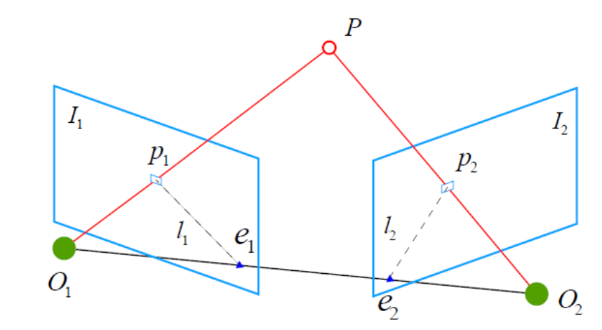
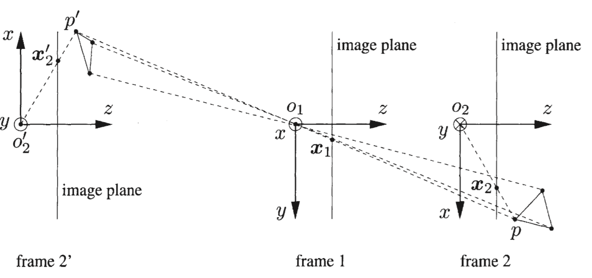

# <center>orbslam notebook </center>
- [orbslam notebook ](#orbslam-notebook-)
  - [矩阵的性质](#矩阵的性质)
    - [特征值分解](#特征值分解)
    - [秩与自由度（ 方阵A(n\*n) ）](#秩与自由度-方阵ann-)
    - [齐次线性方程组求解（秩表示可以列几个方程）](#齐次线性方程组求解秩表示可以列几个方程)
    - [特殊矩阵的性质](#特殊矩阵的性质)
      - [一：为什么本质矩阵(E)的秩为2？](#一为什么本质矩阵e的秩为2)
      - [二：为什么基础矩阵(F)的秩为2](#二为什么基础矩阵f的秩为2)
      - [三：为什么尺度等价性要减少一个自由度？](#三为什么尺度等价性要减少一个自由度)
      - [四：为什么基础矩阵自由度是7？](#四为什么基础矩阵自由度是7)
      - [五：为什么本质矩阵自由度是5？](#五为什么本质矩阵自由度是5)
      - [六：为什么单应矩阵自由度是8？](#六为什么单应矩阵自由度是8)
  - [基础矩阵](#基础矩阵)
    - [对极几何](#对极几何)
    - [计算基础矩阵](#计算基础矩阵)
      - [归一化8点法](#归一化8点法)
        - [算法步骤](#算法步骤)
        - [对特征点归一化变换](#对特征点归一化变换)
        - [求解基础矩阵F，步骤在8点法里](#求解基础矩阵f步骤在8点法里)
        - [解除归一化](#解除归一化)
    - [基础矩阵的分解](#基础矩阵的分解)
    - [检查R和t](#检查r和t)
      - [检查3D点和两个相机的视差](#检查3d点和两个相机的视差)
      - [检查3D点的深度](#检查3d点的深度)
      - [检查3D点在两个相机的重投影误差](#检查3d点在两个相机的重投影误差)
  - [单应矩阵](#单应矩阵)
    - [计算单应矩阵](#计算单应矩阵)
    - [单应矩阵的分解](#单应矩阵的分解)
  - [三角测量原理](#三角测量原理)
  - [PnP问题](#pnp问题)
  - [重投影误差与BA优化函数](#重投影误差与ba优化函数)
    - [重投影误差](#重投影误差)
    - [BA优化](#ba优化)
      - [稀疏性和边缘化](#稀疏性和边缘化)
      - [鲁棒核函数](#鲁棒核函数)
      - [优化实践](#优化实践)
      - [高斯牛顿法](#高斯牛顿法)


## 矩阵的性质

**（1）正交矩阵相乘仍然是正交矩阵**  

**（2）一个矩阵乘以正交矩阵，范数不变**（保范性） 

**（3）一个矩阵乘以可逆矩阵秩不变** 

**（4）初等变换只是不影响矩阵的秩，其他的特性都改变了。对于计算矩阵的行列式，不能进行初等变换，但是可以做行列的进加减，不能乘以系数。** 

**（5）矩阵的迹：矩阵的主对角线上各个元素的总和，是矩阵所有特征值的和** 

**（6）对角矩阵的特征值是其对角线上的各个元素** 

**（7）矩阵的秩等于非零奇异值的个数，等于非零特征值的个数** 

**（8）任意矩阵都能进行奇异值分解，只有方阵才可以进行特征值分解** 

### 特征值分解
如果一个向量 *v* 是方阵 *A*的特征向量，将可以表示成下面的形式： *Av= λv*，*λ* 称为特征向量 *v* 对应的特征值，并且一个矩阵的一组特征向量是一组正交向量。 
特征值分解：**Q**是这个矩阵A的特征向量组成的矩阵，**Σ**是一个对角阵，每一个对角线上的元素就是一个特征值
$A = Q{\Sigma}Q^{-1}$
奇异值分解SVD：
假设*A*是一个N * M的矩阵，*U*是一个N * N的方阵（正交矩阵），*Σ* 是一个N * M的矩阵（对角线上的元素为奇异值），$V^{T}$是一个M * M的矩阵（正交矩阵） 
$A = U{\Sigma}V^{T}$
特征值和奇异值的关系：

（1）*U*的列向量，是 $AA^T$的特征向量； 
（2）*V*的列向量，是 $A^{T}A$ 的特征向量； 
（3）*A*的奇异值（*Σ*的非零对角元素）则是 $AA^T$ 或者 $A^{T}A$  的非零特征值的平方根。 

### 秩与自由度（ 方阵A(n\*n) ）
矩阵的秩，指的是经过初等变换之后的非零行（列）的个数，若不存在零行（列），则为满秩矩阵（Rank(A)=n；关于矩阵的秩的另一种理解：A矩阵将n维空间中的向量映射到k（k<=n）维空间中，k=Rank(A) 
矩阵（参数矩阵）的自由度，指的是要想求解出矩阵的所有元素至少需要列几个线性方程组。若矩阵本身带有 x 个约束，则只需要列n*n-x个方程组即可求出所有参数，即矩阵A的自由度为n*n-x。 

### 齐次线性方程组求解（秩表示可以列几个方程）
1.r(A)=未知数个数n（约束较强） 
该解空间只含有零向量 
2.r(A)<未知数个数n（约束不够） 
由齐次线性方程组解空间维数 = n - r(A) >0，所以该齐次线性方程组有非零解，而且不唯一，存在一个基础解系（基础解系中的向量个数为 n - r(A)个)。 

### 特殊矩阵的性质

#### 一：为什么本质矩阵(E)的秩为2？
（1）因为一个矩阵乘以可逆矩阵秩不变，因为可逆矩阵可以表示为初等矩阵的乘积，而初等变换不改变矩阵的秩。 
对于一个矩阵施行一次初等**列变换**相当于在这个矩阵**右乘**一个相应的初等矩阵 
对于一个矩阵施行一次初等**行变换**相当于在这个矩阵**左乘**一个相应的初等矩阵 
$E = t^{^\wedge}R$
Rank(R)=3,R可逆矩阵
*Rank(t^)=2* 

R不会改变矩阵的秩，因此E矩阵的秩为2. 
Rank(E)=Rank(t^)=2
（2）因为本质矩阵 E 的奇异值必定是 $[σ, σ, 0]^T$ 的形式，矩阵的秩等于非零奇异值的个数
证明一：三维反对称矩阵的分解

证明二：SVD分解与矩阵的迹


#### 二：为什么基础矩阵(F)的秩为2
$\boldsymbol{F} = \boldsymbol{K}^{-T}\mathbf{t}^{\wedge}\boldsymbol{R}\boldsymbol{K}^{-1}$
两个相机内参矩阵和旋转矩阵R都是满秩矩阵（可逆矩阵），$\mathbf{t}^{\wedge}$是一个秩为2的矩阵，同样，矩阵乘以可逆矩阵秩不变，因为可逆矩阵可以表示为初等矩阵的乘积，而初等变换不改变矩阵的秩（左乘-行变换，右乘-列变换）。 

#### 三：为什么尺度等价性要减少一个自由度？
以本质矩阵为例，表达两帧的相机归一化坐标之间的对应关系

将矩阵写成向量，转化为下式： 

由于等式右侧是0，所以上面两式子乘以任意常数以后还是表示同样两点之间的变换，所以E是尺度等价的。 
由于尺度等价性，所以对于9个参数的向量e，我们只需要通过8个方程计算出其中8个未知数即可， 8个数都用第9个数表示，由于尺度等价，所以第9个数取什么值都是对的。 
单目相机的初始化往往由对极几何约束完成。对极几何约束应用的场景是已知两幅图像之间若干匹配点，求解两幅图像之间的相机运动，是一个2D-2D的问题。详细的推导过程可以参考《视觉SLAM14讲》中的过程，其核心求解是一个本质矩阵E（或者带有内参矩阵的基础矩阵），本质矩阵E的特点是具有尺度等价性。位姿R和t是由E通过奇异值分解得到的，其中R是正交矩阵，其逆等于自身的转置，相当于自身的约束可以克服掉尺度等价性；但是t没有办法克服尺度等价性，即这个t乘上任意一个非零的正数，都能满足对极几何约束。   

对极几何约束的几何意义是$O_L,O_R,X$三点共面，**纯旋转情况下$O_L,O_R$共点，t为0，本质矩阵也为0,无法分解出R，单目初始化不能只有纯旋转，必须有一定程度的平移。**。通常的初始化做法是，将t归一化，让其长度等于$\lVert t \rVert = 1$，并作为单位计算相机的运动和图像特征点对应的3D点位置。初始化之后，便可以利用3D-2D的PnP方法，求解后续相邻帧的运动位姿。至于这个长度1对应到真实世界中的长度可能是5cm,也可能是40m，这就需要额外的深度信息介入进行确定，这个以t的长度作为单位的尺度世界只和真实世界之间相差一个尺度因子，代码见[TwoViewReconstruction.cc](../ORB_SLAM3/src/TwoViewReconstruction.cc)的**DecomposeE函数**。
```C++ 
// 对 t 有归一化，但是这个地方并没有决定单目整个SLAM过程的尺度
// 因为CreateInitialMapMonocular函数对3D点深度会缩放，然后反过来对 t 有改变
t = t / t.norm();
```
对t长度的归一化直接导致了单目视觉的尺度不确定性。如果对轨迹和地图同时缩放任意倍数，我们得到的图像仍然是一样的。而对两张图像间的平移t进行归一化相当于固定尺度。以t的长度作为为单位长度，计算相机轨迹和特征点的三维位置。这被称为单目 slam 的初始化。初始化后，就可以利用 3D - 2D 来计算相机运动了。进行初始化的两张图像必须有一定程度的平移，而后都将以此步长的平移为单位。
#### 四：为什么基础矩阵自由度是7？
$\boldsymbol{F} = \boldsymbol{K}^{-T}\mathbf{t}^{\wedge}\boldsymbol{R}\boldsymbol{K}^{-1}$
左右相机内参的待定参数各为4，平移$\mathbf{t}^{\wedge}$的待定参数是3，旋转矩阵R的自由度是3，加在一起是14个参数，也就是正常来说把14个参数都确定了才能确定F，但是实际上F是一个3*3的矩阵，只包含9个参数，所以计算F的自由度最大是9，也就是9个参数就可以确定F。 
同时F满足下面两个约束，所以F的自由度是9-2=7. 
（1）秩约束：基础矩阵的秩必须是 2，这个约束减少了一个自由度。
（2）尺度不变性：基础矩阵是与其尺度不变的，即如果将矩阵乘以一个常数𝜆，矩阵本身的几何意义不会改变。这个约束又减少了一个自由度（因为矩阵可以乘以一个非零常数而不改变其几何意义）。

#### 五：为什么本质矩阵自由度是5？
（1）秩约束：减少了 1 个自由度（从 9 到 8）。
（2）尺度不变性：减少了 1 个自由度（从 8 到 7）。
（3）相机内参已知：提供了额外的约束，进一步减少了自由度（从 7 到 5）。 

#### 六：为什么单应矩阵自由度是8？
单应矩阵也具有尺度等价性：9-1=8 


## 基础矩阵   

### 对极几何  
  
上图展示了一对匹配好的特征点。我们希望求取这两帧之间的运动。设两个相机光心分别为$O_1$和$O_2$ ，第一帧到第二帧到运动为$R，t$。点$p_1$和点$p_2$ 是同一个空间点P在两个成像平面上的投影。连线$O_1 \ p_1$和$O_2 \ p_2$在三维空间中相交于点P 。这时，$O_1, O_2$和P三点确定一个平面，称为极平面 (epipolar plane)。连线$O_1, O_2$与像平面$I_1, I_2$的交点分别为$e_1, e_2$。点$e_1, e_2$称为极点 (epipoles)，是相机光心在另一幅影像上的投影。注意到这里$e_1, e_2$都位于像平面内。有时候它们有可能会落在成像平面之外。
$O_1, O_2$称为基线 (baseline)。而极平面与两个像平面之间的交线$l_1, l_2$为极线 (epipolar line)，它们分别是射线$O_2 \ p_2$和$O_1 \ p_1$ 在对方影像上的投影。
从几何上来看，射线$O_1 \ p_1$是像素点$p_1$所对应的物方点可能出现的位置：该射线上的所有点都有可能投影到点$p_1$上。射线$O_2 \ p_2$是像素点$p_2$所对应的物方点可能出现的位置。如果匹配正确的话，像素点$p_2$对应于同一个物方点。这两条射线的交点就是就是点P的空间位置。如果没有特征匹配，我们就必须在极线$l_2$上搜索$p_1$的匹配点。
现在我们从代数的角度上看，在第一帧的相机坐标系下，点P的空间位置为：$\mathbf{P}=[X, Y, Z]^T$     
根据针孔相机模型，不考虑畸变，两个像素点$p_1$,$p_2$点像素（$u,v$）坐标分别为：$s_1\mathbf{p}_1=\mathbf{K}\mathbf{P},\ s_2\mathbf{p}_2=\mathbf{K}(\mathbf{R}\mathbf{P}+\mathbf{t})$   
$s_1p_1$和$p_1$成投影关系，他们在齐次坐标系下是相等的，我们称这种关系为尺度意义下相等，记作：$sp\simeq p$      
在使用齐次坐标的时候，一个向量将等于它自身乘以一个非零的常数，这通常用于表达一个投影关系，$s_1p_1=p_1$，这里可以参考一下14讲中P100页关于归一化平面和归一化坐标的定义：
归一化坐标可以看作相机前方$z=1$处平面上的一个点，这个$z=1$的平面上的点也叫做归一化平面。归一化坐标再左乘内参即可得到像素坐标，所以我们可以将像素坐标$(u,v)$看作是归一化平面上的点进行量化测量的结果
$$
\mathbf{RP_w +t}=\underbrace{[X,Y,Z]^T }_{相机坐标系} \rightarrow \underbrace{[\frac{X}{Z},\frac Y Z ,1]}_{归一化坐标系}
$$
我们再来看一下针孔相机的投影模型:
$$
\begin{pmatrix}
 u\\
 v\\
1
\end{pmatrix} = \frac{1}{Z} \begin{pmatrix}
  f_x& 0 &c_x \\
  0& f_y  &c_y \\
 0 &0  &1
\end{pmatrix}\begin{pmatrix}
 X\\
Y \\
Z
\end{pmatrix} \overset{\mathrm{def}}{=} \frac{1}{Z}KP
$$
针孔相机的成像模型中本身对于Z就是未知的无约束的。    
那么上述的两个投影关系可以写成:$p_1 \simeq KP,p_2\simeq K(RP+t)$   
这里K为相机内参矩阵。如果使用齐次坐标，则前面的系数$s_1, s_2$可以省略。设：
$$
\mathbf{x}_1=\mathbf{K}^{-1}\mathbf{p}_1,\ \mathbf{x}_2=\mathbf{K}^{-1}\mathbf{p}_2
$$    
这里，$x_1$和$x_2$分别为两个像素点在各自相机坐标系下的归一化平面坐标。将之代入上式（将 $p_1,p_2$分别带入上面的式子）可得：
$$
\mathbf{x}_2 = \mathbf{R}\mathbf{x}_1+\mathbf{t}
$$   
上面公式去除尺度因子之后仍然成立？其实带上尺度因子推倒了一遍，发现结果是一样的，也就是说尺度无法影响对极约束，当然求解出来的结果中的$t$,当然不是真实的尺度了，这里放出推倒过程：
   
将上式两边同时左乘$\mathbf{t}^{\wedge}$，这相当于两侧同时和$t$做外积：
$$
\mathbf{t}^{\wedge}\mathbf{x}_2=\mathbf{t}^{\wedge}\mathbf{R}\mathbf{x}_1
$$  
再将两侧同时左乘$\mathbf{x}^T_2$:
$$
\mathbf{x}^T_2\mathbf{t}^{\wedge}\mathbf{x}_2=\mathbf{x}^T_2\mathbf{t}^{\wedge}\mathbf{R}\mathbf{x}_1
$$    
注意到$\mathbf{t}^{\wedge}\mathbf{x}_2$是一个垂直于二者的向量，因此它和$x_2$的内积为0。由此可得：
$$
\mathbf{x}^T_2\mathbf{t}^{\wedge}\mathbf{R}\mathbf{x}_1=0
$$
如果我们代入$p_1, p_2$则可得：
$$
\mathbf{p}^T_2\mathbf{K}^{-T}\mathbf{t}^{\wedge}\mathbf{R}\mathbf{K}^{-1}\mathbf{p}_1=0
$$  
这两个式子称为对极约束。它的几何意义为$O_1, O_2$ 和P三点共面。这两个式子的中间部分分别称为本质矩阵 (essential matrix) E和基础矩阵 (fundamental matrix) F。
$$
\mathbf{E} = \mathbf{t}^{\wedge}\mathbf{R}   \\ 
\mathbf{F} =\mathbf{K}^{-T}\mathbf{t}^{\wedge}\mathbf{R}\mathbf{K}^{-1} \\
\mathbf{x}_2^T\mathbf{E}\mathbf{x}_1=\mathbf{p}_2^T\mathbf{F}\mathbf{p}_1=0
$$
### 计算基础矩阵
计算基础矩阵的函数定义在[TwoViewReconstruction::FindFundamental()](../ORB_SLAM3/src/TwoViewReconstruction.cc)，计算基础矩阵 *f*, 8组对应坐标点构成系数矩阵A，维度为8*9。 
假设$\boldsymbol{x} = \begin{bmatrix} u & v & 1 \end{bmatrix}^T$为参考帧中的像素齐次坐标， $\boldsymbol{x'} = \begin{bmatrix} u' & v' & 1 \end{bmatrix}^T$为当前帧中与之匹配的坐标。那么式(1)可以展开如下:
$$
\begin{array}{c}
            \begin{bmatrix} u' & v' & 1 \end{bmatrix}
            \begin{bmatrix}
                f_{11} & f_{12} & f_{13} \\
                f_{21} & f_{22} & f_{23} \\
                f_{31} & f_{32} & f_{33}
            \end{bmatrix}
            \begin{bmatrix} u \\ v \\ 1 \end{bmatrix} = 0
        \end{array} \\
$$
$       u'uf_{11} + u'v f_{12} + u' f_{13} + v'u f_{21} + v'vf_{22} + v'f_{23} + uf_{31} + vf_{32} + f_{33} = 0$    
记$\boldsymbol{f} = \begin{bmatrix} f_{11} & f_{12} & f_{13} & f_{21} & f_{22} & f_{23} & f_{31} & f_{32} & f_{33} \end{bmatrix}^T$,假设我们有 m 对匹配点，根据上式我们可以写出 m 个约束，可以写成 Af=0的矩阵形式，如下:   

$$
\begin{equation}\
            \boldsymbol{Af} = \begin{bmatrix}
                u_1'u_1 & u_1'v_1 & u_1'   & v_1'u_1 & v_1'v_1 &   v_1' &    u_1 &    v_1 & 1 \\
                 \vdots &  \vdots & \vdots &  \vdots &  \vdots & \vdots & \vdots & \vdots &   \\
                u_m'u_m & u_m'v_m & u_m'   & v_m'u_m & v_m'v_m & v_m'   &    u_m &    v_m & 1 \\
            \end{bmatrix} \boldsymbol{f} = \boldsymbol{0}
        \end{equation}
$$

通常我们会找到很多对匹配点，构建矩阵 A，得到一个超定方程组。由于测量噪声的存在，基本上找不到一个解能够使得方程成立。 但我们可以通过最小二乘法找到一个f，使Af尽可能的接近 0。根据 MVG 一书的说法， 对矩阵 A 进行SVD分解 $A = U{\Sigma}V^{T}$，取V中的最后一列，就是一个能够最小化$\|\boldsymbol{Af} \| / \| \boldsymbol{f} \|$的解。 我们至少需要8个点才能求得基础矩阵，这也就是所谓的**八点法**。
#### 归一化8点法
8点法成功的关键是在构造解的方程之前应对输入的数据认真进行适当的归 一化，为了防止不同分辨率、尺度和坐标**原点**下的影响，图像点的一个简单变换(平移或变尺度)将使这个问题的条件极大地改善，从而提高结果的稳定性，函数定义在[TwoViewReconstruction::Normalize()](../ORB_SLAM3/src/TwoViewReconstruction.cc)。 
##### 算法步骤


##### 对特征点归一化变换 
系数矩阵A是利用8点法求基础矩阵的关键，所以Hartey就认为，利用8点法求基础矩阵不稳定的一个主要原因就是原始的图像像点坐标组成的系数矩阵A不好造成的，而造成A不好的原因是像点的齐次坐标各个分量的数量级相差太大。基于这个原因，Hartey提出一种改进的8点法，在应用8点法求基础矩阵之前，先对像点坐标进行归一化处理，即对原始的图像坐标做同向性变换，这样就可以减少噪声的干扰，大大的提高8点法的精度。
步骤一： 求取所有 N 个特征点的质心坐标（X, Y）
$$
meanX = \frac{\sum_{N}^{i=0}u_{i}}{N},\quad meanY = \frac{\sum_{N}^{i=0}v_{i}}{N}
$$
步骤二： 计算所有点相对于质心的平均距离
$$
meanDevX = \frac{\sum_{N}^{i=0}\left | u_{i}-meanX \right |}{N},\quad meanDevY = \frac{\sum_{N}^{i=0}\left | v_{i}-meanY \right |}{N}
$$
并将平均距离的倒数作为缩放尺度因子
$$
sX = \frac{1}{meanDevX} ,\quad sY = \frac{1}{meanDevY}
$$
步骤三： 对特征点的 x 和 y 坐标进行缩放，使得一阶绝对矩为 1，以此作为归一化的结果坐标
$$
x=x\cdot sX, \quad y = y \cdot  sY
$$
步骤四： 获得归一化矩阵 T（由 x y 方向的缩放因子和归一化的特征点质心组成）
$$
T = \begin{bmatrix}
  sX &0  & -meanX\cdot sX\\ 
  0 & sY & -meanY\cdot sY\\ 
  0 & 0 & 1
  \end{bmatrix}
$$
关于一阶绝对矩，什么是矩？ 在统计学中，矩表征随机量的分布。 一阶矩是随机变量的期望，二阶矩是随机变量平方的期望。一阶绝对矩是只变量与均值差的绝对值的平均。
##### 求解基础矩阵F，步骤在8点法里 
由于基础矩阵F在一个常量因子下是等价的，这样可以给基础矩阵F的元素组成的向量f施加一个约束条件：$\parallel f \parallel = 1$
这样由K>=8个匹配的点对，组合成一个矩阵$Q_{K\times9}$，求解上面方程就变成了求解如下问题的最小二乘解
$$
\min_{\parallel f \parallel = 1}\parallel Qf \parallel ^2
$$
其中，矩阵Q的每一行来自一对匹配点；f是基础矩阵F元素构成的待求解的向量，根据2-范数的定义:
$$
\parallel Qf \parallel^2 = (Qf)^T(Qf)=f^T(Q^TQ)f
$$
将上式的中间部分提取出来得到矩阵$M=Q^TQ$,这是一个9×9的矩阵。基于拉格朗日-欧拉乘数优化定理，在$\parallel f \parallel = 1$约束下，$Qf=0$的最小二乘解，为矩阵$M=Q^TQ$的最小特征值对应的特征向量。所以可以对矩阵Q进行奇异值分解（SVD），$Q = U\Sigma V^T$。最小二乘解就是$V^T$的第9个列向量，也就是可由向量$f = V_9$构造基础矩阵F。

##### 解除归一化 


### 基础矩阵的分解  
基础矩阵的分解函数定义在[TwoViewReconstruction::ReconstructF()](../ORB_SLAM3/src/TwoViewReconstruction.cc)，本质矩阵分解定义在**TwoViewReconstruction::DecomposeE函数**。

根据基础矩阵$\boldsymbol{F} = \boldsymbol{K}^{-T}\mathbf{t}^{\wedge}\boldsymbol{R}\boldsymbol{K}^{-1}$和本质矩阵$\boldsymbol{E} = \mathbf{t}^{\wedge}\boldsymbol{R}$的定义，其中K是相机的内参矩阵， 我们可以从刚刚求解出的基础矩阵中算出本征矩阵:    
$\boldsymbol{E} = \boldsymbol{K}^T \boldsymbol{FK}$  
本质矩阵E的的充分必要条件是的奇异值分解具有如下的形式,其中令a = 1
$$
E=U
\left[\begin{array}{c}
a & &  \\
& a &  \\
& & 0
\end{array}\right]
V^T; \quad a>0 \tag{1.1}
$$
$\mathbf{t}^{\wedge}$,是由相机的平移向量t构成的反对称矩阵，记作S吧,对于任意的3×3的斜对称矩阵都可以分解成$k \boldsymbol{UZU^T}$,其中U是一个正交矩阵，k为一个非零的常数。 Z具有如下的形式：
$$
\boldsymbol{Z} = \begin{bmatrix}
            0 & 1 & 0 \\
           -1 & 0 & 0 \\
            0 & 0 & 0
        \end{bmatrix} = -\underbrace{\begin{bmatrix}
            1 & 0 & 0 \\
            0 & 1 & 0 \\
            0 & 0 & 0
        \end{bmatrix}}_{\boldsymbol{D}_{1, 1, 0}}\underbrace{\begin{bmatrix}
            0 & -1 & 0 \\
            1 &  0 & 0 \\
            0 &  0 & 1
        \end{bmatrix}}_{\boldsymbol{W}}
$$   
在对极约束下，我们忽略符号的作用，有$\boldsymbol{Z} = \boldsymbol{D}_{1,1,0}\boldsymbol{W}$, 忽略尺度因子k的作用，有$\boldsymbol{S} = \boldsymbol{U}\boldsymbol{D}_{1,1,0}\boldsymbol{W}\boldsymbol{U}^T$。本征矩阵可以分解为$\boldsymbol{E} = \boldsymbol{U}\boldsymbol{D}_{0,0,1}(\boldsymbol{W}\boldsymbol{U}^T\boldsymbol{R})$。容易验证W是一个正交矩阵，所以$(\boldsymbol{W}\boldsymbol{U}^T\boldsymbol{R})$也是正交矩阵，记为$V^T$。 那么$\boldsymbol{U}\boldsymbol{D}_{-k,-k,0}\boldsymbol{V}^T$就是E的SVD分解。    
上述的推导得到$\boldsymbol{E} = \boldsymbol{U}\boldsymbol{D}_{0,0,1}(\boldsymbol{W}\boldsymbol{U}^T\boldsymbol{R})$,的过程中，我们忽略了符号和尺度的作用。 如果本质矩阵分解为$\boldsymbol{E} = \boldsymbol{U}\boldsymbol{D}_{1,1,0}\boldsymbol{V}^T$的形式， 那么E=SR有两种可能的分解：    
$$
\text{(1)}
        \begin{cases}
            \boldsymbol{S} = \boldsymbol{UZU^T} \\
            \boldsymbol{R} = \boldsymbol{UWV^T}
        \end{cases}
$$
$$
        \text{(2)}
        \begin{cases}
            \boldsymbol{S} = \boldsymbol{UZU^T} \\
            \boldsymbol{R} = \boldsymbol{UW^TV^T}
        \end{cases}
$$
因为在忽略符号的作用的情况下，$\boldsymbol{D}_{1,1,0}\boldsymbol{W}$与$\boldsymbol{D}_{1,1,0}\boldsymbol{W}^T$的作用一样。 上式中的R确定了相机的姿态矩阵。忽略尺度因子的作用时，上式中$\boldsymbol{S} = \boldsymbol{UZU^T}$,确定了相机的平移向量。 因为向量对自身的叉积为零，即$St=\mathbf{t}^{\wedge}t=0$，因此$\boldsymbol{t}=\boldsymbol{U}\begin{bmatrix} 0 & 0 & 1\end{bmatrix}^T = \boldsymbol{u_3}$,**即矩阵U的最后一列**。
$$
\left(U
\left[\begin{array}{c}
0 \\
0 \\
1
\end{array}\right]\right)^{\wedge}=
U
\left[\begin{array}{c}
0 &-1 &0  \\
1 &0 &0  \\
0 &0 &0
\end{array}\right]U^T \tag{1.5}
$$
但是因为E的符号不能确定，所以也不能确定t符号。 因此相机的位姿共有四种可能：
$$
\begin{equation}
        \begin{array}{c}
            \begin{bmatrix} \boldsymbol{UWV^T} | \boldsymbol{u_3} \end{bmatrix}  &
            \begin{bmatrix} \boldsymbol{UWV^T} | -\boldsymbol{u_3} \end{bmatrix} &
            \begin{bmatrix} \boldsymbol{UW^TV^T} | \boldsymbol{u_3} \end{bmatrix} & 
            \begin{bmatrix} \boldsymbol{UW^TV^T} | -\boldsymbol{u_3} \end{bmatrix} &
        \end{array}
        \end{equation}
$$   
在这4中可能中，只有一种解能够保证特征点位于在两个相机的前面，既深度值为正的。把各个匹配点对代进去分贝检测一遍，就可以找出正确的那个。手写推导如下：

令 W 表示沿 Z 轴旋转 90° 得到的旋转矩阵
$$
\mathbf{W}=\mathbf{R}_z(\frac{\pi}{2}) = \begin{bmatrix}
        0 &  -1& 0\\ 
        1 & 0 & 0\\ 
        0 & 0 & 1
        \end{bmatrix}
$$
对于任意一个 E，对它分解都能得到两个与之对应的 R 和 t ，所以一共存在 4 组解
$$
\begin{align}
\mathbf{t}_1^{\wedge} = \mathbf{U} \mathbf{R}_z(\frac{\pi}{2}) \mathbf{\Sigma} \mathbf{U}^T = U_3, & \ \mathbf{R}_1 = \mathbf{U} \mathbf{R}^T_z(\frac{\pi}{2}) \mathbf{V}^T \\
\mathbf{t}_2^{\wedge} = \mathbf{U} \mathbf{R}_z(-\frac{\pi}{2}) \mathbf{\Sigma} \mathbf{U}^T = -U_3, & \ \mathbf{R}_2 = \mathbf{U} \mathbf{R}^T_z(-\frac{\pi}{2}) \mathbf{V}^T \\
\end{align}
$$
其中$\mathbf{R}_z(\frac{\pi}{2})$，表示沿Z轴旋转90度的旋转矩阵。对比上面两个式子可以发现，这两组解其实是以参考帧为中心，绕Z轴呈180度旋转对称的两组解，如下图所示
 
 
同时，由于本质矩阵E可以取任意符号，即E和-E是等价的，所以对任意一个E取负号又取得一个符合条件的解，所以一共有四组符合条件的解。
我们可以将任意一对特征点代入所取得的4组解中，检测该点在两个相机下的深度值。显然物方特征点应该位于两个相机的前方，取两个**深度值都为正的解**即是正确的解。

### 检查R和t
#### 检查3D点和两个相机的视差 

#### 检查3D点的深度 

#### 检查3D点在两个相机的重投影误差
在误差允许范围内的计算内点数，大于阈值舍弃改组R和t

## 单应矩阵 
假设使用同一相机在不同的位姿拍摄同一平面，如下图：
  
上图表示场景中的平面$\pi$在两相机的成像，设平面$\pi$在第一个相机坐标系下的单位法向量为N，其到第一个相机中心（坐标原点）的距离为d，则平面$\pi$可表示为：$N^TX_1 = d$，转换下可得$\frac{1}{d}N^TX_1 = 1,\forall X_1 \in \pi$，其中$X_1$是三维点X在第一相机坐标系下的坐标，其在第二个相机坐标系下的坐标为$X_2$，则$X_2 = RX_1 + t$。将上面式子结合起来：
$$
X_2 = RX_1 + t\frac{1}{d}N^TX_1=(R+t\frac{N^T}{d})X_1=H'X_1
$$
所以就得到了同一平面两个不同相机坐标系的单应矩阵$H' = R+t\frac{N^T}{d}$
上面得到的单应矩阵第一个相机坐标系取得，还需要将其变换到成像平面坐标系中，取得两图像间的单应矩阵。设$x_1,x_2$为X在两图像的像点坐标，$x_1 = KX_1,x_2 = KX_2$,K是相机的内参数，代入上面求得单应变换公式
$$
K^{-1}x_2 = HK^{-1}x_1 \Longrightarrow x_2 = KH'K^{-1}x_1=K(R+t\frac{N^T}{d})K^{-1}x_1
$$
所以，同一平面得到的两个图像间的单应矩阵H为$H = K(R+t\frac{N^T}{d})K^{-1}$
### 计算单应矩阵  
计算单应性矩阵的函数定义在[TwoViewReconstruction::FindHomography()](../ORB_SLAM3/src/TwoViewReconstruction.cc)。
针对平面场景，根据摄影变换关系建立了两幅图像之间各点的一一对应关系。 这个映射关系可以用一个3×3的齐次矩阵H来表示，我们称之为单应矩阵。 假设x,x′分别是初始化过程中的参考帧和当前帧中匹配的两个特征点，K为相机的内参，被观测的平面的法向量是N，平面到参考帧的距离为d， 可以推导出x,x′存在如下的关系:
$$
\begin{equation}\
            \begin{array}{rl}
                            & \boldsymbol{x'} = \cfrac{z_1}{z_2}\boldsymbol{K}\left(\boldsymbol{R} + \boldsymbol{t}\cfrac{1}{d}\boldsymbol{N}^T\right)\boldsymbol{K}^{-1}\boldsymbol{x} \\
                \Rightarrow & \boldsymbol{x'} = s\boldsymbol{H}\boldsymbol{x}
            \end{array}
        \end{equation}
$$
其中$\boldsymbol{H} = \boldsymbol{K}\left(\boldsymbol{R} + \boldsymbol{t}\cfrac{1}{d}\boldsymbol{N}^T\right)\boldsymbol{K}^{-1}$是两幅图像的单应矩阵,$s = z_1 / z_2$是两幅图像之间的尺度因子。    

$$
\begin{equation}\
            \begin{bmatrix} u_2 \\ v_2 \\ 1 \end{bmatrix} = s \begin{bmatrix} h_1 & h_2 & h_3 \\
                                                                              h_4 & h_5 & h_6 \\
                                                                              h_7 & h_8 & h_9 \end{bmatrix}
                                                            \begin{bmatrix} u_1 \\ v_1 \\ 1 \end{bmatrix}
        \end{equation}
$$   
其中，$(u_2, v_2)$为当前帧中特征点的像素坐标，$(u_1, v_1)$为参考帧中匹配点的像素坐标。$h_1 \cdots h_9$是矩阵H中的9个元素。    
$$
\begin{cases}
            u_2 = s(h_1 u_1 + h_2 v_1 + h_3) \\
            v_2 = s(h_4 u_1 + h_5 v_1 + h_6) \\
              1 = s(h_7 u_1 + h_8 v_1 + h_9)
        \end{cases} \Rightarrow \begin{cases}
            u_2 = \frac{h_1 u_1 + h_2 v_1 + h_3}{h_7 u_1 + h_8 v_1 + h_9} \\
            v_2 = \frac{h_4 u_1 + h_5 v_1 + h_6}{h_7 u_1 + h_8 v_1 + h_9}
        \end{cases}
$$    
一对匹配点我们可以根据上式写出两个约束，整理上式有：    
$$
\begin{cases}
            h_1 u_1 + h_2 v_1 + h_3 - h_7 u_1 u_2 - h_8 v_1 u_2 - u_2 = 0 \\
            h_4 u_1 + h_5 v_1 + h_6 - h_7 u_1 v_2 - h_8 v_1 v_2 - v_2 = 0
        \end{cases}
$$    
假设我们有 m 对匹配点，根据上式我们可以写出 2m 个约束，可以写成 $A\hat{H} = \boldsymbol{0}$的矩阵形式，如下，由于尺度因子的存在，求解时一般认为$h_9=1$，所以向量$\hat{H}$中只有8个未知数，至少需要4对匹配点，写出8个线性方程才可以求解，**直接线性变换法（Direct Linear Transform）**。

### 单应矩阵的分解 
单应性矩阵分解的函数定义在[TwoViewReconstruction::ReconstructH()](../ORB_SLAM3/src/TwoViewReconstruction.cc)。   
下图表示场景中的平面M在两相机的成像，设平面M在第一个相机坐标系下的单位法向量为N，其到第一个相机中心（坐标原点）的距离为d，则平面M可表示为：$N^TX_1 = d$  
$\frac{1}{d}N^TX_1 = 1,\forall X_1 \in \pi$  转换下
其中，$X_1$是三维点P在第一相机坐标系下的坐标，其在第二个相机坐标系下的坐标为$X_2$，则
$X_2 = RX_1 + T$   
将上面式子结合起来，   
$X_2 = RX_1 + T\frac{1}{d}N^TX_1=(R+T\frac{1}{d}N^T)X_1=H'X_1$  
所以就得到了同一平面两个不同相机坐标系的单应矩阵
$H' = R+T\frac{1}{d}N^T$
    
    
   
   
   
ORB-SLAM2 只处理 $d_1>d_2>d_3$ 的情况，根据$d', \varepsilon_1, \varepsilon_3$的符号一共有 8 种不同的解。 下面我们详细分析函数 ReconstructH，了解具体的实现过程。  
## 三角测量原理    
函数的定义在[GeometricTools::Triangulate()](../ORB_SLAM3/src/GeometricTools.cc)，**函数作用是根据求得R和t求解出3D点**，现在假设相机的内参矩阵为K，根据单应矩阵或者基础矩阵估计出相机的旋转矩阵R和平移向量t。那么对于空间中一点$\boldsymbol{X} = \begin{bmatrix} x & y & z \end{bmatrix}^T$， 其在相机中的成像点$\boldsymbol{x} = \begin{bmatrix} u & v & 1 \end{bmatrix}^T$ 。那么我们可以写出3D坐标到2D像素之间的投影关系：   
$$
\boldsymbol{x} = \cfrac{1}{z} \boldsymbol{K} [\boldsymbol{R} | \boldsymbol{t}] \boldsymbol{X} 
$$

$$
\begin{bmatrix} u \\ v \\ 1 \end{bmatrix} = \cfrac{1}{s} \begin{bmatrix}
                                            f_x & 0   & c_x \\
                                                0 & f_y & c_y \\
                                                0 & 0   & 1 \end{bmatrix}
\begin{bmatrix}
    r_{11} & r_{12} & r_{13} & t_x \\
    r_{21} & r_{22} & r_{23} & t_y \\
    r_{31} & r_{32} & r_{33} & t_z \\
\end{bmatrix}
\begin{bmatrix} x \\ y \\ z \\ 1 \end{bmatrix}
$$  
上式中符号$s = r_{31} x + r_{32} y + r_{33} z + t_z$为空间中的点X在经 [R|t]变换之后得到的点到相机的距离。 我们把矩阵$K[R|t]$称为空间点到像素点的投影矩阵来表示。 若参考帧的投影矩阵为$P$，空间点$X$在其中的投影像素为$x$，那么其投影关系可以记为$\boldsymbol{x} = \frac{1}{s}\boldsymbol{PX}$。 设当前帧的投影矩阵为$\boldsymbol{P'}$，空间点$X$在其中的投影像素为$x′$，那么其投影关系可以记为$\boldsymbol{x'} = \frac{1}{s'}\boldsymbol{P'X}$。 现在我们的目标是要根据这两帧的像素点坐标来估计空间点X的坐标。    
ORB-SLAM2中采用了一种线性三角形的方法进行求解的，其思路与求解单应矩阵的DLT算法一样， 也是将两个点的约束构建成$AX=0$的形式，然后对矩阵A进行SVD分解，取零空间的特征向量作为X的估计。 我们将像素点坐标叉乘到投影方程的两侧，可以去除掉尺度因子。
对上述矩阵A进行SVD分解，取V矩阵的最后一列就是X。因为在ORB-SLAM2中，地图坐标系是以初始化时的参考帧为基准构建的， 所以参考帧的投影矩阵为$P=K[I|0]$。  
$$
\boldsymbol{x} \times \boldsymbol{PX} = \boldsymbol{0} \Rightarrow \begin{cases}
            (u P_3^T - P_1^T) \boldsymbol{X} = 0 \\
            (v P_3^T - P_2^T) \boldsymbol{X} = 0 \\
            (u P_2^T - vP_1^T) \boldsymbol{X} = 0 \\
        \end{cases}
        ,
        \boldsymbol{x'} \times \boldsymbol{P'X} = \boldsymbol{0} \Rightarrow \begin{cases}
            (u' {P'}_3^T -   {P'}_1^T) \boldsymbol{X} = 0 \\
            (v' {P'}_3^T -   {P'}_2^T) \boldsymbol{X} = 0 \\
            (u' {P'}_2^T - v'{P'}_1^T) \boldsymbol{X} = 0 \\
        \end{cases}
$$
上式中，**$P_i$为投影矩阵中的第i行**。从上式中每帧图像的像素点上取两个约束，就可以得到一个关于4个齐次坐标的4个方程$AX=0$，其中:
$$
\begin{equation}
        \boldsymbol{A} = \begin{bmatrix}
            u P_3^T - P_1^T \\
            v P_3^T - P_2^T \\
            u' {P'}_3^T - {P'}_1^T \\
            v' {P'}_3^T - {P'}_2^T
        \end{bmatrix}
        \end{equation}
$$   
```C++ 
/** 
 * @brief 三角化获得三维点(初始化用的)
 * @param x_c1 点在关键帧1
 * @param x_c2 点在关键帧2
 * @param Tc1w 关键帧1投影矩阵  Camera 1 Projection Matrix K[I|0]
 * @param Tc2w 关键帧2投影矩阵  Camera 2 Projection Matrix K[R|t]
 * @param x3D 三维点坐标，作为结果输出
 */
bool GeometricTools::Triangulate(
    Eigen::Vector3f &x_c1, Eigen::Vector3f &x_c2, Eigen::Matrix<float,3,4> &Tc1w, Eigen::Matrix<float,3,4> &Tc2w,
    Eigen::Vector3f &x3D)
{
    Eigen::Matrix4f A;
    // x = a*P*X， 左右两面乘Pc的反对称矩阵 a*[x]^ * P *X = 0 构成了A矩阵，中间涉及一个尺度a，因为都是归一化平面，但右面是0所以直接可以约掉不影响最后的尺度
    A.block<1,4>(0,0) = x_c1(0) * Tc1w.block<1,4>(2,0) - Tc1w.block<1,4>(0,0);
    A.block<1,4>(1,0) = x_c1(1) * Tc1w.block<1,4>(2,0) - Tc1w.block<1,4>(1,0);
    A.block<1,4>(2,0) = x_c2(0) * Tc2w.block<1,4>(2,0) - Tc2w.block<1,4>(0,0);
    A.block<1,4>(3,0) = x_c2(1) * Tc2w.block<1,4>(2,0) - Tc2w.block<1,4>(1,0);

    // 解方程 AX=0
    Eigen::JacobiSVD<Eigen::Matrix4f> svd(A, Eigen::ComputeFullV);

    Eigen::Vector4f x3Dh = svd.matrixV().col(3);

    if(x3Dh(3)==0)
        return false;
    // 求出的是4维的结果[X,Y,Z,A]，所以需要除以最后一维使之为1，就成了[X,Y,Z,1]这种齐次形式Euclidean coordinates 
    x3D = x3Dh.head(3)/x3Dh(3);

    return true;
}
```
## PnP问题
PnP 问题(Perspective-n-Point Problem)是，已知相机内参矩阵K和 n 个 3D 空间点${c_1,c_2,⋯,c_n}$及其到图像上 2D 的投影点${μ_1,μ_2,⋯,μ_n}$，求解相机的位置和姿态。记第 i 个 3D 空间点的齐次坐标为 $\boldsymbol{c_i} = \begin{bmatrix} x_i & y_i & z_i & 1\end{bmatrix}^T$，其在图像上投影的 2D 像素坐标为 $\boldsymbol{\mu_i} = \begin{bmatrix} u_i & v_i & 1 \end{bmatrix}^T$。 其投影过程，可以分解为两步：    
1. 根据相机的位姿，将空间点从世界坐标系下变换到相机坐标系下。
2. 将相机坐标系下的点，根据相机内参矩阵，投影到图像上。     
  
其整个过程相当于连续乘了两个矩阵：   
$$
s \begin{bmatrix} u_i \\ v_i \\ 1 \end{bmatrix} = \boldsymbol{K} \left[ \boldsymbol{R} \big | \boldsymbol{t} \right]
                                                        \begin{bmatrix} x_i \\ y_i \\ z_i \\ 1 \end{bmatrix}
        = \begin{bmatrix} f_x & 0 & c_x \\ 0 & f_y & c_y \\ 0 & 0 & 1 \end{bmatrix}
          \begin{bmatrix} t_1 & t_2 & t_3 & t_4 \\
                          t_5 & t_6 & t_7 & t_8 \\
                          t_9 & t_{10} & t_{11} & t_{12} \end{bmatrix}
          \begin{bmatrix} x_i \\ y_i \\ z_i \\ 1 \end{bmatrix}
$$   
其中，s是一个尺度系数，在计算时通常通过叉乘或者归一化将之消除掉。K,R,t分别是相机的内参矩阵、姿态矩阵和位置向量。 参照单应矩阵和基础矩阵的求解过程， 我们用矩阵$A=K[R∣t]$将上式改写为:   
$$
s \begin{bmatrix} u_i \\ v_i \\ 1 \end{bmatrix} = \underbrace{\begin{bmatrix}
                           a_1 & a_2    & a_3    & a_4 \\
                           a_5 & a_6    & a_7    & a_8 \\
                           a_9 & a_{10} & a_{11} & a_{12}
                        \end{bmatrix}}_{\boldsymbol{A}} \begin{bmatrix} x_i \\ y_i \\ z_i \\ 1 \end{bmatrix}
        \Rightarrow
$$  
$$
        \begin{cases}
            u_i = \frac{ a_1 x_i + a_2 y_i + a_3 z_i + a_4 }{ a_9 x_i + a_{10} y_i + a_{11}z_i + a_{12} } \\
            v_i = \frac{ a_5 x_i + a_6 y_i + a_7 z_i + a_8 }{ a_9 x_i + a_{10} y_i + a_{11}z_i + a_{12} }
        \end{cases}
        \Rightarrow
$$
$$
        \begin{bmatrix}
            x_i & y_i & z_i & 1 & 0 & 0 & 0 & 0 & -x_i & -y_i & -z_i & -1 \\
            0 & 0 & 0 & 0 & x_i & y_i & z_i & 1 & -x_i & -y_i & -z_i & -1
        \end{bmatrix}
        \begin{bmatrix}
            a_1 \\ a_2 \\ \vdots \\ a_{11} \\ a_{12}
        \end{bmatrix} = \boldsymbol{0}
$$   
如此，对于 n 个匹配点对，就可以得到下面形式的线性方程组。SVD分解，解零空间，就可以解得矩阵A。 最少6个匹配点对，就可以完成求解。这就是一个DLT(Direct Linear Transformation)的方法。   
$$
\begin{bmatrix}
            x_0 & y_0 & z_0 & 1 & 0 & 0 & 0 & 0 & -x_0 & -y_0 & -z_0 & -1 \\
            0 & 0 & 0 & 0 & x_0 & y_0 & z_0 & 1 & -x_0 & -y_0 & -z_0 & -1 \\
            \vdots & \vdots & \vdots & \vdots & \vdots & \vdots & \vdots & \vdots & \vdots & \vdots & \vdots & \vdots \\
            x_{n-1} & y_{n-1} & z_{n-1} & 1 & 0 & 0 & 0 & 0 & -x_{n-1} & -y_{n-1} & -z_{n-1} & -1 \\
            0 & 0 & 0 & 0 & x_{n-1} & y_{n-1} & z_{n-1} & 1 & -x_{n-1} & -y_{n-1} & -z_{n-1} & -1
        \end{bmatrix}
        \begin{bmatrix}
            a_1 \\ a_2 \\ \vdots \\ a_{11} \\ a_{12}
        \end{bmatrix} = \boldsymbol{0}
$$    
当然上述DLT算法解得的是矩阵A，它包含了相机内参K、姿态矩阵R和平移向量t。 进一步的，通过QR分解，可以从矩阵A中把这三个都给分解出来。看起来这一过程还附带算出了相机的内参，这也正是相机的内参标定的求解过程。 DLT算法简单直接，但是它忽略了太多的约束，所以结果一般都不会很好。后来人们还研究出了很多求解 PnP 问题的算法，有只需要3个点就可以求解的P3P算法。 ORB-SLAM2 用的就是EPnP算法，效率高而且稳定，据说其算法复杂度是 O(n) 的。      
提供了三种估计相机位姿的方式，在正常情况下以匀速运动模型估计相机位姿；如果跟丢了，先通过参考关键帧估计相机位姿； 如果这样无法恢复，则尝试进行重定位。重定位的过程可以看做是从历史的关键帧中搜索出一个最有希望的作为新的参考关键帧估计相机位姿。 
跟踪使用运动模型的**Tracking::TrackWithMotionModel()**，使用上一帧mLastFrame的3D点云来pnp求解[matcher.SearchByProjection(mCurrentFrame,mLastFrame](../ORB_SLAM3/src/ORBmatcher.cc);跟踪参考关键帧的**Tracking::TrackReferenceKeyFrame()**，使用最近的参考关键帧的3D点云来pnp求解[matcher.SearchByBoW(mpReferenceKF,mCurrentFrame](../ORB_SLAM3/src/ORBmatcher.cc);重定位**Tracking::Relocalization()**，使用历史上每一个关键帧pKF的3D点云pnp求解[matcher.SearchByBoW(pKF,mCurrentFrame](../ORB_SLAM3/src/ORBmatcher.cc);最后一个是跟踪局部地图**Tracking::TrackLocalMap()**，使用局部地图的3D点云来求解pnp[matcher.SearchByProjection(mCurrentFrame, mvpLocalMapPoints](../ORB_SLAM3/src/ORBmatcher.cc)。   
## 重投影误差与BA优化函数  
### 重投影误差 
BA(Bundle Adjustment)，又称光束法平差（平差就是抹平误差）。BA的本质是一个优化模型，其目的是最小化重投影误差，所谓重投影误差就是二次投影与一次投影之间产生的误差。实际函数定义在[Optimizer::BundleAdjustment()](../ORB_SLAM3/src/Optimizer.cc)。
   
第一次投影指的就是相机在拍照的时候三维空间点投影到图像上第一次投影在相机平面产生了特征点$p_1$，我们可以计算出P的坐标位置。之后相机进行了运动，通过一些方法我们得到这个运动的数值，进而得到了它的位姿。由于我们现在知道相机的位姿（计算估计得来）和P的世界坐标，因此可以计算P在第二幅图下的投影，这就是所谓的第二次投影。此时在相机平面产生了特征点$p_2$，而通过特征匹配我们能够知道特征点$\hat{p}_2$的真实位置，两者会产生误差，这就是所谓的重投影误差。换句话说，重投影误差是指的真实三维空间点在图像平面上的投影（也就是图像上的像素点）和重投影（其实是用我们的计算值得到的虚拟的像素点）的差值。    
给定N个两张图中完成匹配的点，记作：  
${z_1} = \left\{ {z_1^1,z_1^2, \ldots ,z_1^N} \right\},{z_2} = \left\{ {z_2^1,z_2^2, \ldots ,z_2^N} \right\}$   
已知相机的内参矩阵为K，求解相机的运动R,t，注意字符z上标表示第几个点。则：
$z_i^j=[u,v]_i^j$   
根据投影关系:
$$
\begin{equation} {\lambda _1}\left[ \begin{array}{l} z_1^j\\ 1 \end{array} \right] = K{P^j},\quad {\lambda _2}\left[ \begin{array}{l} z_2^j\\ 1 \end{array} \right] = K\left( {R{P^j} + t} \right) \end{equation}
$$  
已知观测方程为$z=h(x,y)$，其中x表示位姿，y表示路标。观测误差就可以表示为：  
$e=z-h(\xi,p)$   
z表示一次投影得到的特征点位置，$h(\xi,p)$表示二次投影的结果，h就是投影函数（这里用李代数表示，p表示三维点）。如果把所有观测结果考虑进来，给误差添加一个下标：$z_{ij}$表示位姿处$\xi_i$观测路标$p_i$产生的数据，最后就得到了需要优化的函数：  
$$
\frac{1}{2}\sum_{i=1}^{m}\sum_{j=1}^{n}||e_{ij}||^2=\frac{1}{2}\sum_{i=1}^{m}\sum_{j=1}^{n}||z_{ij}-h(\xi_i,p_j)||^2
$$   
### BA优化   
根据非线性优化的思想，我们应该从某个的初始值开始，不断地寻找下降方向Δx
来找到目标函数的最优解，即不断地求解增量方程中的增量Δx。首先需要把所有自变量定义成待优化变量：$x=[\xi_1,...,\xi_m,p_1,...,p_n]^T$，相应的，增量方程中的Δx
则是对整体自变量的增量。在这个意义下，当我们给自变量一个增量时，目标函数变为：  
$$
\frac{1}{2}\|f(\boldsymbol{x}+\Delta \boldsymbol{x})\|^{2} \approx \frac{1}{2} \sum_{i=1}^{m} \sum_{i=1}^{n}\left\|\boldsymbol{e}_{i j}+\boldsymbol{F}_{i j} \Delta \boldsymbol{\xi}_{i}+\boldsymbol{E}_{i j} \Delta \boldsymbol{p}_{j}\right\|^{2}
$$   
其中$F_{ij}$代价函数对相对位姿的偏导数，$E_{ij}$表示该函数对路标点位置的偏导。 无论使用高斯牛顿法还是列文伯格—马夸尔特方法，最后都将面对增量线性方程：$\boldsymbol{H} \Delta \boldsymbol{x}=\boldsymbol{g}$，根据第6讲的知识，高斯牛顿法和列文伯格—马夸尔特方法的主要差别在于，这里的 $\boldsymbol H$ 是取 $\boldsymbol J^T\boldsymbol J$ 还是 $\boldsymbol J^T\boldsymbol J+\lambda \boldsymbol I$ 的形式。
由于把变量归类成了位姿和空间点两种，所以雅可比矩阵可以分块为：  
$
\boldsymbol{J}=[\boldsymbol{F} \boldsymbol{E}]
$   
以高斯牛顿法为例，则 $\boldsymbol H$ 矩阵为：    
$
\boldsymbol{H}=\boldsymbol{J}^{\mathrm{T}} \boldsymbol{J}=\left[\begin{array}{ll}
\boldsymbol{F}^{\mathrm{T}} \boldsymbol{F} & \boldsymbol{F}^{\mathrm{T}} \boldsymbol{E} \\
\boldsymbol{E}^{\mathrm{T}} \boldsymbol{F} & \boldsymbol{E}^{\mathrm{T}} \boldsymbol{E}
\end{array}\right]
$   
#### 稀疏性和边缘化    
$\boldsymbol H$ 矩阵的稀疏性是由雅可比矩阵 $\boldsymbol J(\boldsymbol x)$ 引起的。
考虑这些代价函数当中的其中一个 $\boldsymbol e_{ij}$
注意，这个误差项只描述了在 $\boldsymbol T_i$ 看到 $\boldsymbol p_j$ 这件事，只涉及第 $i$ 个相机位姿和第 $j$ 个路标点，对其余部分的变量的导数都为 $0$。所以该误差项对应的雅可比矩阵有下面的形式：
$$
\boldsymbol{J}_{i j}(\boldsymbol{x})=\left(\mathbf{0}_{2 \times 6}, \ldots \boldsymbol{0}_{2 \times 6}, \frac{\partial \boldsymbol{e}_{i j}}{\partial \boldsymbol{T}_{i}}, \boldsymbol{0}_{2 \times 6}, \ldots \boldsymbol{0}_{2 \times 3}, \ldots \boldsymbol{0}_{2 \times 3}, \frac{\partial \boldsymbol{e}_{i j}}{\partial \boldsymbol{p}_{j}}, \boldsymbol{0}_{2 \times 3}, \ldots \boldsymbol{0}_{2 \times 3}\right)
$$

其中 $\mathbf{0}_{2 \times 6}$ 表示维度为 $2×6$ 的 $\mathbf 0$ 矩阵，同理，$\mathbf{0}_{2 \times 3}$ 也是一样的。
该误差项对相机姿态的偏导 $\partial \boldsymbol{e}_{i j}/\partial \boldsymbol \xi_i$ 维度为 $2×6$，对路标点的偏导 $\partial \boldsymbol{e}_{i j}/\partial \boldsymbol p_i$ 维度是 $2×3$。
这个误差项的雅可比矩阵，除了这两处为非零块，其余地方都为零。
这体现了该误差项与其他路标和轨迹无关的特性。
从图优化角度来说，这条观测边只和两个顶点有关。
以下图为例，设 $\boldsymbol J_{ij}$ 只在 $i,j$ 处有非零块，那么它对 $\boldsymbol H$ 的贡献为 $\boldsymbol J^T_{ij}\boldsymbol J_{ij}$，具有图上所画的稀疏形式。
 
对R进行一次扰动$\triangle{R}$，假设左扰动$\triangle{R}$对应的李代数为
$$
\begin{aligned}
\frac{\partial ({\boldsymbol Rp})}{\partial {\boldsymbol \varphi}}
&= \lim_{\boldsymbol \varphi \to 0}
\frac{ \overbrace{ \exp ({\boldsymbol \varphi}^{\land})
}^{\color{Red}{可作泰勒展开}} \exp ({\boldsymbol \phi}^{\land})
{\boldsymbol p} - \exp ({\boldsymbol \phi}^{\land}) {\boldsymbol p}}
{ {\boldsymbol \varphi} }\\
&\approx \lim_{\boldsymbol \varphi \to 0}
\frac{({\boldsymbol I} + {\boldsymbol \varphi}^{\land}) \exp
({\boldsymbol \phi}^{\land}) {\boldsymbol p} - \exp ({\boldsymbol
\phi}^{\land}) {\boldsymbol p}}
{ {\boldsymbol \varphi} }  \\
&= \lim_{\boldsymbol \varphi \to 0}
\frac{ {\boldsymbol \varphi}^{\land} {\boldsymbol {Rp}} }
{ {\boldsymbol \varphi} }  \\
&= \lim_{\boldsymbol \varphi \to 0}
\frac{ -({\boldsymbol {Rp}})^{\land} {\boldsymbol \varphi} }
{ {\boldsymbol \varphi} } \\
&= -({\boldsymbol {Rp}})^{\land}
\end{aligned}
$$   
假设空间点p经过一次变换T（对应的李代数为$\xi$）后变为 Tp。当给左乘一个扰动$\Delta {\boldsymbol
T} = \exp (\delta {\boldsymbol
\xi}^{\land})$，设扰动项的李代数为$\delta {\boldsymbol \xi} = [\delta {\boldsymbol
\rho}, \delta {\boldsymbol \phi}]^{T}$，有
$$
\begin{aligned}
\frac{\partial ({\boldsymbol {Tp}})}{\partial \delta{\boldsymbol \xi}}
&= \lim_{\delta{\boldsymbol \xi} \to 0}
\frac{ \overbrace{ \exp (\delta {\boldsymbol \xi}^{\land})
}^{\color{Red}{可作泰勒展开}}  \exp ({\boldsymbol \xi}^{\land})
{\boldsymbol p} - \exp ({\boldsymbol \xi}^{\land}) {\boldsymbol p}}
{ \delta {\boldsymbol \xi} } \\
&\approx \lim_{\delta{\boldsymbol \xi} \to 0}
\frac{ ({\boldsymbol I} + \delta {\boldsymbol \xi}^{\land}) \exp
({\boldsymbol \xi}^{\land}) {\boldsymbol p} - \exp ({\boldsymbol
\xi}^{\land}) {\boldsymbol p} }
{ \delta {\boldsymbol \xi} } \\
&= \lim_{\delta{\boldsymbol \xi} \to 0}
\frac{  \delta {\boldsymbol \xi}^{\land} \exp ({\boldsymbol
\xi}^{\land}) {\boldsymbol p}  }
{ \delta {\boldsymbol \xi} } \\
&= \lim_{\delta{\boldsymbol \xi} \to 0}
\frac{
\begin{bmatrix}
\delta {\boldsymbol \phi}^{\land}  &   \delta {\boldsymbol
\rho}     \\
     {\boldsymbol
0}^{T}                 &                      1                           \\
\end{bmatrix}
\begin{bmatrix}
   {\boldsymbol {Rp}} +  {\boldsymbol t}     \\
                                     1                                \\
\end{bmatrix}
}
{ \delta {\boldsymbol \xi} } \\
&= \lim_{\delta{\boldsymbol \xi} \to 0}
\frac{
\begin{bmatrix}
   \delta {\boldsymbol \phi}^{\land} ({\boldsymbol {Rp}} + {\boldsymbol
t}) + \delta {\boldsymbol \rho}     \\
                                     0                                \\
\end{bmatrix}
}
{ \delta {\boldsymbol \xi} } \\
&=
\overbrace{
\begin{bmatrix}
{\boldsymbol I}            &   -({\boldsymbol {Rp}} + {\boldsymbol
t})^{\land}    \\
{\boldsymbol 0}^{T}    &     {\boldsymbol 0}^{T}             \\
\end{bmatrix}
}^{\color{Red}{上式分块求导}}\\
&= ({\boldsymbol {Tp}})^{\bigodot}
\end{aligned}
$$   
上式中运算符号的含义$\bigodot$：将一个齐次坐标的空间点变换成一个4*6的矩阵。   
       
   
当某个误差项 $\boldsymbol J$ 具有稀疏性时，它对 $\boldsymbol H$ 的贡献也具有稀疏形式。
这个 $\boldsymbol J^T_{ij}\boldsymbol J_{ij}$ 矩阵也仅有4个非零块，位于 $(i,i),(i,j),(j,i),(j,j)$。
对于整体的 $\boldsymbol H$，有：

$$
\boldsymbol{H}=\sum_{i, j} \boldsymbol{J}_{i j}^{\mathrm{T}} \boldsymbol{J}_{i j}
$$

$i$ 在所有相机位姿中取值，$j$ 在所有路标点中取值。把 $\boldsymbol H$ 进行分块：

$$
\boldsymbol{H}=\left[\begin{array}{ll}
\boldsymbol{H}_{11} & \boldsymbol{H}_{12} \\
\boldsymbol{H}_{21} & \boldsymbol{H}_{22}
\end{array}\right]
$$

这里，$\boldsymbol H_{11}$ 只和相机位姿有关，而 $\boldsymbol H_{22}$ 只和路标点有关。
当遍历 $i,j$ 时，以下事实总是成立的：

不管 $i,j$ 怎么变，$\boldsymbol H_{11}$ 都是对角阵，只在 $\boldsymbol H_{i,i}$ 处有非零块。
同理，$\boldsymbol H_{22}$ 也是对角阵，只在 $\boldsymbol H_{j,j}$ 处有非零块。
对于 $\boldsymbol H_{12}$ 和 $\boldsymbol H_{21}$，它们可能是稀疏的，也可能是稠密的，视具体的观测数据而定。

这显示了 $\boldsymbol H$ 的稀疏结构。
举一个实例来直观地说明它的情况。
假设一个场景内有 $2$ 个相机位姿 $(\boldsymbol C_1,\boldsymbol C_2)$ 和 $6$ 个路标点 $(\boldsymbol P_1 ,\boldsymbol P_2, \boldsymbol P_3, \boldsymbol P_4, \boldsymbol P_5,\boldsymbol P_6)$。
这些相机和点云所对应的变量为 $\boldsymbol T_i,i= 1,2$ 及 $\boldsymbol p_j,j= 1,\cdots,6$。
相机 $\boldsymbol C_1$ 观测到路标点 $\boldsymbol P_1 ,\boldsymbol P_2, \boldsymbol P_3, \boldsymbol P_4$，相机 $\boldsymbol C_2$ 观测到路标点 $\boldsymbol P_3, \boldsymbol P_4, \boldsymbol P_5,\boldsymbol P_6$。
把这个过程画成示意图，如下图所示。相机和路标以圆形节点表示。如果 $i$ 相机能够观测到 $j$ 点，就在它们对应的节点连上一条边。    
    
可以推出，场景下的BA目标函数应为：

$$
\frac{1}{2}\left(\left\|\boldsymbol e_{11}\right\|^{2}+\left\|\boldsymbol e_{12}\right\|^{2}+\left\|\boldsymbol e_{13}\right\|^{2}+\left\|\boldsymbol e_{14}\right\|^{2}+\left\|\boldsymbol e_{23}\right\|^{2}+\left\|\boldsymbol e_{24}\right\|^{2}+\left\|\boldsymbol e_{25}\right\|^{2}+\left\|\boldsymbol e_{26}\right\|^{2}\right)
$$

这里的 $\boldsymbol e_{i,j}$ 使用之前定义过的代价函数，即式 $\frac{1}{2} \sum_{i=1}^{m} \sum_{j=1}^{n}\left\|\boldsymbol{e}_{i j}\right\|^{2}=\frac{1}{2} \sum_{i=1}^{m} \sum_{j=1}^{n}\left\|\boldsymbol{z}_{i j}-h\left(\boldsymbol{T}_{i}, \boldsymbol{p}_{j}\right)\right\|^{2}$
以 $\boldsymbol e_{11}$ 为例，它描述了在 $\boldsymbol C_1$ 看到了 $\boldsymbol P_1$ 这件事，与其他的相机位姿和路标无关。
令 $\boldsymbol J_{11}$ 为 $\boldsymbol e_{11}$ 所对应的雅可比矩阵，不难看出 $\boldsymbol e_{11}$ 对相机变量 $\boldsymbol \xi_2$ 和路标点 $\boldsymbol p_2,\cdots,\boldsymbol p_6$ 的偏导都为 $0$。
把所有变量以 $\boldsymbol x=(\boldsymbol \xi_1,\boldsymbol \xi_2,\boldsymbol p_1,\cdots,\boldsymbol p_6)^T$ 的顺序摆放，则有：

$$
\boldsymbol{J}_{11}=\frac{\partial \boldsymbol{e}_{11}}{\partial \boldsymbol{x}}=\left(\frac{\partial \boldsymbol{e}_{11}}{\partial \boldsymbol{\xi}_{1}}, \mathbf{0}_{2 \times 6}, \frac{\partial \boldsymbol{e}_{11}}{\partial \boldsymbol{p}_{1}}, \mathbf{0}_{2 \times 3}, \mathbf{0}_{2 \times 3}, \mathbf{0}_{2 \times 3}, \mathbf{0}_{2 \times 3}, \mathbf{0}_{2 \times 3}\right)
$$

为了方便表示稀疏性，用带有颜色的方块表示矩阵在该方块内有数值，其余没有颜色的区域表示矩阵在该处数值都为 $0$。那么上面的 $\boldsymbol{J}_{11}$ 则可以表示成下图所示的图案。同理，其他的雅可比矩阵也会有类似的稀疏图案。    
      
$\boldsymbol{J}_{11}$ 矩阵的非零块分布图。上方的标记表示矩阵该列所对应的变量。由于相机参数维数比点云参数维数大，所以 $\boldsymbol C_1$ 对应的矩阵块要比 $\boldsymbol P_1$ 对应的矩阵块宽。
为了得到该目标函数对应的雅可比矩阵，将这些 $\boldsymbol{J}_{ij}$ 按照一定顺序列为向量，那么整体雅可比矩阵及相应的 $\boldsymbol H$ 矩阵的稀疏情况就如下图所示。     
   
现在考虑更一般的情况，假如有 $m$ 个相机位姿，$n$ 个路标点。
由于通常路标的数量远远多于相机，于是有 $n\gg m$。
由上面的推理可知，一般情况下的 $\boldsymbol H$ 矩阵如下图所示。它的左上角块显得非常小，而右下角的对角块占据了大量地方。

除此之外，非对角部分则分布着散乱的观测数据。由于它的形状很像箭头，又称为箭头形（Arrow-like）矩阵。
对于具有这种稀疏结构的 $\boldsymbol H$，线性方程 $\boldsymbol{H} \Delta \boldsymbol{x}=\boldsymbol{g}$ 的求解在现实当中存在着若干种利用 $\boldsymbol H$ 的稀疏性加速计算的方法。
本节介绍视觉SLAM里一种最常用的手段：Schur 消元。在SLAM研究中也称为Marginalization（边缘化）。
仔细观察上图，发现这个矩阵可以分成 $4$ 个块，和式 $\boldsymbol{H}=\left[\begin{array}{ll}
\boldsymbol{H}_{11} & \boldsymbol{H}_{12} \\
\boldsymbol{H}_{21} & \boldsymbol{H}_{22}
\end{array}\right]$ 一致。
左上角为对角块矩阵，每个对角块元素的维度与相机位姿的维度相同，且是一个对角块矩阵。
右下角也是对角块矩阵，每个对角块的维度是路标的维度。
非对角块的结构与具体观测数据相关。
首先将这个矩阵按照下图所示的方式做区域划分，这4个区域正好对应了公式 $\boldsymbol{H}=\boldsymbol{J}^{\mathrm{T}} \boldsymbol{J}=\left[\begin{array}{ll}
\boldsymbol{F}^{\mathrm{T}} \boldsymbol{F} & \boldsymbol{F}^{\mathrm{T}} \boldsymbol{E} \\
\boldsymbol{E}^{\mathrm{T}} \boldsymbol{F} & \boldsymbol{E}^{\mathrm{T}} \boldsymbol{E}
\end{array}\right]$ 中的 $4$ 个矩阵块。

为了后续分析方便，记这 $4$ 个块为 $\boldsymbol B,\boldsymbol E, \boldsymbol E^T ,\boldsymbol C$。
于是，对应的线性方程组也可以由 $\boldsymbol{H} \Delta \boldsymbol{x}=\boldsymbol{g}$ 变为如下形式：

$$
\left[\begin{array}{ll}
\boldsymbol{B} & \boldsymbol{E} \\
\boldsymbol{E}^{\mathrm{T}} & \boldsymbol{C}
\end{array}\right]\left[\begin{array}{l}
\Delta \boldsymbol{x}_{\mathrm{c}} \\
\Delta \boldsymbol{x}_{p}
\end{array}\right]=\left[\begin{array}{l}
\boldsymbol{v} \\
\boldsymbol{w}
\end{array}\right]
$$

其中 $\boldsymbol B$ 是对角块矩阵，每个对角块的维度和相机参数的维度相同，对角块的个数是相机变量的个数。
由于路标数量会远远大于相机变量个数，所以 $\boldsymbol C$ 往往也远大于 $\boldsymbol B$。
三维空间中每个路标点为三维，于是 $\boldsymbol C$ 矩阵为对角块矩阵，每个块为 $3×3$ 矩阵。
对角块矩阵求逆的难度远小于对一般矩阵的求逆难度，因为只需要对那些对角线矩阵块分别求逆即可。
考虑到这个特性，对线性方程组进行高斯消元，目标是消去右上角的非对角部分 $\boldsymbol E$，得：

$$
\left[\begin{array}{cc}
\boldsymbol{I} & -\boldsymbol{E} \boldsymbol{C}^{-1} \\
\mathbf 0 & \boldsymbol{I}
\end{array}\right]\left[\begin{array}{cc}
\boldsymbol{B} & \boldsymbol{E} \\
\boldsymbol{E}^{\mathrm{T}} & \boldsymbol C
\end{array}\right]\left[\begin{array}{l}
\Delta \boldsymbol{x}_{\mathrm{c}} \\
\Delta \boldsymbol{x}_{p}
\end{array}\right]=\left[\begin{array}{cc}
\boldsymbol{I} & -\boldsymbol{E} \boldsymbol{C}^{-1} \\
\mathbf{0} & \boldsymbol{I}
\end{array}\right]\left[\begin{array}{l}
\boldsymbol{v} \\
\boldsymbol{w}
\end{array}\right]
$$

整理得：

$$
\left[\begin{array}{cc}
\boldsymbol{B}-\boldsymbol{E} \boldsymbol{C}^{-1} \boldsymbol{E}^{\mathrm{T}} & \mathbf 0 \\
\boldsymbol{E}^{\mathrm{T}} & \boldsymbol C
\end{array}\right]\left[\begin{array}{l}
\Delta \boldsymbol{x}_{\mathrm{c}} \\
\Delta \boldsymbol{x}_{p}
\end{array}\right]=\left[\begin{array}{c}
\boldsymbol{v}-\boldsymbol{E} \boldsymbol{C}^{-1} \boldsymbol{w} \\
\boldsymbol{w}
\end{array}\right]
$$

消元之后，方程组第一行变成和 $\Delta \boldsymbol{x}_p$ 无关的项。
单独把它拿出来，得到关于位姿部分的增量方程：

$$
\left[\boldsymbol{B}-\boldsymbol{E} \boldsymbol{C}^{-1} \boldsymbol{E}^{T}\right] \Delta \boldsymbol{x}_{\mathrm{c}}=\boldsymbol{v}-\boldsymbol{E} \boldsymbol{C}^{-1} \boldsymbol{w}
$$

这个线性方程的维度和 $\boldsymbol B$ 矩阵一样。
先求解这个方程，然后把解得的 $\Delta \boldsymbol{x}_c$ 代入原方程，求解 $\Delta \boldsymbol{x}_p$
这个过程称为 Marginalization，或者 Schur 消元（Schur Elimination）
相比于直接解线性方程的做法、它的优势在于：

在消元过程中，由于 $\boldsymbol C$ 为对角块，所以 $\boldsymbol C^{-1}$ 容易解出
求解了 $\Delta \boldsymbol{x}_c$ 之后，路标部分的增量方程由 $\Delta \boldsymbol{x}_{p}=\boldsymbol{C}^{-1}\left(\boldsymbol{w}-\boldsymbol{E}^{\mathrm{T}} \Delta \boldsymbol{x}_{\mathrm{c}}\right)$ 给出。这依然用到了 $\boldsymbol C^{-1}$ 易于求解的特性。

于是，边缘化的主要计算量在于求解式 $\left[\boldsymbol{B}-\boldsymbol{E} \boldsymbol{C}^{-1} \boldsymbol{E}^{T}\right] \Delta \boldsymbol{x}_{\mathrm{c}}=\boldsymbol{v}-\boldsymbol{E} \boldsymbol{C}^{-1} \boldsymbol{w}$
将此方程的系数记为 $\boldsymbol S$，它的稀疏性式不规则的，下图显示了对 $\boldsymbol H$ 矩阵进行 Schur 消元后的一个 $\boldsymbol S$ 实例。

$\boldsymbol H$ 矩阵的非对角块处的非零元素对应着相机和路标的关联。
进行了 Schur 消元后 $\boldsymbol S$ 的稀疏性也具有物理意义：$\boldsymbol S$ 矩阵的非对角线上的非零矩阵块，表示了该处对应的两个相机变量之间存在着共同观测的路标点，有时称为共视（Co-visibility）。
反之，如果该块为零，则表示这两个相机没有共同观测。
于是，$\boldsymbol S$ 矩阵的稀疏性结构当取决于实际观测的结果，无法提前预知。
在实践中，例如 ORB-SLAM 中的 Local Mapping 环节，在做BA的时候刻意选择那些具有共同观测的帧作为关键帧，在这种情况下，Schur 消元后得到的 $\boldsymbol S$ 就是稠密矩阵。
不过，由于这个模块并不是实时执行，所以这种做法也是可以接受的。
但是有另一些方法，例如 DSO、OKVIS 等，它们采用了滑动窗口（Sliding Window）方法。这类方法对每一帧都要求做一次BA来防止误差的累积，因此它们也必须采用一些技巧来保持 $\boldsymbol S$ 矩阵的稀疏性。
从概率角度来看，称这一步为边缘化，是因为实际上把求 $(\Delta \boldsymbol x_c,\Delta \boldsymbol x_p)$ 的问题，转化成了先固定 $\Delta \boldsymbol x_p$，求出 $\Delta \boldsymbol x_c$，再求 $\Delta \boldsymbol x_p$ 的过程。这一步相当于做了条件概率展开：

$$
P\left(\boldsymbol{x}_{\mathrm{c}}, \boldsymbol{x}_{p}\right)=P\left(\boldsymbol{x}_{\mathrm{c}} \mid \boldsymbol{x}_{p}\right) P\left(\boldsymbol{x}_{p}\right),
$$

结果是求出了关于 $\boldsymbol x_p$ 的边缘分布，故称边缘化。
在前面介绍的边缘化过程中，实际上把所有的路标点都给边缘化了。
根据实际情况，也能选择一部分进行边缘化。
同时，Schur 消元只是实现边缘化的其中一种方式，同样可以使用 Cholesky 分解进行边缘化。
#### 鲁棒核函数
在前面的BA问题中，将最小化误差项的二范数平方和作为目标函数。
这种做法虽然很直观，但存在一个严重的问题：如果出于误匹配等原因，某个误差项给的数据是错误的，会发生什么呢？
我们把一条原本不应该加到图中的边给加进去了，然而优化算法并不能辨别出这是个错误数据，它会把所有的数据都当作误差来处理。
在算法看来，这相当于突然观测到了一次很不可能产生的数据。这时，在图优化中会有一条误差很大的边，它的梯度也很大，意味着调整与它相关的变量会使目标函数下降更多。
所以，算法将试图优先调整这条边所连接的节点的估计值，使它们顺应这条边的无理要求。
由于这条边的误差真的很大，往往会抹平其他正确边的影响，使优化算法专注于调整一个错误的值。
这显然不是我们希望看到的。
出现这种问题的原因是，当误差很大时，二范数增长得太快。
于是就有了核函数的存在。核函数保证每条边的误差不会大得没边而掩盖其他的边。
具体的方式是，把原先误差的二范数度量替换成一个增长没有那么快的函数，同时保证自己的光滑性质（不然无法求导）。因为它们使得整个优化结果更为稳健，所以又叫它们鲁棒核函数（Robust Kernel）。
鲁棒核函数有许多种，例如最常用的 Huber 核：

$$
H(e)=\left\{\begin{array}{ll}
\frac{1}{2} e^{2} & \text { 当 }|e| \leqslant \delta, \\
\delta\left(|e|-\frac{1}{2} \delta\right) & \text { 其他 }
\end{array}\right.
$$

当误差 $e$ 大于某个阈值 $\delta$ 后，函数增长由二次形式变成了一次形式，相当于限制了梯度的最大值。
同时，Huber 核函数又是光滑的，可以很方便地求导。
下图显示了 Huber 核函数与二次函数的对比，可见在误差较大时 Huber 核函数增长明显低于二次函数。

除了 Huber 核，还有 Cauchy 核、Tukey 核，等等，g2o和Ceres都提供了一些核函数。
实践中，多数软件库已经实现了细节操作，而需要做的主要是构造BA问题，设置 Schur 消元，然后调用稠密或者稀疏矩阵求解器对变量进行优化。
#### 优化实践  
在视觉SLAM十四讲也有具体说明基于SE3的g2o版本[pose_graph_g2o_SE3.cpp](../slambook/ch11/pose_graph_g2o_SE3.cpp)，当机器人在更大范围的时间和空间中运动时，从减小计算量的角度出发有一下解决方案：
a 滑动窗口法，丢弃一些历史数据；
b 位姿图，舍弃对路标点的优化，只保留相机位姿。   
  
构造最优化问题所有的位姿顶点和位姿-位姿边构成了一个图优化，本质上是一个最小二乘问题，优化变量为各个顶点的位姿，边来自于位姿观测约束。优化方法可以选用高斯牛顿法、列文伯格-马夸尔特方法等求解。      
位姿图优化——g2o原生位姿图实现
3.1） 数据说明：
位姿图数据是由g2o自带的create sphere 程序仿真生成的
真实轨迹为一个球体，由从下往上的多个层组成
仿真程序生成了t-1到t时刻的边，称为odometry边（里程计），此外，又生成了层与层之间的边，称为loop closure (回环)
在每条边上添加噪声，根据里程计边的噪声，重新设置节点的初始值，这样就生成了带有累计误差的位姿图数据。
3.2） 位姿图信息读取
包括各个位姿点的位姿信息；（ID + 平移向量+ 四元数）
两两位姿点之间的量测信息以及R阵信息（其中R阵是非对角线元素是一样的，所以给的是三角阵）
3.3） 图优化问题构建
求解器的设置，优化问题构建   
边的类型采用g2o::EdgeSE3：
其中需要注意边类型中：
computeError 误差函数计算（两测的两两顶点的位姿变化和实际位姿变化的残差计算）
linearizeOplus线性化函数实现（雅克比矩阵求解）：computeEdgeSE3Gradient函数   
#### 高斯牛顿法   
1.构建最小二乘问题：
$T^{*}=argmin\frac{1}{2} \displaystyle \sum^{n}_{i=1}||u_{i}-\frac{1}{s_{i}}KTP_{i}||^{2}_{2}$  
线性化：$e(x+\Delta x) \approx e(x) + J^{T}\Delta x$   
高斯的增量方程为：$(\displaystyle \sum^{100}_{i=1} J_{i}(\sigma^{2})^{-1} J_{i}^{T})\Delta x_{k}=\displaystyle \sum^{100}_{i=1} -J_{i}(\sigma^{2})^{-1} e_{i}$   
$H\Delta x_{k}=b$   
2.求雅可比矩阵：
1. 使用非齐次坐标，像素误差e是2维，x为相机位姿是6维，$J^T$是一个2*6的矩阵。  
2. 将P变换到相机坐标下为$P^{'}=[X^{'},Y^{'},Z^{'}]^{T}$,则$su=KP^{'}$。   
3. 消去s得：$v=f_{y}\frac{Y^{'}}{Z^{'}}+c_{y}$  
4. 对T左乘扰动量$\delta \xi$，考虑e的变化关于扰动量的导数。则$\frac{\partial e}{\partial \delta \xi}= \frac{\partial e}{\partial P^{'}} \frac{\partial P^{'}}{\partial \delta \xi}$。
5. 得出$\frac{\partial e}{\partial P^{'}}-\left[ \begin{matrix} \frac{f_{x}}{Z^{'}} & 0 & -\frac{f_{x}X^{'}}{Z^{'2}} \\ 0 & \frac{f_{y}}{Z^{'}} & -\frac{f_{y}Y^{'}}{Z^{'2}} \end{matrix} \right]$  
6. 由李代数得出$\frac{\partial (TP)}{\partial \delta \xi} = \left[ \begin{matrix} I & -P^{' \Lambda} \\ 0^{T} & 0^{T} \end{matrix} \right]$
7. 在$P^{'}$定义中取了前三维，所以$\frac{\partial P^{'}}{\partial \delta \xi} = \left[ \begin{matrix} I & -P^{' \Lambda} \end{matrix} \right]$
8. 两个式子相乘就可以得到雅可比矩阵：
$\frac{\partial e}{\partial \delta \xi} = - \left[ \begin{matrix} \frac{f_{x}}{Z^{'}} & 0 & -\frac{f_{x}X^{'}}{Z^{'2}} & -\frac{f_{x}X^{'}Y^{'}}{Z^{'2}}  & f_{x} + \frac{f_{x}X^{'2}}{Z^{'2}} &- \frac{f_{x}Y^{'}}{Z^{'}} \\  0 & \frac{f_{y}}{Z^{'}} & -\frac{f_{y}Y^{'}}{Z^{'2}} & -f_{y} - \frac{f_{y}Y^{'2}}{Z^{'2}} & \frac{f_{y}X^{'}Y^{'}}{Z^{'2}} & \frac{f_{y}X^{'}}{Z^{'}} \end{matrix} \right]$
```C++ 
//G-N法求解PnP问题
void solvePnPByGN(const vector<Eigen::Vector3d, Eigen::aligned_allocator<Eigen::Vector3d>> &ps3d, 
const vector<Eigen::Vector2d, Eigen::aligned_allocator<Eigen::Vector2d>> &ps2d, 
const Mat &k,
Sophus::SE3d &pose)
{
    const int iterations = 10;	//迭代次数
    double cost = 0, lastCost = 0;	//目标函数
    double fx = k.at<double>(0, 0);
    double cx = k.at<double>(0, 2);
    double fy = k.at<double>(1, 1);
    double cy = k.at<double>(1, 2);
        
    //开始迭代求解
    for(int i = 0; i < iterations; i++)
    {
        Eigen::Matrix<double, 6, 6> H = Eigen::Matrix<double, 6, 6>::Zero();
        Eigen::Matrix<double, 6, 1> b = Eigen::Matrix<double, 6, 1>::Zero();

        //计算J、H、b
        cost = 0;
        for(int j = 0; j < (int)ps3d.size(); j++)
        {		
            Eigen::Vector3d tp3d = pose * ps3d[j];	//旋转后的空间坐标
            Eigen::Vector2d tpNor2d(tp3d[0]/tp3d[2], tp3d[1]/tp3d[2]);	//旋转后点的归一化坐标
            Eigen::Vector2d tp2d(fx*tpNor2d[0] + cx, fy*tpNor2d[1] + cy);	//旋转后点的像素坐标

            Eigen::Vector2d e = ps2d[j] - tp2d;	//误差		
            cost += e.squaredNorm();
            
            Eigen::Matrix<double, 2, 6> J;
            double invZ = 1.0 / tp3d[2];
            double invZ2 = invZ * invZ;
            //J是2x6矩阵
            J << -fx * invZ, 0, fx * tp3d[0] * invZ2,
                fx * tp3d[0] * tp3d[1] * invZ2,	-fx - fx * tp3d[0] * tp3d[0] * invZ2, fx * tp3d[1] * invZ,
                0, -fy * invZ, fy * tp3d[1] * invZ2,
                fy + fy * tp3d[1] * tp3d[1] * invZ2, -fy * tp3d[0] * tp3d[1] * invZ2, -fy * tp3d[0] * invZ;

            H += J.transpose()*J;
            b += -J.transpose()*e;
        }

        //求解 Hx = b
        Eigen::Matrix<double, 6, 1> dx;
        dx = H.ldlt().solve(b);
        
        if(isnan(dx[0]))
        {
            cout << "isnan" << endl;
            break;
        }
        if(i > 0 && cost >= lastCost)
        {
            cout << "cost and last cost: " << cost << " " << lastCost << endl;
            break;
        }
        
        //更新优化变量和目标函数
        pose = Sophus::SE3d::exp(dx)*pose;
        lastCost = cost;
        
        cout << i << "\tcost: " << cost << endl;
        
        //dx足够小
        if(dx.norm() <= 1e-6)
        {
            cout << "converge" << endl;
            break;
        }
    }
}
```