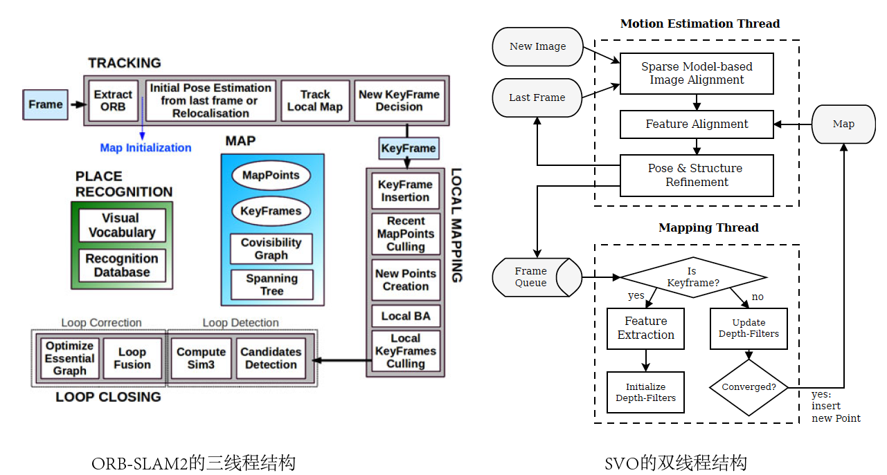
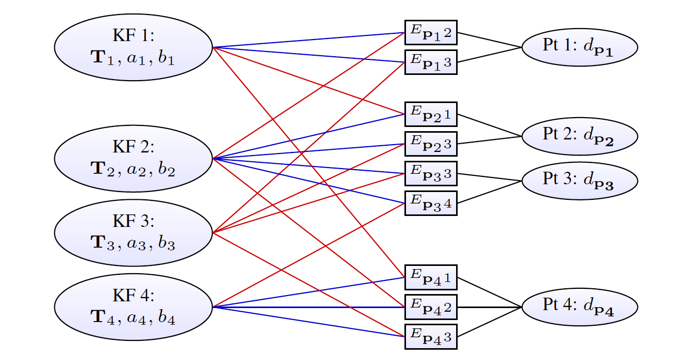

# 
orbslam notebook 

## 矩阵的性质

**（1）正交矩阵相乘仍然是正交矩阵** 

 *A**、**B*是正交矩阵,那么*AA'=E  、 BB'=E* 

 *(AB)\*(AB)'=AB\*B'A'=A(BB')A'=AEA'=AA'=E* 

**（2）一个矩阵乘以正交矩阵，范数不变**（保范性） 

**（3）一个矩阵乘以可逆矩阵秩不变** 

**（4）初等变换只是不影响矩阵的秩，其他的特性都改变了。对于计算矩阵的行列式，不能进行初等变换，但是可以做行列的进加减，不能乘以系数。** 

**（5）矩阵的迹：矩阵的主对角线上各个元素的总和，是矩阵所有特征值的和** 

**（6）对角矩阵的特征值是其对角线上的各个元素** 

**（7）矩阵的秩等于非零奇异值的个数，等于非零特征值的个数** 

**（8）任意矩阵都能进行奇异值分解，只有方阵才可以进行特征值分解** 

**特征值分解：** 

如果一个向量 *v* 是方阵 *A*的特征向量，将可以表示成下面的形式： *Av= λv*，*λ* 称为特征向量 *v* 对应的特征值，并且一个矩阵的一组特征向量是一组正交向量。 

特征值分解：**Q**是这个矩阵A的特征向量组成的矩阵，**Σ**是一个对角阵，每一个对角线上的元素就是一个特征值
$A = Q{\Sigma}Q^{-1}$

 **奇异值分解：** 

假设*A*是一个N * M的矩阵，*U*是一个N * N的方阵（正交矩阵），*Σ* 是一个N * M的矩阵（对角线上的元素为奇异值），$V^{T}$是一个M * M的矩阵（正交矩阵） 
$A = U{\Sigma}V^{T}$

**特征值和奇异值的关系：** 

（1）*U*的列向量，是 $AA^T$的特征向量； 

（2）*V*的列向量，是 $A^{T}A$ 的特征向量； 

（3）*A*的奇异值（*Σ*的非零对角元素）则是 $AA^T$ 或者 $A^{T}A$  的非零特征值的平方根。 

 **（9）秩与自由度（ 方阵A(n\*n) ）** 

 矩阵的秩，指的是经过初等变换之后的非零行（列）的个数，若不存在零行（列），则为满秩矩阵（Rank(A)=n；关于矩阵的秩的另一种理解：A矩阵将n维空间中的向量映射到k（k<=n）维空间中，k=Rank(A) 

 矩阵（参数矩阵）的自由度，指的是要想求解出矩阵的所有元素至少需要列几个线性方程组。若矩阵本身带有 x 个约束，则只需要列n*n-x个方程组即可求出所有参数，即矩阵A的自由度为n*n-x。 

 **（10）齐次线性方程组求解（秩表示可以列几个方程）** 

1.r(A)=未知数个数n（约束较强） 

该解空间只含有零向量 

2.r(A)<未知数个数n（约束不够） 

由齐次线性方程组解空间维数 = n - r(A) >0，所以该齐次线性方程组有非零解，而且不唯一，存在一个基础解系（基础解系中的向量个数为 n - r(A)个)。 

### **特殊矩阵的性质**
**一：为什么本质矩阵(E)的秩为2？** 

**（1）因为一个矩阵乘以可逆矩阵秩不变，因为可逆矩阵可以表示为初等矩阵的乘积，而初等变换不改变矩阵的秩。** 

对于一个矩阵施行一次初等**列变换**相当于在这个矩阵**右乘**一个相应的初等矩阵 

对于一个矩阵施行一次初等**行变换**相当于在这个矩阵**左乘**一个相应的初等矩阵 

$E = t^{^\wedge}R$

Rank(R)=3,R可逆矩阵

*Rank(t^)=2* 

R不会改变矩阵的秩，因此E矩阵的秩为2. 

*Rank(E)=Rank(t^)=2* 

**（2）因为本质矩阵 E 的奇异值必定是 $[σ, σ, 0]^T$ 的形式，矩阵的秩等于非零奇异值的个数** 

**证明一：三维反对称矩阵的分解** 

**证明二：SVD分解与矩阵的迹** 

**二：为什么基础矩阵(F)的秩为2**

$\boldsymbol{F} = \boldsymbol{K}^{-T}[\boldsymbol{t}]_{\times}\boldsymbol{R}\boldsymbol{K}^{-1}$

两个相机内参矩阵和旋转矩阵R都是满秩矩阵（可逆矩阵），[T]x是一个秩为2的矩阵，同样，矩阵乘以可逆矩阵秩不变，因为可逆矩阵可以表示为初等矩阵的乘积，而初等变换不改变矩阵的秩（左乘-行变换，右乘-列变换）。 

 

**三：为什么尺度等价性要减少一个自由度？** 

以本质矩阵为例，表达两帧的相机归一化坐标之间的对应关系

将矩阵写成向量，转化为下式： 

由于等式右侧是0，所以上面两式子乘以任意常数以后还是表示同样两点之间的变换，所以E是尺度等价的。 

由于尺度等价性，所以对于9个参数的向量e，我们只需要通过8个方程计算出其中8个未知数即可， 8个数都用第9个数表示，由于尺度等价，所以第9个数取什么值都是对的。 

**四：为什么基础矩阵自由度是7？** 

$\boldsymbol{F} = \boldsymbol{K}^{-T}[\boldsymbol{t}]_{\times}\boldsymbol{R}\boldsymbol{K}^{-1}$

左右相机内参的待定参数各为4，平移[T]x的待定参数是3，旋转矩阵R的自由度是3，加在一起是14个参数，也就是正常来说把14个参数都确定了才能确定F，但是实际上F是一个3*3的矩阵，只包含9个参数，所以计算F的自由度最大是9，也就是9个参数就可以确定F。 

同时F满足下面两个约束，所以F的自由度是9-2=7. 

（1）尺度等价性 

（2）秩为2，行列式为0，det(F)=0 

**五：为什么本质矩阵自由度是5？** 

平移[t]x的自由度是3，旋转矩阵R的自由度是3，加在一起是6个参数，也就是要想确定E矩阵，确定6个参数就够了，不用考虑E矩阵的所有9个参数 

同时E满足下面约束，所以E的自由度是6-1=5. 

（1）尺度等价性 

 **六：为什么单应矩阵自由度是8？** 

单应矩阵也具有尺度等价性：9-1=8 

 ## **计算基础矩阵** 

 ### **1. 基于代数误差的线性估计** 

 **(1) 8点法，线性最小二乘法** 

 **a. 线性解** 

计算基础矩阵 *f*, 8组对应坐标点构成系数矩阵A，维度为8*9。 
假设$\boldsymbol{x} = \begin{bmatrix} u & v & 1 \end{bmatrix}^T$为参考帧中的像素齐次坐标， $\boldsymbol{x'} = \begin{bmatrix} u' & v' & 1 \end{bmatrix}^T$为当前帧中与之匹配的坐标。那么式(1)可以展开如下:
$$
\begin{array}{c}
            \begin{bmatrix} u' & v' & 1 \end{bmatrix}
            \begin{bmatrix}
                f_{11} & f_{12} & f_{13} \\
                f_{21} & f_{22} & f_{23} \\
                f_{31} & f_{32} & f_{33}
            \end{bmatrix}
            \begin{bmatrix} u \\ v \\ 1 \end{bmatrix} = 0
        \end{array} \\
$$
$       u'uf_{11} + u'v f_{12} + u' f_{13} + v'u f_{21} + v'vf_{22} + v'f_{23} + uf_{31} + vf_{32} + f_{33} = 0$    
记$\boldsymbol{f} = \begin{bmatrix} f_{11} & f_{12} & f_{13} & f_{21} & f_{22} & f_{23} & f_{31} & f_{32} & f_{33} \end{bmatrix}^T$,假设我们有 m 对匹配点，根据上式我们可以写出 m 个约束，可以写成 Af=0的矩阵形式，如下:   

$$
\begin{equation}\
            \boldsymbol{Af} = \begin{bmatrix}
                u_1'u_1 & u_1'v_1 & u_1'   & v_1'u_1 & v_1'v_1 &   v_1' &    u_1 &    v_1 & 1 \\
                 \vdots &  \vdots & \vdots &  \vdots &  \vdots & \vdots & \vdots & \vdots &   \\
                u_m'u_m & u_m'v_m & u_m'   & v_m'u_m & v_m'v_m & v_m'   &    u_m &    v_m & 1 \\
            \end{bmatrix} \boldsymbol{f} = \boldsymbol{0}
        \end{equation}
$$

通常我们会找到很多对匹配点，构建矩阵 A，得到一个超定方程组。由于测量噪声的存在，基本上找不到一个解能够使得方程成立。 但我们可以通过最小二乘法找到一个f，使Af尽可能的接近 0。根据 MVG 一书的说法， 对矩阵 A 进行SVD分解 $A = U{\Sigma}V^{T}$，取V中的最后一列，就是一个能够最小化$\|\boldsymbol{Af} \| / \| \boldsymbol{f} \|$的解。 我们至少需要8个点才能求得基础矩阵，这也就是所谓的***八点法***。

**问题转化为求使得|| Af||最小化并满足||** **f** **||=1的** **f** **:** 

**结论：** **f** **的最小二乘解是对应于A的最小奇异值的奇异向量** 

 **b. 强迫约束（因为方程的个数>自由度）：用最接近F的矩阵F’ 代替F** 

上述求得的 **f** 转化为的矩阵**F**一般不满足秩为2的约束，所以需要对**F**进行修正，将**F**的三个奇异值修正为2个，就**F**满足了秩为2的约束。 

所以需要对**F**进行SVD分解，然后修正中间的奇异值矩阵 

**(2) 归一化 8点法**（ORB-SLAM：FindFundamental）（OpenCV：findFundamentalMat—runkenel—run8point） 

8点法成功的关键是在构造解的方程之前应对输入的数据认真进行适当的归 一化，图像点的一个简单变换(平移或变尺度)将使这个问题的条件极大地改善，从而提高结果的稳定性 

**算法步骤：** 

**a. 归一化变换** 

**b. 求解基础矩阵F，步骤在8点法里** 

 **c. 解除归一化** 

 **(3) 最小点对应算法** 

 **a. 7-点：仅用 7 组点对应来估计 F**（OpenCV：findFundamentalMat—runkenel—run7point） 

 好处（1）：因为考虑7自由度，必定生成 一 个秩 2 的矩阵，从而无需添加强迫约束 

 好处（2）：保证一个高概率的没有野值的结果所需的采样次数是样本集大小的指数函数，例如，8 组时达 99% 的监性度时所需的采样数是 7 组时所需采样数的两倍 

 坏处：它可能给出 F 的 3 个实数解，且所有 3 个解都要通过检验来选择 

 对于**Af=0**，**Rank(A)=7** , 

即为$A = U{\Sigma}V^{T}$中$V^{T}$的最后两行. **f1=VT(7), f2=VT(8)** ， 则方程组的基础解系 **f=k\*f1+(1-k)\*f2** ，由 **f, f1, f2**组成的矩阵 **F**也满足这个关系：**F=k\*F1+(1-k)\*F2**，再加入**det(F)=0**的约束， 

即**det(k\*F1+(1-k)\*F2)=0** ，得到一个关于**k**的三次多项式，可以求解出来三个可能的**F**解。 

 

**b. 6-点：根据基础矩阵与单应矩阵的关系** 

**2. 基于几何误差的非线性估计** 

将估计基本矩阵的问题化为数学的最优化问题，然后使用某种优化迭代算法求解。算法如下: 

(1) 构造基于几何意义的目标函数 

(2) 选取8点算法的结果作为迭代算法的初始值 

(3) 选取一种迭代方法(L-M方法)， 迭代求解最小化问题 

构造基于几何意义的目标函数 

常用准则: 

**(1)点到对应极线距离的平方和（一般是通过数值求解之后出F矩阵之后用这个判断是否满足要求）** 

### **基础矩阵的分解** 

根据基础矩阵$\boldsymbol{F} = \boldsymbol{K}^{-T}[\boldsymbol{t}]_{\times}\boldsymbol{R}\boldsymbol{K}^{-1}$和本质矩阵$\boldsymbol{E} = [\boldsymbol{t}]_{\times}\boldsymbol{R}$的定义，其中K是相机的内参矩阵， 我们可以从刚刚求解出的基础矩阵中算出本征矩阵:    
$\boldsymbol{E} = \boldsymbol{K}^T \boldsymbol{FK}$   
$[\boldsymbol{t}]_{\times}$,是由相机的平移向量t构成的斜对称矩阵，记作S吧,对于任意的3×3的斜对称矩阵都可以分解成$k \boldsymbol{UZU^T}$,其中U是一个正交矩阵，k为一个非零的常数。 Z具有如下的形式：
$$
\boldsymbol{Z} = \begin{bmatrix}
            0 & 1 & 0 \\
           -1 & 0 & 0 \\
            0 & 0 & 0
        \end{bmatrix} = -\underbrace{\begin{bmatrix}
            1 & 0 & 0 \\
            0 & 1 & 0 \\
            0 & 0 & 0
        \end{bmatrix}}_{\boldsymbol{D}_{1, 1, 0}}\underbrace{\begin{bmatrix}
            0 & -1 & 0 \\
            1 &  0 & 0 \\
            0 &  0 & 1
        \end{bmatrix}}_{\boldsymbol{W}}
$$   
在对极约束下，我们忽略符号的作用，有$\boldsymbol{Z} = \boldsymbol{D}_{1,1,0}\boldsymbol{W}$, 忽略尺度因子k的作用，有$\boldsymbol{S} = \boldsymbol{U}\boldsymbol{D}_{1,1,0}\boldsymbol{W}\boldsymbol{U}^T$。本征矩阵可以分解为$\boldsymbol{E} = \boldsymbol{U}\boldsymbol{D}_{0,0,1}(\boldsymbol{W}\boldsymbol{U}^T\boldsymbol{R})$。容易验证W是一个正交矩阵，所以$(\boldsymbol{W}\boldsymbol{U}^T\boldsymbol{R})$也是正交矩阵，记为$V^T$。 那么$\boldsymbol{U}\boldsymbol{D}_{-k,-k,0}\boldsymbol{V}^T$就是E的SVD分解。    
上述的推导得到$\boldsymbol{E} = \boldsymbol{U}\boldsymbol{D}_{0,0,1}(\boldsymbol{W}\boldsymbol{U}^T\boldsymbol{R})$,的过程中，我们忽略了符号和尺度的作用。 如果本征矩阵分解为$\boldsymbol{E} = \boldsymbol{U}\boldsymbol{D}_{1,1,0}\boldsymbol{V}^T$的形式， 那么E=SR有两种可能的分解：    
$$
\text{(1)}
        \begin{cases}
            \boldsymbol{S} = \boldsymbol{UZU^T} \\
            \boldsymbol{R} = \boldsymbol{UWV^T}
        \end{cases}
$$
$$
        \text{(2)}
        \begin{cases}
            \boldsymbol{S} = \boldsymbol{UZU^T} \\
            \boldsymbol{R} = \boldsymbol{UW^TV^T}
        \end{cases}
$$
因为在忽略符号的作用的情况下，$\boldsymbol{D}_{1,1,0}\boldsymbol{W}$与$\boldsymbol{D}_{1,1,0}\boldsymbol{W}^T$的作用一样。 上式中的R确定了相机的姿态矩阵。忽略尺度因子的作用时，上式中$\boldsymbol{S} = \boldsymbol{UZU^T}$,确定了相机的平移向量。 因为向量对自身的叉积为零，所以St=0，因此$\boldsymbol{t}=\boldsymbol{U}\begin{bmatrix} 0 & 0 & 1\end{bmatrix}^T = \boldsymbol{u_3}$,矩阵U的最后一列。但是因为E的符号不能确定，所以也不能确定t符号。 因此相机的位姿共有四种可能：
$$
\begin{equation}
        \begin{array}{c}
            \begin{bmatrix} \boldsymbol{UWV^T} | \boldsymbol{u_3} \end{bmatrix}  &
            \begin{bmatrix} \boldsymbol{UWV^T} | -\boldsymbol{u_3} \end{bmatrix} &
            \begin{bmatrix} \boldsymbol{UW^TV^T} | \boldsymbol{u_3} \end{bmatrix} & 
            \begin{bmatrix} \boldsymbol{UW^TV^T} | -\boldsymbol{u_3} \end{bmatrix} &
        \end{array}
        \end{equation}
$$   
在这4中可能中，只有一种解能够保证特征点位于在两个相机的前面，既深度值为正的。把各个匹配点对代进去分贝检测一遍，就可以找出正确的那个。手写推导如下：

**b. 检查3D点和两个相机的视差** 

**c. 检查3D点的深度** 

 **d. 检查3D点在两个相机的重投影误差，在误差允许范围内的计算内点数** 

## **计算本质矩阵（ORBSLAM是先计算基础矩阵F，然后通过相机内参计算E，没有直接计算E）**

**（1）8点法** 

基本做法与基础矩阵8点法相同，不同之处在于第二步：强迫约束 

**（2）5点法**（OpenCV:findEssentialMat—EMEstimatorCallback—runkenel） 

原理参考文献：An Efficient Solution to the Five-Point Relative Pose Problem 

具体步骤为： 

## **单应矩阵** 
### **计算单应矩阵**
针对平面场景，根据摄影变换关系建立了两幅图像之间各点的一一对应关系。 这个映射关系可以用一个3×3的齐次矩阵H来表示，我们称之为单应矩阵。 假设x,x′分别是初始化过程中的参考帧和当前帧中匹配的两个特征点，K为相机的内参，被观测的平面的法向量是N，平面到参考帧的距离为d， 可以推导出x,x′存在如下的关系:
$$
\begin{equation}\
            \begin{array}{rl}
                            & \boldsymbol{x'} = \cfrac{z_1}{z_2}\boldsymbol{K}\left(\boldsymbol{R} + \boldsymbol{t}\cfrac{1}{d}\boldsymbol{N}^T\right)\boldsymbol{K}^{-1}\boldsymbol{x} \\
                \Rightarrow & \boldsymbol{x'} = s\boldsymbol{H}\boldsymbol{x}
            \end{array}
        \end{equation}
$$
其中$\boldsymbol{H} = \boldsymbol{K}\left(\boldsymbol{R} + \boldsymbol{t}\cfrac{1}{d}\boldsymbol{N}^T\right)\boldsymbol{K}^{-1}$是两幅图像的单应矩阵,$s = z_1 / z_2$是两幅图像之间的尺度因子。    

$$
\begin{equation}\
            \begin{bmatrix} u_2 \\ v_2 \\ 1 \end{bmatrix} = s \begin{bmatrix} h_1 & h_2 & h_3 \\
                                                                              h_4 & h_5 & h_6 \\
                                                                              h_7 & h_8 & h_9 \end{bmatrix}
                                                            \begin{bmatrix} u_1 \\ v_1 \\ 1 \end{bmatrix}
        \end{equation}
$$   
其中，$(u_2, v_2)$为当前帧中特征点的像素坐标，$(u_1, v_1)$为参考帧中匹配点的像素坐标。$h_1 \cdots h_9$是矩阵H中的9个元素。    
$$
\begin{cases}
            u_2 = s(h_1 u_1 + h_2 v_1 + h_3) \\
            v_2 = s(h_4 u_1 + h_5 v_1 + h_6) \\
              1 = s(h_7 u_1 + h_8 v_1 + h_9)
        \end{cases} \Rightarrow \begin{cases}
            u_2 = \frac{h_1 u_1 + h_2 v_1 + h_3}{h_7 u_1 + h_8 v_1 + h_9} \\
            v_2 = \frac{h_4 u_1 + h_5 v_1 + h_6}{h_7 u_1 + h_8 v_1 + h_9}
        \end{cases}
$$    
一对匹配点我们可以根据上式写出两个约束，整理上式有：    
$$
\begin{cases}
            h_1 u_1 + h_2 v_1 + h_3 - h_7 u_1 u_2 - h_8 v_1 u_2 - u_2 = 0 \\
            h_4 u_1 + h_5 v_1 + h_6 - h_7 u_1 v_2 - h_8 v_1 v_2 - v_2 = 0
        \end{cases}
$$    
假设我们有 m 对匹配点，根据上式我们可以写出 2m 个约束，可以写成 $A\hat{H} = \boldsymbol{0}$的矩阵形式，如下，由于尺度因子的存在，求解时一般认为$h_9=1$，所以向量$\hat{H}$中只有8个未知数，至少需要4对匹配点，写出8个线性方程才可以求解。

### **单应矩阵的分解**     
下图表示场景中的平面M在两相机的成像，设平面M在第一个相机坐标系下的单位法向量为N，其到第一个相机中心（坐标原点）的距离为d，则平面M可表示为：$N^TX_1 = d$  
$\frac{1}{d}N^TX_1 = 1,\forall X_1 \in \pi$  转换下
其中，$X_1$是三维点P在第一相机坐标系下的坐标，其在第二个相机坐标系下的坐标为$X_2$，则
$X_2 = RX_1 + T$   
将上面式子结合起来，   
$X_2 = RX_1 + T\frac{1}{d}N^TX_1=(R+T\frac{1}{d}N^T)X_1=H'X_1$  
所以就得到了同一平面两个不同相机坐标系的单应矩阵
$H' = R+T\frac{1}{d}N^T$
    
    
   
   
   
ORB-SLAM2 只处理 $d_1>d_2>d_3$ 的情况，根据$d', \varepsilon_1, \varepsilon_3$的符号一共有 8 种不同的解。 下面我们详细分析函数 ReconstructH，了解具体的实现过程。  
## **三角测量原理**    
现在假设相机的内参矩阵为K，根据单应矩阵或者基础矩阵估计出相机的旋转矩阵R和平移向量t。那么对于空间中一点$\boldsymbol{X} = \begin{bmatrix} x & y & z \end{bmatrix}^T$， 其在相机中的成像点$\boldsymbol{x} = \begin{bmatrix} u & v & 1 \end{bmatrix}^T$ 。那么我们可以写出3D坐标到2D像素之间的投影关系：   
$$
\boldsymbol{x} = \cfrac{1}{z} \boldsymbol{K} [\boldsymbol{R} | \boldsymbol{t}] \boldsymbol{X} 
$$

$$
\begin{bmatrix} u \\ v \\ 1 \end{bmatrix} = \cfrac{1}{s} \begin{bmatrix}
                                            f_x & 0   & c_x \\
                                                0 & f_y & c_y \\
                                                0 & 0   & 1 \end{bmatrix}
\begin{bmatrix}
    r_{11} & r_{12} & r_{13} & t_x \\
    r_{21} & r_{22} & r_{23} & t_y \\
    r_{31} & r_{32} & r_{33} & t_z \\
\end{bmatrix}
\begin{bmatrix} x \\ y \\ z \\ 1 \end{bmatrix}
$$  
上式中符号$s = r_{31} x + r_{32} y + r_{33} z + t_z$为空间中的点X在经 [R|t]变换之后得到的点到相机的距离。 我们把矩阵$K[R|t]$称为空间点到像素点的投影矩阵来表示。 若参考帧的投影矩阵为$P$，空间点$X$在其中的投影像素为$x$，那么其投影关系可以记为$\boldsymbol{x} = \frac{1}{s}\boldsymbol{PX}$。 设当前帧的投影矩阵为$\boldsymbol{P'}$，空间点$X$在其中的投影像素为$x′$，那么其投影关系可以记为$\boldsymbol{x'} = \frac{1}{s'}\boldsymbol{P'X}$。 现在我们的目标是要根据这两帧的像素点坐标来估计空间点X的坐标。    
ORB-SLAM2中采用了一种线性三角形的方法进行求解的，其思路与求解单应矩阵的DLT算法一样， 也是将两个点的约束构建成$AX=0$的形式，然后对矩阵A进行SVD分解，取零空间的特征向量作为X的估计。 我们将像素点坐标叉乘到投影方程的两侧，可以去除掉尺度因子。
对上述矩阵A进行SVD分解，取V矩阵的最后一列就是X。因为在ORB-SLAM2中，地图坐标系是以初始化时的参考帧为基准构建的， 所以参考帧的投影矩阵为$P=K[I|0]$。  
$$
\boldsymbol{x} \times \boldsymbol{PX} = \boldsymbol{0} \Rightarrow \begin{cases}
            (u P_3^T - P_1^T) \boldsymbol{X} = 0 \\
            (v P_3^T - P_2^T) \boldsymbol{X} = 0 \\
            (u P_2^T - vP_1^T) \boldsymbol{X} = 0 \\
        \end{cases}
        ,
        \boldsymbol{x'} \times \boldsymbol{P'X} = \boldsymbol{0} \Rightarrow \begin{cases}
            (u' {P'}_3^T -   {P'}_1^T) \boldsymbol{X} = 0 \\
            (v' {P'}_3^T -   {P'}_2^T) \boldsymbol{X} = 0 \\
            (u' {P'}_2^T - v'{P'}_1^T) \boldsymbol{X} = 0 \\
        \end{cases}
$$
上式中，$P_i$为投影矩阵中的第i行。从上式中每帧图像的像素点上取两个约束，就可以得到一个关于4个齐次坐标的4个方程$AX=0$，其中:
$$
\begin{equation}
        \boldsymbol{A} = \begin{bmatrix}
            u P_3^T - P_1^T \\
            v P_3^T - P_2^T \\
            u' {P'}_3^T - {P'}_1^T \\
            v' {P'}_3^T - {P'}_2^T
        \end{bmatrix}
        \end{equation}
$$   
对上述矩阵A进行SVD分解，取V矩阵的最后一列就是X。因为在ORB-SLAM2中，地图坐标系是以初始化时的参考帧为基准构建的， 所以参考帧的投影矩阵为$P=K[I|0]$。  
## **PnP问题**   
PnP 问题(Perspective-n-Point Problem)是，已知相机内参矩阵K和 n 个 3D 空间点${c_1,c_2,⋯,c_n}$及其到图像上 2D 的投影点${μ_1,μ_2,⋯,μ_n}$，求解相机的位置和姿态。记第 i 个 3D 空间点的齐次坐标为 $\boldsymbol{c_i} = \begin{bmatrix} x_i & y_i & z_i & 1\end{bmatrix}^T$，其在图像上投影的 2D 像素坐标为 $\boldsymbol{\mu_i} = \begin{bmatrix} u_i & v_i & 1 \end{bmatrix}^T$。 其投影过程，可以分解为两步：    
1. 根据相机的位姿，将空间点从世界坐标系下变换到相机坐标系下。
2. 将相机坐标系下的点，根据相机内参矩阵，投影到图像上。   
其整个过程相当于连续乘了两个矩阵：   
$$
s \begin{bmatrix} u_i \\ v_i \\ 1 \end{bmatrix} = \boldsymbol{K} \left[ \boldsymbol{R} \big | \boldsymbol{t} \right]
                                                        \begin{bmatrix} x_i \\ y_i \\ z_i \\ 1 \end{bmatrix}
        = \begin{bmatrix} f_x & 0 & c_x \\ 0 & f_y & c_y \\ 0 & 0 & 1 \end{bmatrix}
          \begin{bmatrix} t_1 & t_2 & t_3 & t_4 \\
                          t_5 & t_6 & t_7 & t_8 \\
                          t_9 & t_{10} & t_{11} & t_{12} \end{bmatrix}
          \begin{bmatrix} x_i \\ y_i \\ z_i \\ 1 \end{bmatrix}
$$   
其中，s是一个尺度系数，在计算时通常通过叉乘或者归一化将之消除掉。K,R,t分别是相机的内参矩阵、姿态矩阵和位置向量。 参照单应矩阵和基础矩阵的求解过程， 我们用矩阵$A=K[R∣t]$将上式改写为:   
$$
s \begin{bmatrix} u_i \\ v_i \\ 1 \end{bmatrix} = \underbrace{\begin{bmatrix}
                           a_1 & a_2    & a_3    & a_4 \\
                           a_5 & a_6    & a_7    & a_8 \\
                           a_9 & a_{10} & a_{11} & a_{12}
                        \end{bmatrix}}_{\boldsymbol{A}} \begin{bmatrix} x_i \\ y_i \\ z_i \\ 1 \end{bmatrix}
        \Rightarrow
$$  
$$
        \begin{cases}
            u_i = \frac{ a_1 x_i + a_2 y_i + a_3 z_i + a_4 }{ a_9 x_i + a_{10} y_i + a_{11}z_i + a_{12} } \\
            v_i = \frac{ a_5 x_i + a_6 y_i + a_7 z_i + a_8 }{ a_9 x_i + a_{10} y_i + a_{11}z_i + a_{12} }
        \end{cases}
        \Rightarrow
$$
$$
        \begin{bmatrix}
            x_i & y_i & z_i & 1 & 0 & 0 & 0 & 0 & -x_i & -y_i & -z_i & -1 \\
            0 & 0 & 0 & 0 & x_i & y_i & z_i & 1 & -x_i & -y_i & -z_i & -1
        \end{bmatrix}
        \begin{bmatrix}
            a_1 \\ a_2 \\ \vdots \\ a_{11} \\ a_{12}
        \end{bmatrix} = \boldsymbol{0}
$$   
如此，对于 n 个匹配点对，就可以得到下面形式的线性方程组。SVD分解，解零空间，就可以解得矩阵A。 最少6个匹配点对，就可以完成求解。这就是一个DLT(Direct Linear Transformation)的方法。   
$$
\begin{bmatrix}
            x_0 & y_0 & z_0 & 1 & 0 & 0 & 0 & 0 & -x_0 & -y_0 & -z_0 & -1 \\
            0 & 0 & 0 & 0 & x_0 & y_0 & z_0 & 1 & -x_0 & -y_0 & -z_0 & -1 \\
            \vdots & \vdots & \vdots & \vdots & \vdots & \vdots & \vdots & \vdots & \vdots & \vdots & \vdots & \vdots \\
            x_{n-1} & y_{n-1} & z_{n-1} & 1 & 0 & 0 & 0 & 0 & -x_{n-1} & -y_{n-1} & -z_{n-1} & -1 \\
            0 & 0 & 0 & 0 & x_{n-1} & y_{n-1} & z_{n-1} & 1 & -x_{n-1} & -y_{n-1} & -z_{n-1} & -1
        \end{bmatrix}
        \begin{bmatrix}
            a_1 \\ a_2 \\ \vdots \\ a_{11} \\ a_{12}
        \end{bmatrix} = \boldsymbol{0}
$$    
当然上述DLT算法解得的是矩阵A，它包含了相机内参K、姿态矩阵R和平移向量t。 进一步的，通过QR分解，可以从矩阵A中把这三个都给分解出来。看起来这一过程还附带算出了相机的内参，这也正是相机的内参标定的求解过程。 DLT算法简单直接，但是它忽略了太多的约束，所以结果一般都不会很好。后来人们还研究出了很多求解 PnP 问题的算法，有只需要3个点就可以求解的P3P算法。 ORB-SLAM2 用的就是EPnP算法，效率高而且稳定，据说其算法复杂度是 O(n) 的。